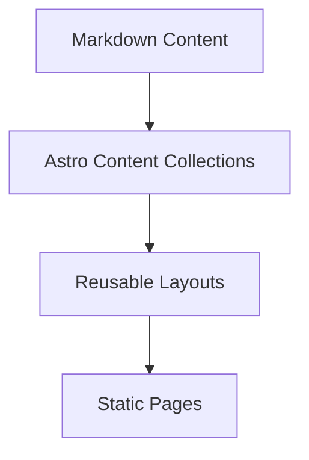

## Why Astro

Astro keeps the site fast by default and lets content live in Markdown.

## Architecture Sketch


```mermaid
graph TD
  A[Markdown Content] --> B[Astro Content Collections]
  B --> C[Reusable Layouts]
  C --> D[Static Pages]
```

## Example Code

```ts
export const speed = 'fast';
```
