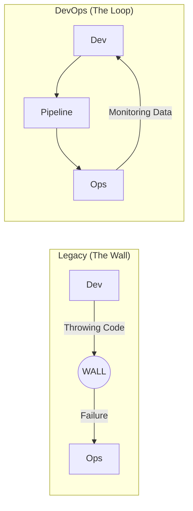

# DevOps Philosophy: The Cultural Revolution

Version: 1.0.0
Last Updated: 2026-03-09
Prerequisites: None

## 1. The History and "The Wall of Confusion"

### Story Introduction

Imagine a **Medieval Kingdom** split by a massive, 100-foot **Stone Wall**.

*   **On the Left (The Developers)**: You have the "Architects." They are always building new, shiny towers (Code). They want to move fast, change things, and show off their work. 
*   **On the Right (The Operations)**: You have the "Guardians." They are responsible for the stability of the kingdom. They hate change. To them, "Change" is what causes fires and collapses.
*   **The Conflict**: When the Architects finish a tower, they literally "throw the blueprints over the wall" to the Guardians and walk away. The Guardians try to build it, but it doesn't fit the ground. The tower collapses. The Guardians blame the Architects; the Architects blame the Guardians.

This wall is what we call the **"Wall of Confusion."** DevOps was born to tear this wall down.

### Concept Explanation

**DevOps** is a set of practices, tools, and a cultural philosophy that automates and integrates the processes between software development and IT teams.

#### Problems with Traditional Delivery (The "Waterfall" Era):
1.  **Silos**: Dev and Ops teams didn't talk until it was too late.
2.  **Finger-Pointing**: "It worked on my machine" became the developer's favorite excuse.
3.  **Long Lead Times**: It took months or even years to release a single update.
4.  **High Failure Rate**: Because of the lack of communication, most releases caused system crashes.

#### The Solution:
DevOps introduces the **Three Ways**:
1.  **Flow**: Move work from left (Dev) to right (Ops) as fast as possible.
2.  **Feedback**: Shorten and amplify feedback loops (Right to Left).
3.  **Continuous Learning**: Foster a culture of experimentation and risk-taking.

### Code Examples (Simulating the "Wall")

In the old days, a developer might send a "Deployment Manual" like this:

```markdown
# deployment_manual.v1.2.txt
1. Copy the .war file to /opt/tomcat/webapps
2. Restart the server: sudo service tomcat restart
3. Hope that the Java version on the server is 11...
```

In the DevOps world, we use **Infrastucture as Code (IaC)**. We send a script that *is* the server:

```yaml
# docker-compose.yml (The Modern "Manual")
version: '3'
services:
  web-app:
    image: my-app:v1.2
    build:
      context: .
    ports:
      - "8080:8080"
    environment:
      - JAVA_VERSION=11
    restart: always # Automatic self-healing
```

### Step-by-Step Walkthrough

1.  **`image: my-app:v1.2`**: Instead of a manual copy-paste, we define an exact "snapshot" of the app.
2.  **`ports: "8080:8080"`**: We explicitly map how the outside world talks to the internal app. No more guessing.
3.  **`environment: JAVA_VERSION=11`**: We define the requirements *inside* the file. Operations doesn't have to guess the Java version.
4.  **`restart: always`**: This is a mini-Operations person inside the script. If the app crashes, the system automatically restarts it.

### Diagram



### Real World Use Cases

**Netflix** is a pioneer of DevOps philosophy. They realized that if developers also had to "be on call" for the services they wrote, they would write better, more stable code. This is called "You build it, you run it." Because of this, Netflix can deploy thousands of times a day while maintaining 99.9% uptime.

### Best Practices

1.  **Stop the Finger-Pointing**: Use shared metrics. If the site is slow, it's *everyone's* problem.
2.  **Automate Everything**: If you have to do a task twice, write a script.
3.  **Psychological Safety**: Reward people for finding and reporting bugs, even if they caused them.

### Common Mistakes

*   **Buying DevOps**: You can't just buy a "DevOps Tool" and say you have DevOps. It starts with **Culture**.
*   **The "DevOps Team" Silo**: Many companies create a "DevOps Team" that just becomes another wall between Dev and Ops. DevOps should be a shared skill, not a separate department.

### Exercises

1.  **Beginner**: Define the "Wall of Confusion" in your own words.
2.  **Intermediate**: How does "Infrastructure as Code" (like the YAML example above) help solve communication problems between Dev and Ops?
3.  **Advanced**: In a "Blameless Culture," how should a team react if a developer accidentally deletes a production database?

### Mini Projects

#### Beginner: The Communication Audit
**Task**: Interview a developer and a system administrator (or imagine a conversation). Ask them: "What is the biggest thing that frustrates you about the other team?" 
**Deliverable**: A list of 3 "Silos" you identified and a proposed DevOps practice to fix each.

#### Intermediate: Environment Consistency Check
**Task**: Install Docker. Try to run a simple "Hello World" app in a container. Verify that it runs exactly the same way on your laptop as it would on a server.
**Deliverable**: A short report on why the container solves the "It worked on my machine" problem.

#### Advanced: Design a Feedback Loop
**Task**: Design an architectural plan for an app that automatically sends a Slack message to the developer the moment their code causes an error in production.
**Deliverable**: A diagram showing the flow of data from the **App -> Logging System -> Slack**.
