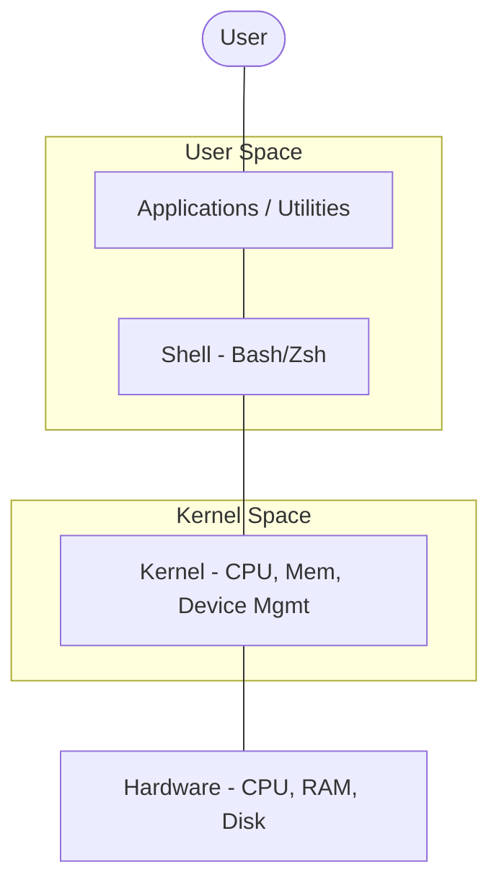
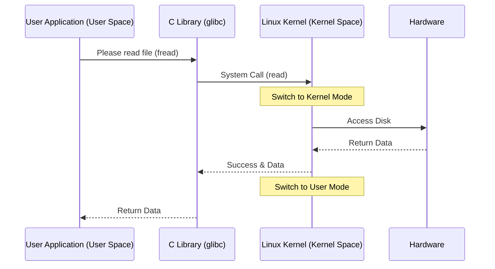

# Linux Fundamentals

Version: 1.0.0
Last Updated: 2026-03-09
Prerequisites: Module 1

## 1. Linux Architecture

### Story Introduction

Imagine a **Large Corporate Headquarters**.

*   **The Building (Hardware)**: This is the actual physical structure—the server, CPU, and RAM.
*   **The Security Team (Kernel)**: These are the only people who have keys to every room. They manage the elevators (CPU scheduling), the storage rooms (Memory), and the entrance gates (I/O). You can't just walk into the server room; you have to ask a security guard to do it for you.
*   **The Employees (Shell/System Utilities)**: These are the workers who perform specific tasks. They don't have keys to the rooms, so they talk to the Security Team via a special intercom system (System Calls).
*   **The Desktop/Apps (User Space)**: These are the specialized departments (Marketing, HR) that use the services provided by the employees and the security team.

In Linux, everything is organized in layers to ensure that if one "employee" trips and falls, they don't bring down the whole building.

### Concept Explanation

Linux architecture is logically divided into several layers that manage the interaction between the user and the physical hardware.

#### The 4 Core Layers:
1.  **Hardware**: The physical machine (CPU, RAM, Disks, NIC).
2.  **Kernel**: The heart of the OS. It interacts directly with the hardware. It manages memory, processes, and device drivers.
3.  **Shell**: The interface between the user and the kernel. It's a command interpreter that takes your commands and translates them into a language the kernel understands (e.g., Bash, Zsh).
4.  **Applications/Utilities**: The software that users interact with (e.g., `ls`, `grep`, a web browser, or a Java application).

#### Key Principle: "Everything is a File"
In Linux, almost everything (text files, directories, hard drives, printers) is treated as a file. This simplifies the architecture because the same set of tools can be used to manage very different resources.

### Diagram



### Real World Usage

**Android Phones** use a Linux kernel at their core. When you touch an icon on your screen (Application), the app sends a request to the Android Runtime, which then uses the Shell/HAL (Hardware Abstraction Layer) to tell the Linux Kernel to turn on the screen's backlight or vibrate the phone (Hardware).

### Exercises

1.  **Beginner**: Which layer of the Linux architecture are you interacting with when you type `ls` in a terminal?
2.  **Intermediate**: Explain the role of the Shell in the context of the "Everything is a File" principle.
3.  **Advanced**: Why is the Kernel kept separate from the User Space? What would happen if a user application could directly write to the System RAM without the Kernel's permission?


## 2. Kernel vs User Space

### Story Introduction

Think of a **Busy Public Hospital**.

*   **The Waiting Room (User Space)**: This is where the patients (applications) wait. They can talk to each other, play on their phones, and move around freely within the room. However, they don't have access to the operating theaters or the medicine cabinets.
*   **The Staff-Only Areas (Kernel Space)**: This is where the doctors (The Kernel) work. They have the keys to the pharmacy and the surgical rooms.
*   **The Intercom System (System Calls)**: If a patient needs medicine, they don't just walk into the pharmacy. They have to tell a nurse (make a System Call). The nurse then takes the message to the doctor, who decides if the request is valid and then fetches the medicine.

If a patient in the waiting room starts shouting or falls over, it's unfortunate, but the surgery in the staff area continues uninterrupted. This separation is what makes Linux stable.

### Concept Explanation

The CPU in a Linux system operates in two distinct modes: **User Mode** and **Kernel Mode**.

#### User Space (User Mode)
*   Where user applications run (e.g., web browsers, compilers, text editors).
*   Applications have limited access to memory and hardware.
*   If a process crashes in User Space, it generally doesn't affect the rest of the system.

#### Kernel Space (Kernel Mode)
*   Where the core of the OS runs.
*   Has full, unrestricted access to the hardware (CPU, RAM, Disks).
*   Highly privileged and protected. A crash here can cause a "Kernel Panic" (the whole system stops).

#### The Bridge: System Calls
Since User Space apps can't talk to hardware directly, they use **System Calls** (syscalls). Common examples include `open()`, `read()`, `write()`, and `fork()`.

### Diagram



### Real World Usage

In **Cloud Computing (AWS/Azure)**, virtual machines (VMs) are essentially isolated User Spaces running on a shared Hypervisor/Kernel. This prevents one customer's web server from accidentally reading another customer's data in the server's RAM.

### Exercises

1.  **Beginner**: Name two applications that run in User Space.
2.  **Intermediate**: What is a "Kernel Panic"? What would cause one to occur?
3.  **Advanced**: Explain the performance overhead associated with "Context Switching" when an application moves from User Mode to Kernel Mode via a system call.

## 3. Linux Distributions and Package Management

### Concept Explanation

A **Linux Distribution** (or "Distro") is the Linux kernel packaged with a shell, system utilities, a package manager, and sometimes a desktop environment. 

#### Major Distro Families:
1.  **Debian-based**: Known for stability. (e.g., Ubuntu, Debian, Kali Linux). Uses `.deb` packages and `apt`.
2.  **Red Hat-based**: Focused on enterprise servers. (e.g., RHEL, Fedora, CentOS, AlmaLinux). Uses `.rpm` packages and `dnf` (previously `yum`).
3.  **Arch-based**: For advanced users who want total control. (e.g., Arch Linux, Manjaro). Uses `pacman`.

#### What is a Package Manager?
Think of it as a **Command-Line App Store**. It automates the process of installing, upgrading, configuring, and removing software. It also handles **Dependencies**—if App A needs Library B to run, the package manager will automatically download Library B for you.

### Code Example

Here is how you would install the `nginx` web server on different families of Linux:

```bash
# Ubuntu/Debian (using apt)
sudo apt update          # Update the list of available packages
sudo apt install nginx   # Download and install nginx

# RHEL/AlmaLinux (using dnf)
sudo dnf install nginx   # Download and install nginx

# Arch Linux (using pacman)
sudo pacman -S nginx     # Download and install nginx
```

### Step-by-Step Walkthrough

1.  **`sudo`**: "SuperUser DO". This command gives you administrative (root) privileges, which are required to change system software.
2.  **`apt update`**: This doesn't update the software itself; it updates the "catalog" of what's available in the remote repositories.
3.  **`install`**: This initiates the download and installation process.
4.  **Dependencies**: If you look at the output of these commands, you'll see Linux installing other small tools. These are the dependencies that `nginx` needs to function.

### Real World Usage

In **DevOps and CI/CD**, we rarely use a GUI. We use package managers inside Dockerfiles or Shell scripts to set up environments automatically. For example, a Jenkins agent might run a script that uses `apt install` to set up Java, Maven, and Python before running a build.

### Best Practices

1.  **Update before Install**: Always run `sudo apt update` before installing a new package to ensure you get the latest version and avoid dependency conflicts.
2.  **Use Fixed Versions (In Production)**: When building Docker images, try to specify exact version numbers (e.g., `apt install nginx=1.18.0`) to avoid "breaking" your build if a new version is released.
3.  **Clean up**: Use `apt clean` or `rm -rf /var/lib/apt/lists/*` in Dockerfiles to keep your images small.

### Common Mistakes

*   **Forgetting `sudo`**: Trying to install software as a normal user will result in a "Permission Denied" error.
*   **Assuming `.exe` works**: New Linux users often try to download `.exe` files from websites. Remember: Linux uses Packages and Repositories.
*   **Interrupting an Install**: Turning off the computer or losing internet during `apt install` can leave the "Package Database" in a locked state, requiring manual repair using `sudo dpkg --configure -a`.

### Exercises

1.  **Beginner**: Which command is used to update the package list on a Ubuntu system?
2.  **Intermediate**: What is the difference between `apt upgrade` and `apt update`?
3.  **Advanced**: Why do we use repositories instead of just downloading `.exe` style installers from websites in a production Linux environment?

## Mini Projects

## Mini Projects

### Beginner: Install a Linux distro in a VM

**Problem**: You want to experiment with Linux without breaking your main computer.
**Task**: Download VirtualBox or VMware Player. Download an Ubuntu ISO. Create a virtual machine with 2GB RAM and 20GB Disk. Install Ubuntu.
**Deliverable**: A screenshot of your terminal inside the VM after running `uname -a` and `lsb_release -a`.

### Intermediate: Create a custom package

**Problem**: You have a script that you want to distribute to your team in a professional way.
**Task**: Use a tool like `fpm` (Effing Package Management) or standard Debian packaging tools to wrap a simple Bash script into a `.deb` file.
**Deliverable**: The `.deb` file and the command used to install it (`sudo dpkg -i your-package.deb`).

### Advanced: Build a minimal Linux kernel

**Problem**: You need a high-performance system for a specialized edge device.
**Task**: Download the Linux kernel source code from `kernel.org`. Use `make menuconfig` to remove unnecessary drivers (like Bluetooth, printers, WiFi) and compile a minimal kernel.
**Deliverable**: A bootable image and its final size compared to a standard distribution kernel.
