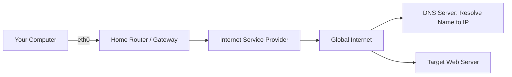

# Networking and System Monitoring

Version: 1.0.0
Last Updated: 2026-03-09
Prerequisites: Service Management

## 1. Linux Networking Fundamentals

### Story Introduction

Imagine a **Global Postal System**.

*   **IP Address**: This is your house address (e.g., "123 Main St"). It tells the world exactly where your computer is located on the internet so packages (data) can be delivered to you.
*   **The Network Interface (NIC)**: This is your mailbox. It's the physical point where the mail enters and leaves your house.
*   **DNS (Domain Name System)**: This is a giant phonebook. You don't remember that Google is at `142.250.190.46`; you just remember the name "google.com". The DNS looks up the name and gives you the address.
*   **Routing**: This is the post office worker who looks at your envelope and decides whether it needs to go to the local branch or be sent on an airplane to another country.

### Concept Explanation

Networking in Linux involves managing how the computer talks to other computers over a network (like a LAN or the Internet).

#### Key Components:
1.  **IP Address**: Every machine has an IP (IPv4 or IPv6).
    *   **Public IP**: Visible to the whole world.
    *   **Private IP**: Visible only inside your home or office network (e.g., `192.168.x.x`).
2.  **Subnet Mask**: Defines which part of the IP is the "Network" and which part is the "Host" (e.g., `255.255.255.0`).
3.  **Gateway**: The "Exit Door" of your local network (usually your router).
4.  **Network Interfaces**:
    *   `eth0` or `enp3s0`: Physical Ethernet connection.
    *   `wlan0`: Wireless connection.
    *   `lo`: The "Loopback" interface (address `127.0.0.1`), used by the computer to talk to itself.

### Diagram



### Real World Usage

In **Cloud Computing (AWS/Azure)**, networking is virtualized. We create **VPCs (Virtual Private Clouds)** and subnets to isolate our production servers from the public internet. Understanding how to check your IP (`ip addr`) and your route (`ip route`) is the first step in debugging why your cloud application cannot reach its database.

### Exercises

1.  **Beginner**: Run `ip addr` on your machine. What is the name of your active network interface and what is your private IP address?
2.  **Intermediate**: What is the purpose of the `127.0.0.1` (loopback) address? Why do we use it for local development?
3.  **Advanced**: You have two servers on the same local network. They can `ping` each other's IP addresses, but they cannot reach each other using their hostnames. What is likely the problem?

## 2. Ports, Sockets, and Firewalls (ufw/iptables)

### Concept Explanation

If your IP address is a house, **Ports** are the specific doors for specific people.

*   **Ports (0 - 65535)**:
    *   **Well-known (0-1023)**: Standard services like HTTP (80), HTTPS (443), SSH (22).
    *   **Registered/Dynamic**: High ports used by your own applications.
*   **Sockets**: The combination of an IP address and a Port (e.g., `127.0.0.1:8080`).
*   **Firewalls**: Security guards standing at the doors (ports). They decide which doors are open and who is allowed to enter.

### Code Example

```bash
# Check which ports are listening on your machine
ss -tulpen

# Check ufw (Uncomplicated Firewall) status
sudo ufw status

# Allow SSH traffic
sudo ufw allow 22/tcp

# Allow HTTP and HTTPS
sudo ufw allow 80
sudo ufw allow 443

# Enable the firewall
sudo ufw enable
```

### Explanation

*   **`ss` (Socket Statistics)**: The modern replacement for `netstat`. It shows you which processes are using which ports.
*   **`ufw`**: A user-friendly front-end for `iptables`. It makes managing a firewall much simpler for DevOps engineers.
*   **Inbound vs Outbound**: By default, firewalls often allow all "Outbound" traffic (from you to the world) but block all "Inbound" traffic (from the world to you) unless you explicitly allow it.

### Exercises

1.  **Beginner**: Which port does a standard web server use for secure (HTTPS) traffic?
2.  **Intermediate**: Run `ss -ltn` on your machine. Find a port that is in the "LISTEN" state. What does that mean?
3.  **Advanced**: Why is it a common security practice to change the default SSH port from 22 to something high and random like 2244?

## 3. Basic Troubleshooting Suite (ping, dig, traceroute, curl)

### Concept Explanation

When a network connection fails, DevOps engineers act like digital detectives. They have a standard toolkit for diagnosing where the problem lies.

1.  **`ping`**: Checks if the target server is alive and responding. (Layer 3 - ICMP).
2.  **`traceroute`**: Shows the path a packet takes between you and the target. It identifies which "hop" (router) is dropping the data.
3.  **`dig` (or `nslookup`)**: Tests DNS. "Is the phonebook giving me the right address?"
4.  **`curl`**: Tests the actual application. "The door is open, but is the web server answering when I knock?"

### Code Example

```bash
# Ping a server to check connectivity
ping google.com

# Check DNS resolution
dig google.com

# Trace the path to a server
traceroute google.com

# Test an HTTP endpoint
curl -I https://www.google.com
```

### Explanation

*   **`curl -I`**: Only fetches the "Headers" (metadata) of the website. This is much faster for testing if a site is "Up" without downloading the whole page.
*   **`traceroute`**: If a `ping` fails, `traceroute` tells you *where* it is failing. Is it your home router? Your ISP? Or the target's firewall?

### Real World Usage

In **CI/CD Pipelines (Jenkins/GitHub Actions)**, we often use `curl` as a "Smoke Test." After deploying a new version of an app, the script runs `curl` against the endpoint. If it gets a `200 OK` response, the deployment is a success. If it gets a `500 Error`, the deployment is automatically rolled back.

### Exercises

1.  **Beginner**: What command would you use to find the IP address of `facebook.com`?
2.  **Intermediate**: You can ping `8.8.8.8` (Google's IP), but you cannot browse `google.com`. What is likely broken?
3.  **Advanced**: How does `curl -v` (Verbose) help you debug an issue with an SSL certificate?

## 4. System Monitoring (df, du, free, iostat, vmstat)

### Concept Explanation

System monitoring is the practice of checking the "vital signs" of your server: Disk space, Memory usage, CPU load, and I/O performance.

#### The "Vital Signs" Kit:
1.  **Disk Space (`df`, `du`)**: "How much room is left in the warehouse?"
2.  **Memory (`free`)**: "How much RAM do I have left for new tasks?"
3.  **Overall Health (`uptime`, `top`)**: "How hard is the CPU working and how long has the system been running?"
4.  **I/O Performance (`iostat`)**: "Are the disks reading and writing data fast enough?"
5.  **Virtual Memory (`vmstat`)**: "Is the system 'swapping' (using slow disk space as fake RAM)?"

### Code Example

```bash
# Check disk space in human-readable format
df -h

# Check the size of a specific directory
du -sh /var/log

# Check memory usage
free -m

# Check system load and uptime
uptime

# Check I/O and CPU statistics (refreshes every 2 seconds)
iostat -xz 2
```

### Step-by-Step Walkthroughs

#### 1. Checking Sockets (`ss -tulpen`)
*   **`ss`**: "Socket Statistics".
*   **`-t`**: Show TCP sockets.
*   **`-u`**: Show UDP sockets.
*   **`-l`**: Show only "Listening" ports.
*   **`-p`**: Show the "Process" (program name) using the port.
*   **`-n`**: Show numeric port numbers (e.g., 80 instead of "http").

#### 2. Debugging with `curl -v`
*   **`curl`**: "Client URL".
*   **`-v`**: Verbose mode. It shows you the "Shakehands" between your computer and the server. You can see the SSL certificate being verified and the exact HTTP request you are sending.

#### 3. Analyzing Disk Health (`df -h`)
*   **`df`**: "Disk Free".
*   **`-h`**: Human-readable. It translates blocks into GB/MB.
*   **`1% used`**: If this is 100%, your server cannot write new files (logs, database entries), and it will likely crash or stop responding.

### Best Practices

1.  **Principle of Least Privilege (Firewalls)**: By default, block *everything* coming in. Only open the specific ports you need (e.g., 80, 443).
2.  **Monitor the Three Pillars**: Always monitor **CPU, Memory, and Disk**. If any of these hit 90%, you should receive an automated alert.
3.  **Use Static IPs for Servers**: Never rely on a dynamic IP (DHCP) for a production server. If the IP changes, your DNS and other services will break.
4.  **Logging**: Ensure your networking logs are sent to a central location (like the ELK stack) so you can audit who is trying to access your server.

### Common Mistakes

*   **DNS Chasing**: Thinking the server is down when actually your DNS isn't resolving. Always test with `ping [IP]` first, then `ping [Name]`.
*   **Listening on 0.0.0.0**: If you bind your app to `0.0.0.0`, it is listening on *every* network interface, including the public internet. If you only want it visible inside your network, bind it to your private IP or `127.0.0.1`.
*   **Mistaking "Free" for "Available" Memory**: In the `free` command, beginners often panic seeing low "Free" memory. Look at "Available"—Linux uses free RAM for speed (caching) and will release it when needed.

### Exercises

1.  **Beginner**: Run `df -h`. Which filesystem is mounted on `/` and how much percentage is used?
2.  **Intermediate**: What is the difference between `df` and `du`? Which one would you use to find a specific large file that is filling up your disk?
3.  **Advanced**: In `iostat`, what does `%util` (percentage utilization) of a disk mean? If it's at 100%, what effect will it have on your application's database queries?

## Mini Projects

### Beginner: Build a "Network Connectivity" Checker

**Problem**: You want to know if your local network or the internet is down.
**Task**: Write a Bash script that pings your local gateway, then pings Google's DNS (`8.8.8.8`), and finally tries to `curl` a website. If any step fails, print an error message identifying where the blockage is.
**Deliverable**: The `net_check.sh` script.

### Intermediate: Secure a Server with ufw

**Problem**: You are setting up a new web server and want to follow the "Best Security Practices."
**Task**: Enable `ufw`. Allow only SSH, HTTP, and HTTPS. Block all other incoming traffic. Set a rule to allow your specific home IP address to access a "secret" port (e.g., 8080).
**Deliverable**: The output of `sudo ufw status numbered` showing the correctly configured rules.

### Advanced: Design a "Full-Stack System Dashboard" script

**Problem**: You want a single command that gives you a complete health report of your server.
**Task**: Create a script that displays: Current IP address, Disk usage of `/`, Available Memory, Top 3 most CPU-hungry processes, and any failed systemd services.
**Deliverable**: The `dashboard.sh` script that outputs a clean, formatted report in the terminal.
