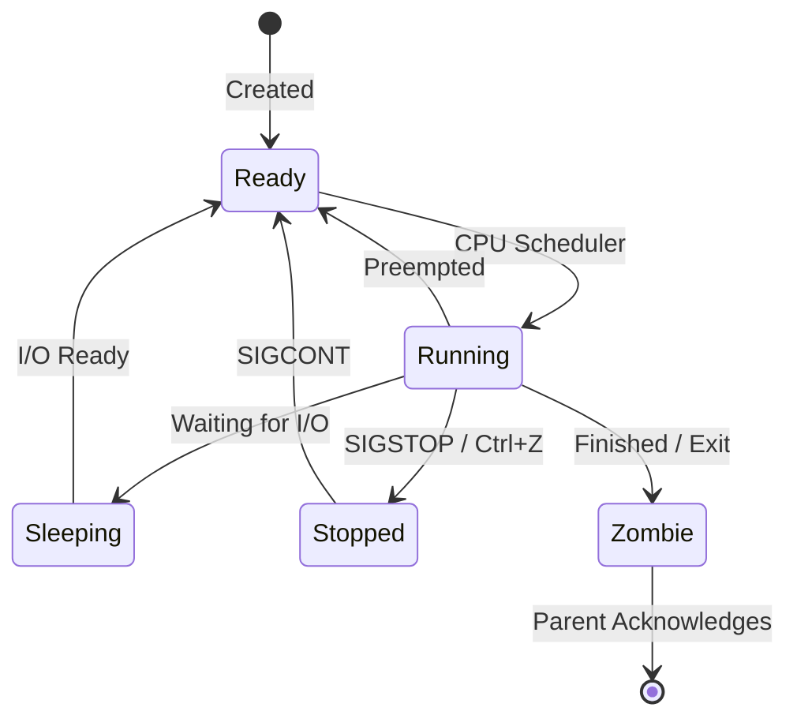

# Process Management

Version: 1.0.0
Last Updated: 2026-03-09
Prerequisites: Linux Fundamentals

## 1. Process Lifecycle and States

### Story Introduction

Imagine a **Busy Factory Assembly Line**.

*   **Program**: This is the blueprint for a car. It's just paper sitting on a desk.
*   **Process**: This is the actual car currently being built on the line. It's taking up physical space, using electricity, and has workers assigned to it.
*   **PID (Process ID)**: This is the serial number assigned to that specific car on the line.
*   **Parent Process**: The machine that feeds the parts to the assembly line.
*   **Child Process**: A smaller sub-assembly line (like the dashboard assembly) that was started by the main line.

Sometimes a car gets stuck (Blocked), sometimes it's waiting for its turn (Ready), and sometimes it's actively being worked on (Running). If the main assembly line shuts down suddenly without telling the dashboard team, those workers might just stand there forever, not knowing what to do—these are the **Zombies** of the factory!

### Concept Explanation

A **Process** is an instance of a running program. Every process has a unique identifier called a **PID**.

#### Process States:
1.  **Running (R)**: The process is either currently using the CPU or is in the queue to use it.
2.  **Sleeping (S)**: The process is waiting for something to happen (like a user keystroke or data from a disk). This is where most processes spend their time.
3.  **Uninterruptible Sleep (D)**: A deep sleep, usually waiting for hardware (I/O). You cannot kill a process in this state.
4.  **Stopped (T)**: The process has been paused (usually by the user pressing `Ctrl+Z`).
5.  **Zombie (Z)**: A process that has finished execution but still has an entry in the process table because its parent hasn't acknowledged its death yet.

#### The Init Process:
In Linux, the very first process started by the kernel is called `systemd` (PID 1). All other processes are descendants of PID 1.

### Diagram



### Real World Usage

In **Microservices**, we often use "Health Checks." A container orchestrator (like Kubernetes) constantly monitors the *state* of the process. If a process enters an "Unresponsive" state (even if it's not Dead), the orchestrator will kill it and start a fresh "car" on the "assembly line."

### Exercises

1.  **Beginner**: What is the difference between a "Program" and a "Process"?
2.  **Intermediate**: What is a "Zombie" process? Why is it considered a "resource leak" if too many exist?
3.  **Advanced**: Why is it impossible to kill a process that is in the "D" (Uninterruptible Sleep) state? (Hint: Think about hardware safety).

## 2. Process Monitoring and Management Commands

### Concept Explanation

Monitoring processes allows you to see which applications are consuming CPU, RAM, and disk resources. Killing processes is the primary way to stop runaway applications.

#### Essential Commands:
1.  **`ps` (Process Status)**: Shows a snapshot of current processes.
2.  **`top`**: A real-time, interactive process monitor.
3.  **`htop`**: An improved, colorful version of `top` (much more user-friendly).
4.  **`kill`**: Sends a "signal" to a process (usually to stop it).
5.  **`pkill` / `killall`**: Kills processes by name instead of PID.

#### Common Signals:
*   **SIGTERM (15)**: The "Polite Request." Asks the process to save its work and close gracefully.
*   **SIGKILL (9)**: The "Nuclear Option." Kills the process immediately. The process cannot ignore this signal.
*   **SIGHUP (1)**: The "Reload." Often used to tell a service to reload its configuration without stopping.

### Code Example

```bash
# List all running processes with details
ps -ef 

# Find a specific process by name
ps -ef | grep nginx

# Interactive monitoring
top

# Kill a process politely (SIGTERM is the default)
kill 1234

# Kill a process immediately (SIGKILL)
kill -9 1234

# Kill all processes with a certain name
pkill -u abhishek chrome
```

### Explanation

*   **`ps -ef`**: `e` means all processes, `f` means full format (showing the user, PID, Parent PID, and start time).
*   **`kill -9`**: Use this only as a last resort. It can cause data corruption if the process was in the middle of writing a file.
*   **`grep`**: Often used with `ps` to filter through a long list of processes to find exactly what you need.

### Exercises

1.  **Beginner**: Open `top` in your terminal. How can you find out which process is using the most CPU?
2.  **Intermediate**: What is the PID of your current Bash shell? (Hint: try `echo $$`).
3.  **Advanced**: A process named `legacy_app` is refusing to close after a `kill 1234` command. What signal should you try next, and what are the risks?

## 3. Background Processes and Job Control

### Story Introduction

Think of a **Busy Professional Kitchen**.

*   **Foreground Task**: The chef is actively chopping onions. They cannot do anything else until the onions are chopped. The "terminal" (the chef's attention) is busy.
*   **Background Task**: The chef puts a pot of water on the stove to boil and sets a timer. Now, the chef is free to go back to chopping onions while the water boils in the background.
*   **Job Control**: 
    *   **`Ctrl+Z`**: The chef stops chopping onions midway and puts them aside to answer the phone.
    *   **`fg` (Foreground)**: The chef hangs up the phone and goes back to those specific onions.
    *   **`bg` (Background)**: The chef decides to let the dishwasher run while they continue with other prep work.

### Concept Explanation

By default, when you run a command in Linux, it takes over your terminal until it finishes. This is called a **Foreground** process. 

#### Job Control Tools:
*   **`&`**: Adding an ampersand at the end of a command runs it in the background immediately.
*   **`Ctrl+C`**: Interrupts (kills) the foreground process.
*   **`Ctrl+Z`**: Suspends (pauses) the foreground process.
*   **`jobs`**: Lists all processes started from the current terminal that are running in the background or suspended.
*   **`fg %[job_id]`**: Brings a background or suspended job to the foreground.
*   **`bg %[job_id]`**: Resumes a suspended job in the background.
*   **`nohup`**: "No Hang Up." Allows a process to keep running even if you close the terminal or log out.

### Code Example

```bash
# Run a long backup in the background
tar -czf backup.tar.gz /large/folder &

# List your current background jobs
jobs

# Suspend a running command (like 'top')
# Press Ctrl+Z
# Output: [1]+  Stopped                 top

# Resume it in the background (it won't be interactive)
bg %1

# Bring it back to the foreground to interact with it
fg %1
```

### Step-by-Step Walkthroughs

#### 1. Checking Processes (`ps -ef`)
*   **`ps`**: "Process Status".
*   **`-e`**: Select all processes.
*   **`-f`**: Full-format listing (shows UID, PID, PPID, C, STIME, TTY, TIME, CMD).
*   **PPID**: The Parent Process ID. This is the ID of the process that "gave birth" to the current one. If you kill the parent, the child often becomes an "orphan."

#### 2. Mastering signals (`kill -9`)
*   **`kill`**: Sends a signal (not necessarily a 'death' signal).
*   **`-9`**: Specifically sends **SIGKILL**.
*   **The Process**: When you run `kill -9 1234`, the kernel immediately stops the process at PID 1234. It doesn't give it any time to clean up memory or close files. It's like pulling the plug on a computer.

#### 3. Managing Jobs (`Ctrl+Z` and `bg`)
*   **`Ctrl+Z`**: Suspends the foreground process. It's still there, but it's "Stopped."
*   **`bg %1`**: Tells the first stopped job to resume running, but in the "Background" so you can keep typing in your terminal.

### Real World Usage

In **DevOps Automation**, we frequently use `nohup` or `screen`/`tmux` to run long-running tasks like database migrations or large file transfers. If your SSH connection drops, you don't want the migration to stop halfway! Another common pattern is using `&` in shell scripts to start multiple services (like a backend and a frontend) simultaneously.

### Best Practices

1.  **Try SIGTERM First**: Always use `kill [PID]` (which sends SIGTERM) before using `kill -9`. This allows the application to finish its work safely.
2.  **Use `top`/`htop` for Troubleshooting**: Before killing a process, use `top` to verify it's actually the one causing the high CPU or Memory usage.
3.  **Use `nohup` for Long Tasks**: If you are running a deployment script over a flaky WiFi connection, always wrap it in `nohup` or use a terminal multiplexer like `tmux`.
4.  **Clean up Zombies**: If you see too many "Z" state processes in `top`, investigate the parent process. A zombie itself uses no resources, but its entry in the process table is limited.

### Common Mistakes

*   **Kill -9 by Default**: New admins often use `-9` for everything. This can lead to corrupted databases and "lock" files being left behind.
*   **Forgetting `&`**: Starting a long process (like a web server) and then realizing you can't use your terminal anymore. Use `Ctrl+Z` and `bg` to fix this without restarting.
*   **Killing PID 1**: If you are root and you manage to kill PID 1 (`systemd`), your entire computer will crash instantly. Linux usually prevents this, but it's a "classic" mistake to try.

### Exercises

1.  **Beginner**: Run `sleep 100`. How can you move this task to the background without killing it?
2.  **Intermediate**: What happens to a background process (run with `&`) if you close your terminal window?
3.  **Advanced**: Why do we use `disown` after starting a background process? How does it differ from `nohup`?

## Mini Projects

## Mini Projects

### Beginner: Build a "Process Monitor" script

**Problem**: You want to quickly check if your important services are running.
**Task**: Write a Bash script that takes a list of process names as arguments. For each name, use `pgrep` to check if a process with that name is running. If it is, print "[RUNNING]"; if not, print "[STOPPED]".
**Deliverable**: A functional script called `check_pros.sh`.

### Intermediate: Manage a "Zombie Apocalypse"

**Problem**: A buggy application is spawning child processes and finishing without waiting for them, creating zombies.
**Task**: Write a small C or Python program that purposefully creates a zombie process (by forking and letting the child finish while the parent sleeps). Use `ps` to identify the zombie and then kill the parent process to clean up the zombie.
**Deliverable**: A session log showing the creation, identification, and removal of the zombie process.

### Advanced: Design a high-availability process watcher

**Problem**: Your business-critical payment gateway process must *never* be down for more than 5 seconds.
**Task**: Write a "Supervisor" script that runs in the background. It should monitor the `payment_gateway` process. If the process crashes, the supervisor should restart it immediately and send an alert (a message to a log file).
**Deliverable**: The `wasp.sh` (Watcher And Supervised Process) script and a demonstration of it restarting a manually killed process.
