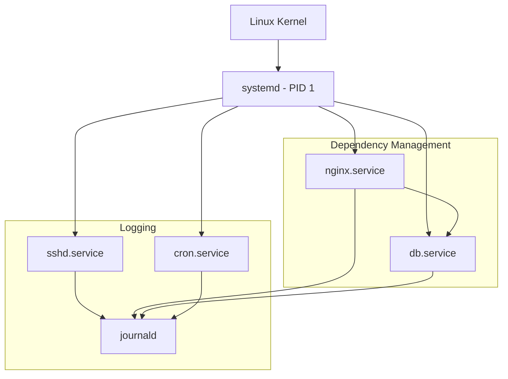

# Service Management with systemd

Version: 1.0.0
Last Updated: 2026-03-09
Prerequisites: Process Management

## 1. Introduction to systemd and Daemons

### Story Introduction

Imagine a **Modern Smart City**.

Instead of every citizen having to manually turn on their own streetlights, fetch their own water, and manage their own trash, the city has a **Utility Department (systemd)**.

*   **Daemons (Services)**: These are the background workers. The "Water Service" runs 24/7. You don't see the workers, but the water (the service) is always available when you turn on the tap.
*   **The Manager (PID 1)**: This is the first person who arrives at the City Hall in the morning. They are responsible for starting every other department in the correct order (e.g., "Don't start the Fire Department until the Water Service is running").
*   **Self-Healing**: If the "Electricity Service" suddenly crashes, the Manager detects it immediately and restarts it without you even noticing.

In the old days of Linux (System V Init), the Manager was just an old man with a long list of scripts. **systemd** is the modern, automated control center.

### Concept Explanation

**systemd** is an init system and system manager that has become the standard for most Linux distributions (Ubuntu, RHEL, Debian, CentOS).

#### Key Functions of systemd:
1.  **Bootstrapping**: It is the first process to start (PID 1) and starts all other processes.
2.  **Service Management**: It starts, stops, and restarts background services (Daemons).
3.  **Dependency Management**: It ensures that if Service B needs Service A, Service A starts first.
4.  **Parallelism**: Unlike older systems that started services one by one, systemd starts as many as possible at the same time, making the boot process much faster.
5.  **Logging**: It includes `journalctl` for centralized logging of all services.

#### What is a Daemon?
A daemon is a computer program that runs as a background process, rather than being under the direct control of an interactive user. In Linux, their names often end with a `d` (e.g., `sshd`, `httpd`, `dockerd`).

### Diagram



### Real World Usage

In **Production Server Management**, we almost never run applications by simply typing `./app`. Instead, we wrap them in a systemd service. This ensures that if the server reboots (due to a power failure), the application starts up automatically. It also ensures that if the application crashes due to a "Memory Leak," systemd will notice and restart it automatically.

### Exercises

1.  **Beginner**: Run `ps -p 1`. What is the name of the process with PID 1 on your system?
2.  **Intermediate**: Why is "Parallelism" in an init system better than "Sequential" startup?
3.  **Advanced**: In the context of systemd, what is a "Target" (e.g., `multi-user.target`)? How does it differ from a "Service"?

## 2. Managing Services with systemctl

### Concept Explanation

`systemctl` is the primary tool used to introspect and control the `systemd` system and service manager.

#### The 5 Primary Operations:
1.  **`start`**: Run a service immediately.
2.  **`stop`**: Terminate a running service.
3.  **`restart`**: Stop and then start a service (useful for clearing errors).
4.  **`reload`**: Ask a service to refresh its config without stopping.
5.  **`status`**: Check if a service is running, its PID, and recent log entries.

#### Persistence (Boot Behavior):
*   **`enable`**: Configure a service to start automatically whenever the server boots.
*   **`disable`**: Prevent a service from starting at boot.

### Code Example

```bash
# Check the status of the SSH service
systemctl status ssh

# Start the Nginx web server
sudo systemctl start nginx

# Ensure Nginx starts automatically on every reboot
sudo systemctl enable nginx

# List all running services
systemctl list-units --type=service --state=running

# Check if a specific service is enabled to start at boot
systemctl is-enabled nginx
```

### Explanation

*   **`status`**: This is your best friend for debugging. If a service fails to start, `systemctl status` will often show the exact error message or a snippet of the logs.
*   **`enable` vs `start`**: This is a common point of confusion for beginners. `start` affects the **now**; `enable` affects the **future** (reboots). You usually want to run both.
*   **`mask`**: A more powerful version of `disable`. It prevents a service from being started either manually or by another service.

### Exercises

1.  **Beginner**: Restart the `network-manager` (or `systemd-resolved`) service on your machine.
2.  **Intermediate**: What is the difference between `systemctl restart` and `systemctl reload`? In a production environment, which one is safer, and why?
3.  **Advanced**: A service is failing to start. You run `systemctl status`, but the output is truncated. Which command would you use to see the full, untruncated logs? (Hint: See section 4).

## 3. Creating Custom Systemd Unit Files

### Concept Explanation

A **Unit File** is a plain text configuration file that tells `systemd` how to run your application. Unit files for user services are usually stored in `/etc/systemd/system/`.

#### Key Sections of a Unit File:
1.  **`[Unit]`**: Metadata and dependencies.
2.  **`[Service]`**: The actual command to run, the user to run as, and restart policies.
3.  **`[Install]`**: How the service should be enabled.

### Code Example

Here is a simple unit file for a Python script located at `/opt/myapp/app.py`:

```ini
[Unit]
Description=My Awesome Python App
After=network.target

[Service]
ExecStart=/usr/bin/python3 /opt/myapp/app.py
Restart=always
User=webapp
Group=webapp
Environment=PORT=8080

[Install]
WantedBy=multi-user.target
```

### Explanation

*   **`After=network.target`**: Don't start this app until the network is ready.
*   **`ExecStart`**: The full path to the command that starts your app.
*   **`Restart=always`**: If the app crashes, systemd will wait a few seconds and then start it again. Forever. This is "Self-Healing."
*   **`WantedBy=multi-user.target`**: This is standard for services that should start during a normal boot.

### Real World Usage

In **Modern Cloud-Native Apps**, we use systemd unit files to manage everything from sidecar processes to the docker daemon itself. Even tools like **Nginx** and **PostgreSQL** come with their own systemd unit files that the package manager installs for you.

### Exercises

1.  **Beginner**: Where are custom systemd unit files usually stored on a Linux system?
2.  **Intermediate**: What does `Restart=always` do? Why is it dangerous if your app has a "Crash Loop" (errors immediately upon starting)?
3.  **Advanced**: Create a unit file for a script that MUST start only *after* the database service (`postgresql.service`) is active. Which field in the `[Unit]` section do you modify?

## 4. Analyzing System Logs with journalctl

### Concept Explanation

`journalctl` is the tool used for querying and displaying logs from `journald`, systemd's logging service. It collects logs from the kernel, system services, and the boot process into a single, centralized, binary location.

### Code Example

```bash
# View all logs in the system
journalctl

# View logs for a specific service (e.g., Nginx)
journalctl -u nginx

# View logs from the current boot only
journalctl -b

# Follow logs in real-time (like 'tail -f')
journalctl -f

# View logs for a specific time range
journalctl --since "2026-03-09 10:00:00" --until "2026-03-09 10:30:00"

# View logs with a specific priority (errors only)
journalctl -p err
```

### Step-by-Step Walkthroughs

#### 1. Checking Service Health (`systemctl status`)
*   **`systemctl`**: "System Control".
*   **`status`**: Shows the current state (Active, Inactive, Failed).
*   **`Loaded`**: Tells you the path to the unit file.
*   **`Drop-In`**: Shows if there are any "Overriding" config files.
*   **`Logs`**: The last few lines of the journal for this specific service.

#### 2. The Persistence Workflow (`enable` vs `start`)
*   **`sudo systemctl start nginx`**: The engine starts running **now**. If you reboot the car, the engine won't start automatically.
*   **`sudo systemctl enable nginx`**: Tells the computer, "Every time you turn on, start Nginx." It doesn't start the engine **now**.
*   **Pro Tip**: You can use `sudo systemctl enable --now nginx` to do both at once!

#### 3. Analyzing Logs with `journalctl -u`
*   **`-u`**: Filter by Unit.
*   **`-f`**: Follow. It's like a live feed of the service's diary. If you start a service and it crashes, the reason will appear here in real-time.

### Best Practices

1.  **Never run as Root**: In your `[Service]` section, always specify a non-root user (e.g., `User=webapp`). This limits the damage if your app is hacked.
2.  **Use `Restart=always`**: This is the heart of self-healing. Set a `RestartSec=5` so the system doesn't try to restart a broken app 1,000 times a second.
3.  **Standardize Unit File Locations**: Keep your custom files in `/etc/systemd/system/`. Never edit the files in `/lib/systemd/system/` as they are owned by the package manager and will be overwritten during updates.
4.  **Reload after Edit**: Every time you change a unit file, you **must** run `sudo systemctl daemon-reload` so systemd notices the changes.

### Common Mistakes

*   **Forgetting `daemon-reload`**: Editing a file and wondering why `systemctl restart` isn't using the new settings.
*   **Bad File Paths**: Using relative paths (e.g., `ExecStart=python app.py`) in your unit file. systemd doesn't know where "you" are. Always use absolute paths (e.g., `/usr/bin/python3 /opt/app/app.py`).
*   **Infinite Restart Loops**: If an app crashes because of a missing config file, `Restart=always` will keep trying forever. Check your logs with `journalctl` to find the root cause.
*   **Assuming `start` also `enables`**: Deploying a server and then being surprised that nothing is running after a reboot.

### Exercises

1.  **Beginner**: How do you see only the most recent 10 lines of the system logs?
2.  **Intermediate**: How would you find all occurrences of the word "denied" in the logs from the last hour?
3.  **Advanced**: Why does `systemd` store logs in a binary format instead of plain text files? What are the advantages for a developer trying to filter logs?

## Mini Projects

## Mini Projects

### Beginner: Create a "Hello World" Background Service

**Problem**: You want to learn how to turn a script into a managed service.
**Task**: Write a simple Bash script that appends "Hello World" and the current date to a file every 10 seconds. Create a systemd unit file for it. Start and enable the service.
**Deliverable**: The unit file and a tail of the output file showing the service is running in the background.

### Intermediate: Automate a Python Web Server with systemd

**Problem**: You have a FastAPI application that you want to run as a reliable service on a server.
**Task**: Create a system user `fastapi_user`. Set up a Python virtual environment. Create a systemd unit file that starts the server using `uvicorn` and automatically restarts if the server crashes.
**Deliverable**: A status report showing the service running as the `fastapi_user` and the systemd logs showing a successful restart after a manual `kill`.

### Advanced: Design a self-healing multi-service architecture

**Problem**: You have a backend service and a database service. The backend *must* wait for the database to be ready before starting.
**Task**: Create two unit files. Use the `After=` and `Requires=` directives to link them. Implement a health-check script for the database and use `ExecStartPre` in the backend service to wait for the health-check to pass.
**Deliverable**: A session log showing that starting the backend automatically triggers the database start, and the backend waits for the database to be fully "Healthy" before its own process begins.
