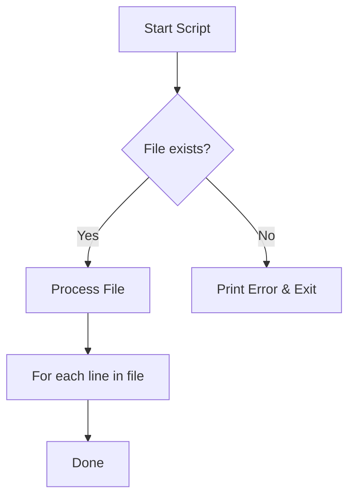

# Control Flow and Functions: The Script's Brain

Version: 1.0.0
Last Updated: 2026-03-09
Prerequisites: Module 3.1 (Bash Fundamentals)

## 1. Decision Making (If/Else)

### Story Introduction

Imagine **A Security Guard at a Gate**.

The guard has a set of instructions:
1.  **Check if** the person has a badge.
2.  **If they do**, unlock the gate.
3.  **Otherwise**, call the supervisor.

In Bash, this is the `if-then-else` statement. We use "tests" (square brackets `[ ]`) to check conditions like "Does this file exist?" or "Is this number greater than 10?"

### Concept Explanation

Control flow allows your script to make decisions and repeat tasks.

#### The `if` Statement:
```bash
if [ condition ]; then
    # Do something
else
    # Do something else
fi
```
*   **Standard Tests**:
    *   `-f file`: True if file exists and is a regular file.
    *   `-d dir`: True if directory exists.
    *   `-z string`: True if string is empty.
    *   `$val1 -gt $val2`: True if val1 is greater than val2.

### Code Example

```bash
#!/bin/bash
# logic_and_loops.sh

# 1. If/Else Logic
FILE="/etc/passwd"
if [ -f "$FILE" ]; then
    echo "$FILE exists. Proceeding with backup..."
else
    echo "ERROR: $FILE not found!"
    exit 1
fi

# 2. For Loops
echo "Listing numbers 1 to 3:"
for i in 1 2 3; do
    echo "Number: $i"
done

# 3. Functions
greet_user() {
    local name=$1
    echo "Hello, $name! I am a helper function."
}

greet_user "Abhishek"
```

### Step-by-Step Walkthrough

1.  **`if [ -f "$FILE" ]`**: The `-f` is a "Unary operator." It looks at the path in `$FILE` and asks the OS if it's a real file.
2.  **`exit 1`**: This is a **Return Code**. In Linux, `0` means success and anything else (like `1`) means failure. This stops the script immediately so it doesn't try to backup a non-existent file.
3.  **`local name=$1`**: Functions use "Positional Parameters." `$1` is the first word after the function name. Using `local` ensures that the variable `name` only exists inside the function.

### Diagram



### Real World Usage

In **Cloud Provisioning (Terraform/Ansible)**, we often use shell scripts to perform "Sanity Checks." Before installing a heavy database, the script checks if there is enough disk space. If `df` returns a value lower than required, the `if` statement triggers an exit, saving you from a half-broken installation.

### Best Practices

1.  **Always use `[[ ]]` instead of `[ ]`**: In modern Bash, double brackets are safer and handle empty variables/special characters better.
2.  **Indentation is Key**: Always indent the code inside your `if` and `for` blocks. It makes reading 100-line scripts possible.
3.  **Return meaningful codes**: Don't just `exit`. Use different numbers for different errors (e.g., 1 for "File not found," 2 for "Permission denied").

### Common Mistakes

*   **Missing spaces in `[ ]`**: Writing `if [$A == $B]` instead of `if [ $A == $B ]`. The spaces are mandatory!
*   **Infinite While Loops**: Forgetting to update the variable in a `while` loop, causing the script to run forever and crash the CPU.
*   **Forgetting `fi` or `done`**: Bash is very strict. Every `if` needs a `fi`, and every `for/while` needs a `done`.

### Exercises

1.  **Beginner**: Write a script that checks if a directory called `test_dir` exists. If not, create it.
2.  **Intermediate**: Write a `for` loop that renames all `.txt` files in a folder to `.bak`.
3.  **Advanced**: Create a function that takes a number as an argument and returns its square.

### Mini Projects

#### Beginner: The "Odd or Even" Checker
**Task**: Write a script that asks the user for a number. Use the modulo operator `%` in an `if` statement to tell the user if the number is odd or even.
**Deliverable**: The `parity.sh` script.

#### Intermediate: The "User Onboarder"
**Task**: Create a script that takes a list of usernames as arguments. For each username, check if the user already exists on the system. If not, print "User [NAME] can be created."
**Deliverable**: A script that uses a `for` loop and an `if` statement to audit system users.

#### Advanced: The Backup Service Function
**Task**: Write a script with a function called `backup_file()`. This function should take a filename, check its size, and only create a `.tar.gz` backup if the file is smaller than 1MB. Use global variables for the backup destination.
**Deliverable**: A robust script showing function usage, conditional logic, and external tool integration (`tar`).
