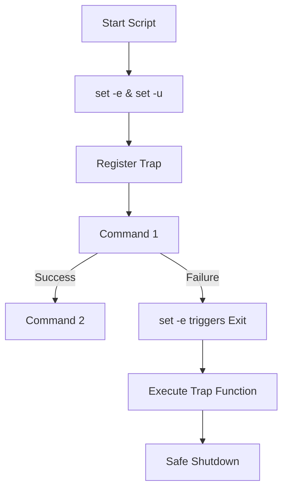

# Logging and Error Handling: The Safety Net

Version: 1.0.0
Last Updated: 2026-03-09
Prerequisites: Module 3.1 - 3.4

## 1. Exit Codes and Error Traps

### Story Introduction

Imagine **A Flight Recorder (Black Box) on an Airplane**.

If the plane flies perfectly, the recorder just sits there, quietly taking notes. But if an engine fails, the recorder instantly captures exactly what happened, what time it happened, and which button the pilot pressed.

When you land, you don't just say "The flight was fine." You look at the logs to ensure it *stays* fine.

In Bash, **Exit Codes** are the "Status Report" of every command. **Traps** are the "Emergency Sensors" that catch a crash before the whole script burns down.

### Concept Explanation

Every command in Linux returns an **Exit Status** (a number between 0 and 255).
*   **`0`**: Success.
*   **Non-zero**: Failure (e.g., `1` for general error, `127` for command not found).

#### Error Handling Tools:
*   **`set -e`**: Tells the script to "Exit immediately" if any command fails. This is the most common safety setting.
*   **`set -u`**: Exit if you try to use an undefined variable (prevents dangerous typos like `rm -rf $MISPELLED_VAR/`).
*   **`trap`**: Executes a command when the script receives a signal (like a crash or a user pressing Ctrl+C). It's used for cleaning up temporary files.

### Code Example

```bash
#!/bin/bash
# robustness.sh

# 1. Safety Settings
set -e # Exit on error
set -u # Exit on unset variables

# 2. The Trap (Cleanup logic)
cleanup() {
    echo "CLEANUP: Removing temporary files..."
    rm -f /tmp/data.*
}
trap cleanup EXIT # Run cleanup whenever the script exits

# 3. Checking Exit Codes
ls /folder_that_does_not_exist || echo "Warning: Folder not found, but I caught it!"

# 4. Custom Error Function
error_exit() {
    echo "CRITICAL ERROR: $1" >&2
    exit 1
}

if [ ! -d "/opt/app" ]; then
    error_exit "Directory /opt/app is missing!"
fi
```

### Step-by-Step Walkthrough

1.  **`set -e`**: This is your "Automated Guard." Without this, if a command fails, Bash just moves to the next line. With this, the script stops instantly, preventing a "Chain Reaction" of failures.
2.  **`trap cleanup EXIT`**: This registers the `cleanup` function. Even if the script crashes halfway through, Bash ensures that `cleanup` runs before the process disappears.
3.  **`|| echo ...`**: The "OR" operator. If the first command fails, the second one runs. This is how you "Catch" and handle specific errors without stopping the whole script.
4.  **`>&2`**: Redirects the message to **stderr**. This ensures your error messages don't get mixed up with your normal data output.

### Diagram



### Real World Usage

In **Database Migrations**, we use `set -e` religiously. If the command to "Connect to DB" fails, we *must not* run the "Delete Old Data" command. Error handling ensures that a system either updates perfectly or doesn't update at all (Atomicity).

### Best Practices

1.  **Use `set -euo pipefail`**: This identifies errors even if they happen inside a pipe (the "Holy Trinity" of Bash safety).
2.  **Log with Timestamps**: Always include `date +'%Y-%m-%d %H:%M:%S'` in your log messages. A log without a time is useless for debugging.
3.  **Clean up /tmp**: Always use a `trap` to delete any temporary files your script created.
4.  **Check for Root**: If your script requires root, check at the very beginning: `if [ "$EUID" -ne 0 ]; then echo "Please run as root"; exit 1; fi`.

### Common Mistakes

*   **Silent Failures**: Not checking exit codes and assuming everything worked.
*   **Ignoring stderr**: Only logging stdout, so when a command crashes, the error message is lost forever.
*   **Dangerous Cleanup**: Using `rm -rf $VAR/*` in a trap. If `$VAR` is empty for some reason, the script might try to delete everything in your root directory! (Always use `set -u` to prevent this).

### Exercises

1.  **Beginner**: How do you check the exit code of the very last command you ran?
2.  **Intermediate**: What does `set -o pipefail` do differently than just `set -e`?
3.  **Advanced**: Write a `trap` that sends a message to a log file only if the script crashes (receives a `SIGTERM` or `ERR`), but not if it finishes successfully.

### Mini Projects

#### Beginner: The "Exit Code" Explorer
**Task**: Try running `ls`, then `ls /nonexistent`. After each command, run `echo $?`. Record the numbers you see.
**Deliverable**: A short list showing the exit codes for success vs. failure.

#### Intermediate: The Robust Backup Script
**Task**: Write a script that tries to compress a folder. Use `set -e` and a `trap` that prints "Backup Failed!" if the compression doesn't finish.
**Deliverable**: A script that demonstrates that the "Failed" message only appears if you interrupt the script (Ctrl+C).

#### Advanced: The Centralized Logger
**Task**: Create a function called `log_msg()` that takes a message and a "Level" (INFO, WARN, ERROR) as arguments. It should write to a file `app.log` in the format: `[YYYY-MM-DD HH:MM:SS] [LEVEL] Message`.
**Deliverable**: A reusable logging module you can copy into any future Bash script.
