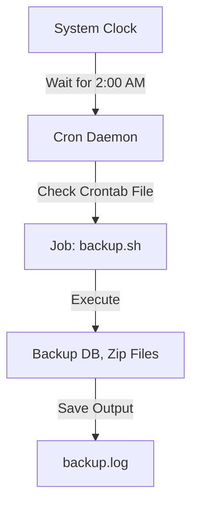

# System Automation: The Digital Servant

Version: 1.0.0
Last Updated: 2026-03-09
Prerequisites: Module 3.1 - 3.3

## 1. Scheduling with Cron

### Story Introduction

Imagine **An Alarm Clock with a Built-in Robot**.

You set the alarm for 2:00 AM every Sunday. When the alarm goes off, instead of just making a noise, the robot wakes up, walks to the basement, and starts backing up all your important files. 

The robot doesn't complain about the late hour, it doesn't forget, and it does the job exactly the same way every time.

In Linux, this "Robot" is called **Cron**. You give it a schedule (the crontab), and it executes your scripts automatically while you sleep.

### Concept Explanation

**Cron** is a time-based job scheduler. It runs a daemon (`crond`) that checks every minute if there are any tasks to be performed.

#### The Crontab Syntax (The 5 Stars):
`* * * * * command_to_execute`
1.  **Minute** (0-59)
2.  **Hour** (0-23)
3.  **Day of the month** (1-31)
4.  **Month** (1-12)
5.  **Day of the week** (0-6, where 0 is Sunday)

Example: `0 2 * * 0 /path/to/backup.sh` (2:00 AM every Sunday).

### Code Example

```bash
# 1. Edit your crontab
crontab -e

# 2. Add these lines to the file:

# Run a backup script every day at midnight
0 0 * * * /home/abhishek/scripts/daily_backup.sh >> /home/abhishek/logs/backup.log 2>&1

# Clear temporary files every hour
0 * * * * /usr/bin/find /tmp -type f -atime +1 -delete

# 3. View your active jobs
crontab -l
```

### Step-by-Step Walkthrough

1.  **`crontab -e`**: This opens your personal schedule file in a text editor (usually Vim or Nano).
2.  **`0 0 * * *`**: The first two zeros signify the "0th minute of the 0th hour." This is 12:00 AM.
3.  **`>> ... 2>&1`**: This is critical for automation. Since there is no screen for a cron job to print to, we redirect the "Regular Output" (`>>`) and the "Error Output" (`2>&1`) to a log file.
4.  **`find ... -delete`**: This is a powerful "one-liner" being automated. It finds files older than 1 day and removes them.

### Diagram



### Real World Usage

In **Site Reliability Engineering (SRE)**, we use automation for "Housekeeping." For example, a system might generate 10GB of logs every day. A cron job runs every night to compress old logs and move them to cheaper storage (like AWS S3). Without this automation, the server's disk would fill up, causing a global outage.

### Best Practices

1.  **Use Absolute Paths**: Cron has a very limited "Environment." It doesn't know where `/usr/local/bin` is. Always use `/usr/bin/python3` instead of just `python3`.
2.  **Log Everything**: Always use redirection so you can debug why a script failed at 3 AM.
3.  **Test Manually First**: Run your script in your terminal exactly as cron would before adding it to the crontab.
4.  **Use Crontab.guru**: Use online visualizers to verify your `* * * * *` syntax is correct.

### Common Mistakes

*   **Forgetting the Shebang**: Cron doesn't know your script is a Bash script unless you have `#!/bin/bash` on the first line.
*   **Permisson Denied**: Forgetting to run `chmod +x` on the script you want cron to execute.
*   **Incorrect Pathing**: Using relative paths like `./config.txt` inside your script. Cron runs from the user's home directory by default. Use absolute paths!

### Exercises

1.  **Beginner**: Write a crontab entry that runs a script every Monday at 8 AM.
2.  **Intermediate**: What does the entry `*/5 * * * *` do?
3.  **Advanced**: How can you prevent a cron job from running if the previous instance of that same job is still running? (Hint: See the `flock` command).

### Mini Projects

#### Beginner: The "Hourly Heartbeat"
**Task**: Create a script that prints "I am alive" and the current timestamp to a file. Schedule it to run every hour using `crontab`.
**Deliverable**: The script and the output of `crontab -l`.

#### Intermediate: The Automated Log Rotator
**Task**: Write a script that checks a log file's size. If the file is larger than 100KB, rename it to `log.1` and create a fresh `log` file. Schedule this to run every midnight.
**Deliverable**: A robust script that handles file renaming and fresh file creation.

#### Advanced: The Website Uptime Monitor
**Task**: Write a script that `curl`s your favorite website. If it gets an error, it should log the error and send a system notification (or write to a central server log). Schedule it to run every 5 minutes.
**Deliverable**: A "Watcher" script and the crontab entry that ensures it checks the site 288 times a day.
