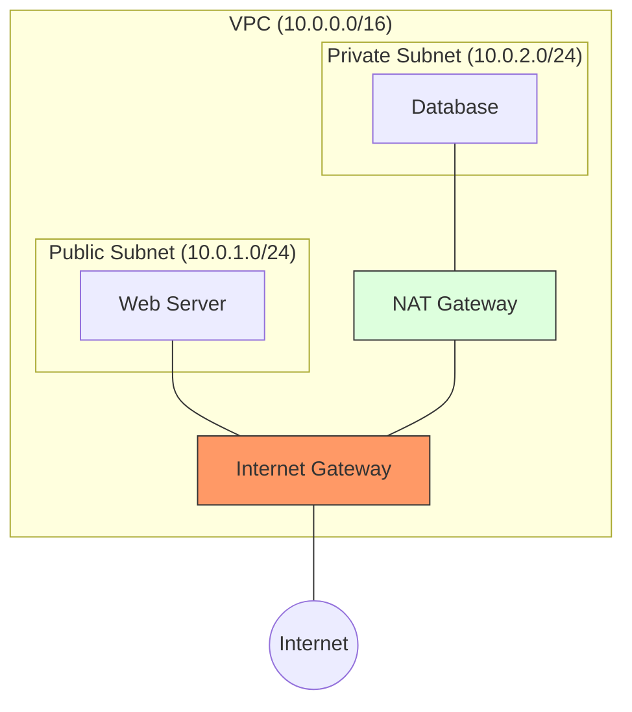

# Cloud Networking: The Virtual Private Cloud

Version: 1.0.0
Last Updated: 2026-03-09
Prerequisites: Module 4.1 - 4.4

## 1. VPC, Subnets, and Routing

### Story Introduction

Imagine **Building your own Private Gated Community**.

1.  **VPC (Virtual Private Cloud)**: This is the outer fence around your entire community. No one gets in or out without your permission.
2.  **Subnets**: These are the individual streets inside the community.
    *   **Public Subnet**: The street with the shops and visitors' center. Anyone can drive here (e.g., your Web Servers).
    *   **Private Subnet**: The residential street where people live. No tourists allowed (e.g., your Database Servers).
3.  **Internet Gateway (IGW)**: This is the main gate of the community. It connects your "Public Subnet" to the "Outside World."
4.  **Route Table**: The GPS of your community. It tells cars, "If you want to go to the internet, head toward the Internet Gateway."

### Concept Explanation

In the cloud, networking is **Software Defined (SDN)**. You don't plug in cables; you write configuration.

#### Core VPC Components:
*   **VPC**: A private network space (e.g., `10.0.0.0/16`).
*   **Subnet**: A slice of the VPC (e.g., `10.0.1.0/24`).
*   **CIDR Notation**: A fancy way to say "How many IP addresses are in this range?"
    *   `/16` = 65,536 IPs (Big).
    *   `/24` = 256 IPs (Medium).
    *   `/32` = 1 IP (Only one machine).
*   **Internet Gateway**: Provides a target in your VPC route tables for internet-routable traffic.
*   **NAT Gateway**: Allows servers in a **Private Subnet** to talk *out* to the internet (to download updates) without allowing the internet to talk *in* to them.

### Code Example (Terraform - The Cloud "Cabling")

```hcl
# Create a VPC
resource "aws_vpc" "main" {
  cidr_block = "10.0.0.0/16"
}

# Create a Public Subnet
resource "aws_subnet" "public" {
  vpc_id     = aws_vpc.main.id
  cidr_block = "10.0.1.0/24"
}

# Create a Private Subnet
resource "aws_subnet" "private" {
  vpc_id     = aws_vpc.main.id
  cidr_block = "10.0.2.0/24"
}
```

### Step-by-Step Walkthrough

1.  **`cidr_block = "10.0.0.0/16"`**: This defines the "Gated Community" size.
2.  **`vpc_id = aws_vpc.main.id`**: This "wires" the subnet into the VPC.
3.  **Tiering**: Notice we have a `.1.0` and a `.2.0` range. We will later configure the `.1.0` to be Public and the `.2.0` to be Private using **Route Tables**.

### Diagram



### Real World Usage

In **FinTech (Banking Apps)**, data security is law. They use **VPC Peering** or **Transit Gateways** to connect different parts of their cloud. They might have one VPC for "Payment Processing" and another for "User Profiles." These VPCs are completely isolated, and data only flows between them through strictly monitored "Tunnels."

### Best Practices

1.  **Plan your CIDR carefully**: Don't use `10.0.0.0/16` if your home office also uses `10.0.0.0/16`—the networks will "overlap" and you won't be able to connect them!
2.  **Use Multi-AZ (Availability Zones)**: Put half your subnets in one "Data Center" and the other half in another. If one data center has a fire, your app keeps running.
3.  **Segment by Environment**: Have a "Dev VPC" and a "Prod VPC" that are totally separate. A developer should never be able to accidentally delete the production database because they were on the wrong network.

### Common Mistakes

*   **Public Databases**: Putting your database in a Public Subnet (with an Internet Gateway). This is how most data breaches happen.
*   **Network Overlap**: Trying to connect two clouds (AWS and Google) that use the exact same IP ranges.
*   **NAT Gateway Costs**: Forgetting that NAT Gateways cost money per hour. For small dev projects, use a cheaper "NAT Instance" or just download updates manually.

### Exercises

1.  **Beginner**: What is the purpose of an Internet Gateway?
2.  **Intermediate**: How many IP addresses are available in a `/24` subnet?
3.  **Advanced**: Why would you use a "Transit Gateway" instead of multiple "VPC Peering" connections?

### Mini Projects

#### Beginner: CIDR Calculator
**Task**: Use an online CIDR calculator (like `cidr.xyz`). Find out the starting and ending IP addresses for `192.168.1.0/27`.
**Deliverable**: The range of IPs and the total count of usable addresses (hint: Cloud providers reserve 5 IPs).

#### Intermediate: Architectural Design
**Task**: Draw a diagram for a "3-Tier App" in a VPC. It should have a Public Subnet for the Load Balancer, a Private Subnet for the Application, and a "Database Subnet" for the DB.
**Deliverable**: A hand-drawn or digital diagram showing the routing logic between the three tiers.

#### Advanced: VPC Terraform Implementation
**Task**: Using the code example from earlier, write a complete Terraform script that creates a VPC, an Internet Gateway, and a Route Table that connects a Public Subnet to the internet.
**Deliverable**: A `.tf` file ready to be run with `terraform plan`.
