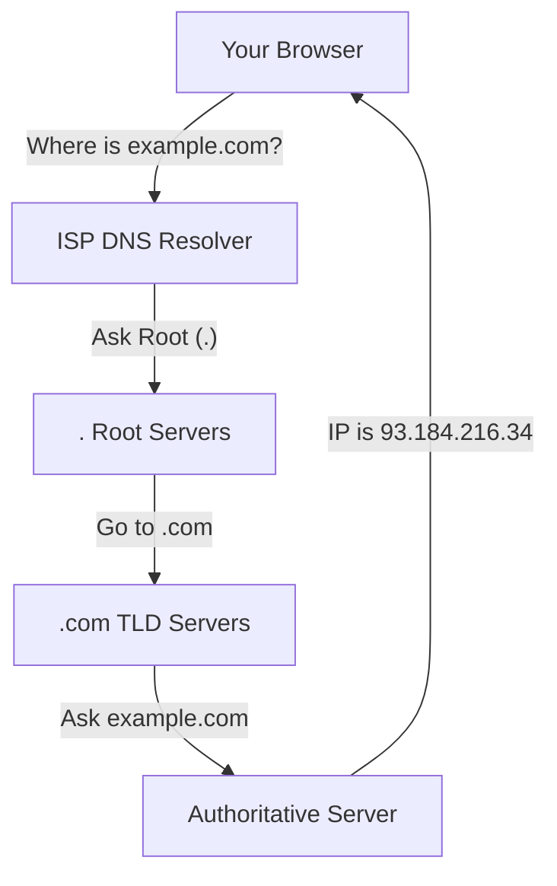

# DNS and Web Protocols: The Internet's Switchboard

Version: 1.0.0
Last Updated: 2026-03-09
Prerequisites: Module 4.1 (OSI and TCP/IP)

## 1. DNS: The Internet's Phonebook

### Story Introduction

Imagine **Trying to Find a Friend's House in a Giant City**.

1.  **You**: "I want to go to Bob's house."
2.  **The Phonebook (DNS)**: You look up "Bob" and find out his address is "123 Maple St."
3.  **The Hierarchy**:
    *   If you don't have the book, you ask the **Local Library (Recursive Resolver)**.
    *   If they don't know, they ask the **Central Records Office (...)**.
    *   Eventually, someone points you to the **Specific Neighborhood Records (.com)**.
    *   Finally, you get the answer from **Bob's Personal Records (Authoritative Name Server)**.

Without the phonebook, you'd have to memorize numbers like `142.250.190.46` for every person you wanted to visit.

### Concept Explanation

**DNS (Domain Name System)** translates human-readable names (google.com) into machine-readable IP addresses.

#### Common Record Types:
*   **A Record**: Points a name to an IPv4 address.
*   **AAAA Record**: Points a name to an IPv6 address.
*   **CNAME (Canonical Name)**: An alias. Points one name to another name (e.g., `www.example.com` -> `example.com`).
*   **MX (Mail Exchange)**: Tells the world where to send emails for that domain.
*   **TXT**: Used for verification (like proving you own the domain to Google or Microsoft).

---

## 2. HTTP and HTTPS: The Language of the Web

### Concept Explanation

**HTTP (HyperText Transfer Protocol)** is how your browser and a web server talk to each other.
**HTTPS** is the same thing, but it uses **TLS (Transport Layer Security)** to encrypt the conversation so hackers can't "eavesdrop" on your passwords.

#### The Evolution:
*   **HTTP/1.1**: One request at a time. Like a waiter who only brings one plate and then goes back to the kitchen.
*   **HTTP/2**: Multiple requests over one connection (Multiplexing). Like a waiter with a giant tray bringing 10 plates at once.
*   **HTTP/3**: Uses QUIC (UDP-based) to make connections even faster, especially on unstable mobile networks.

### Code Example (Inspecting a Web Request)

```bash
# Use curl to see the raw HTTP response headers
curl -I https://www.google.com

# Use dig to trace a DNS lookup
dig +trace google.com
```

### Step-by-Step Walkthrough

1.  **`curl -I`**: The `-I` flag tells curl to fetch the **Headers**. You'll see `HTTP/2 200`. `200` is the "Success" code. If you see `404`, the page is missing. If you see `500`, the server is broken.
2.  **`dig +trace`**: This shows you the "Hierarchy" in action. It starts at the **Root Servers (`.`)**, goes to the **Top Level Domain (`.com`)**, and finally hits the **Authoritative servers** for Google.

### Diagram



### Real World Usage

In **Site Reliability Engineering (SRE)**, we use **Global Server Load Balancing (GSLB)** based on DNS. If you are in India, the DNS will give you the IP of a server in Mumbai. If you are in New York, the same name (`google.com`) will give you the IP of a server in Virginia. This reduces latency for the user.

### Best Practices

1.  **Always use HTTPS**: There is no excuse for using plain HTTP in 2026. Use tools like **Let's Encrypt** for free SSL certificates.
2.  **Short TTLs for Migrations**: The TTL (Time To Live) tells DNS how long to "cache" an address. If you are moving servers, lower your TTL to 60 seconds so users switch to the new IP quickly.
3.  **Use CNAMEs for Flexibility**: Point your `www` to your main record using a CNAME so you only have to update one IP address in the future.

### Common Mistakes

*   **DNS Propagation Latency**: Thinking a DNS change is "Instant." It can take up to 48 hours for the whole world to see a new record if your TTL was high.
*   **Mixed Content Errors**: Loading a website over HTTPS but trying to load an image or script inside it over plain HTTP. Most browsers will block this for security.
*   **Missing MX Records**: Setting up a web server but forgetting the MX records, leading to all your business emails bouncing.

### Exercises

1.  **Beginner**: What is the difference between an 'A' record and a 'CNAME' record?
2.  **Intermediate**: Run `curl -v http://example.com`. Look for the "Location" header. What does it tell you about how the web server handles plain HTTP traffic?
3.  **Advanced**: Why does HTTP/3 use UDP instead of TCP? (Hint: Think about "Head-of-Line Blocking").

### Mini Projects

#### Beginner: The DNS Detective
**Task**: Use the `nslookup` or `dig` command to find the IP address of your favorite news website.
**Deliverable**: The IP address and a 1-sentence explanation of which record type (A or AAAA) you found.

#### Intermediate: SSL Certificate Audit
**Task**: Use the command `openssl s_client -connect google.com:443` to view the details of an SSL certificate. Find the "Expiry Date".
**Deliverable**: A screenshot or log showing when the certificate for that site will expire.

#### Advanced: Design a Global DNS Strategy
**Task**: You have a startup with users in the USA and Europe. You have two servers. Describe how you would set up your DNS so that users are automatically routed to the closest server.
**Deliverable**: A simple architectural diagram showing the DNS records and the routing logic.
