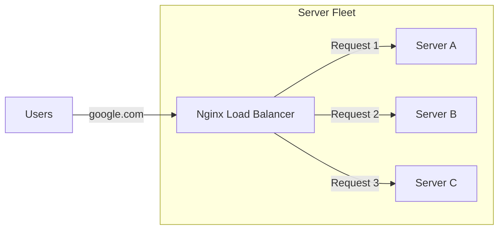

# Proxy and Load Balancing: Traffic Control

Version: 1.0.0
Last Updated: 2026-03-09
Prerequisites: Module 4.1 & 4.2

## 1. Forward vs Reverse Proxy

### Story Introduction

Imagine **A Private Secretary in a Large Office**.

1.  **Forward Proxy**: You (The Client) want to write a letter to someone anonymously. You give your letter to the Secretary (The Proxy), and she sends it from her own desk. The recipient only sees the Secretary's name, not yours. (Used for: Bypassing firewalls, privacy).
2.  **Reverse Proxy**: You (The Client) want to talk to a giant company (Google). You talk to the receptionist. You don't know who is actually answering your question in the back office—it could be a team of 100 people. The receptionist (The Reverse Proxy) handles the talk and passes you the answer. (Used for: Security, Performance, Load Balancing).

### Concept Explanation

A **Proxy** is an intermediate server that acts on behalf of another.

#### Forward Proxy:
*   **Goal**: Protect the Client.
*   **Usage**: Filters web traffic in schools/offices, hides the user's IP address.

#### Reverse Proxy:
*   **Goal**: Protect the Server.
*   **Usage**: 
    *   **SSL Termination**: The proxy handles the heavy encryption, leaving the app server free to process logic.
    *   **Caching**: The proxy saves copies of common pages to serve them instantly.
    *   **Security**: Hides the real IP address of the application server.

---

## 2. Load Balancing Algorithms

### Concept Explanation

When one server is too busy, you need a **Load Balancer (LB)** to share the work among a fleet of servers. But how does it decide who gets the next user?

#### Common Algorithms:
1.  **Round Robin**: The "Simple Rotation." Next server in the list gets the next request (Server A -> B -> C -> A).
2.  **Least Connections**: Sends the next user to the server that is currently doing the least amount of work.
3.  **IP Hash**: Ensures that a specific user (based on their IP) always goes to the same server (Important for "Sticky Sessions").

### Code Example (Nginx as Reverse Proxy & Load Balancer)

```nginx
# /etc/nginx/nginx.conf

http {
    upstream my_app_servers {
        server 10.0.0.1; # Server A
        server 10.0.0.2; # Server B
        server 10.0.0.3; # Server C
    }

    server {
        listen 80;

        location / {
            # This makes Nginx a Reverse Proxy
            proxy_pass http://my_app_servers;
            
            # Pass the user's real IP to the app server
            proxy_set_header X-Real-IP $remote_addr;
        }
    }
}
```

### Step-by-Step Walkthrough

1.  **`upstream`**: This block defines the "Pool" of servers that will do the actual work. By default, Nginx uses **Round Robin**.
2.  **`proxy_pass`**: This is the "Magic Command." Instead of looking for a file on its own disk, Nginx "passes" the request to one of the servers in the `my_app_servers` pool.
3.  **`proxy_set_header`**: Because the app server only sees Nginx's IP, we must manually "inject" the real user's IP address into a header so the app can use it for logging or security.

### Diagram



### Real World Usage

**F5, Nginx, and AWS ELB** are the kings of load balancing. Large websites like **amazon.com** use multi-tier load balancing.
1.  **Global LB**: Routes you to the nearest country.
2.  **Regional LB**: Routes you to the nearest data center.
3.  **Application LB**: Routes your specific request (e.g., "Add to Cart") to the specific microservice responsible for shopping carts.

### Best Practices

1.  **Health Checks**: Configure your Load Balancer to ping the app servers every 5 seconds. If a server stops responding, the LB must stop sending users there immediately.
2.  **SSL Termination at the Edge**: Don't waste CPU power on every app server doing encryption. Do it once at the Load Balancer (Reverse Proxy).
3.  **Keep it Stateless**: Try to design your apps so that a user doesn't care which server they hit. If you rely on "Sticky Sessions," scaling becomes harder.

### Common Mistakes

*   **The Single Point of Failure**: Having one Load Balancer but no backup. If the LB dies, the whole site goes down, even if your 100 app servers are fine. (Solution: Use High Availability LBs).
*   **Invisible Real IPs**: Forgetting to set the `X-Real-IP` header, leading to your app logs showing every single user coming from the same IP (the LB's IP).
*   **Zombie Servers**: A server is "up" but its database is "down." If your health check only checks the CPU, the LB will keep sending users to a broken app.

### Exercises

1.  **Beginner**: What is the main difference between a Forward Proxy and a Reverse Proxy?
2.  **Intermediate**: If you have two servers, and one is much more powerful than the other, which Load Balancing algorithm should you use? (Hint: See "Weighted Round Robin").
3.  **Advanced**: How does a Load Balancer handle "Sticky Sessions" (Session Persistence)?

### Mini Projects

#### Beginner: The Proxy Experiment
**Task**: Install a browser extension that acts as a Proxy (or use a free VPN). Check your IP address on `ipchicken.com` before and after.
**Deliverable**: A screenshot or note showing your real IP vs your "Proxy" IP.

#### Intermediate: Nginx Reverse Proxy Setup
**Task**: Install Nginx. Configure it to act as a reverse proxy for another web service (like a Python `simpleHTTPserver` running on port 8000).
**Deliverable**: Your Nginx configuration file and a screenshot showing port 80 serving content from port 8000.

#### Advanced: High Availability Architecture Design
**Task**: Design an architecture for a website that can survive the failure of its Load Balancer. Use two Nginx servers and a "Floating IP" (Keepalived).
**Deliverable**: A network diagram showing how the Floating IP moves from one LB to another during a crash.
