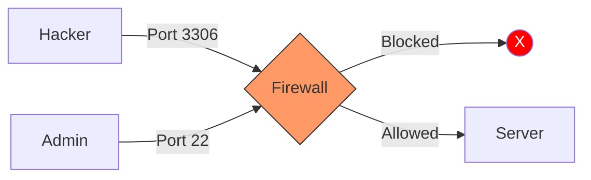

# Security and Firewalls: Protecting the Perimeter

Version: 1.0.0
Last Updated: 2026-03-09
Prerequisites: Module 2.3 & 4.1

## 1. Ports, Protocols, and the "Open Door" Policy

### Story Introduction

Imagine **A High-Security Research Lab**.

The lab has one main entrance IP (The Address). Inside, there are 65,535 different lockers (Ports).
*   **Locker 22 (SSH)**: Only scientists with the master key can open this.
*   **Locker 80 (HTTP)**: A public display window where anyone can look inside.
*   **Locker 443 (HTTPS)**: A secure window where you can talk to a scientist through bulletproof glass.
*   **Locker 3306 (Database)**: This locker is hidden in a dark corner and is welded shut for anyone from the outside world.

A **Firewall** is the security team standing at the front door. They have a list (The Rules) that says exactly who is allowed to touch which locker.

### Concept Explanation

Ports allow a single IP address to host multiple different services.

#### Common Ports every DevOps Engineer must know:
*   **22**: SSH (Remote Access)
*   **80 / 443**: Web Traffic (HTTP/HTTPS)
*   **21**: FTP (File Transfer - outdated/insecure)
*   **53**: DNS
*   **3306**: MySQL Database
*   **5432**: PostgreSQL Database
*   **6379**: Redis Cache

#### The Firewall's Job:
1.  **Ingress (Inbound)**: Traffic coming *into* your server.
2.  **Egress (Outbound)**: Traffic leaving your server to the internet.
3.  **Stateful Inspection**: The firewall remembers that you started a conversation and automatically allows the reply back in.

### Code Example (Configuring UFW)

```bash
# 1. Reset everything to a safe state (block all inbound)
sudo ufw default deny incoming
sudo ufw default allow outgoing

# 2. Open specific "Locker Doors"
sudo ufw allow 22/tcp   # SSH
sudo ufw allow 80/tcp   # HTTP
sudo ufw allow 443/tcp  # HTTPS

# 3. Restrict database access to a specific private IP
sudo ufw allow from 192.168.1.50 to any port 3306

# 4. Final step: Enable!
sudo ufw enable
```

### Step-by-Step Walkthrough

1.  **`default deny incoming`**: This is the "Zero Trust" model. Start by blocking everything, then only open what you absolutely need.
2.  **`allow 22/tcp`**: We specify the port AND the protocol. Most services use TCP.
3.  **`allow from [IP]`**: This is a **Whitelisting** rule. It says "I don't care who you are, if you aren't coming from this specific address, you can't even see the database door."
4.  **`ufw enable`**: Changes don't take effect until you "Turn on the power" to the firewall.

### Diagram



### Real World Usage

In **Cloud Security Groups (AWS/Azure)**, the rules are virtualized. Instead of configuring each individual server's firewall, you create a "Security Group" (a template of rules) and apply it to a fleet of 100 servers at once. This ensures that a single configuration error doesn't leave a "backdoor" open in your production environment.

### Best Practices

1.  **Don't use Default Ports for SSH**: Changing port 22 to something like 2244 reduces 99% of automated "script kiddie" attacks.
2.  **Zero Trust for Databases**: Never, ever make a database port (3306/5432) accessible to the public internet. Use a VPN or SSH Tunnel instead.
3.  **Audit your rules**: Every 6 months, check your firewall rules. If a rule was for a developer who left the company, delete it!
4.  **Log Dropped Packets**: Configure your firewall to log whenever it blocks someone. This helps you identify if you are under a "Brute Force" attack.

### Common Mistakes

*   **Locking yourself out**: Enabling a firewall without first allowing port 22 (SSH). If you do this on a remote server, you lose access forever and have to factory reset the server!
*   **Permissive Rules**: Using `0.0.0.0/0` (The whole internet) for ports that should be private.
*   **Conflict of Rules**: Having one rule that "Allows" and another that "Denies" the same traffic. Firewalls usually process rules from top to bottom; the first match wins.

### Exercises

1.  **Beginner**: Which command shows the current status of the `ufw` firewall?
2.  **Intermediate**: How would you allow a range of ports (e.g., 8000 to 8100) through a firewall?
3.  **Advanced**: What is the difference between a "Stateless" firewall (Access Control List) and a "Stateful" firewall?

### Mini Projects

#### Beginner: The Firewall Challenge
**Task**: On a Linux machine (or VM), enable `ufw`. Block all traffic except for port 80. Try to SSH into the machine from another terminal—it should fail.
**Deliverable**: The output of `sudo ufw status` showing your rules.

#### Intermediate: Secure SSH Configuration
**Task**: Edit the file `/etc/ssh/sshd_config`. Change the `Port` to 2222 and set `PermitRootLogin` to `no`. Restart the SSH service.
**Deliverable**: A successful login attempt to your server using `ssh -p 2222 [user]@[ip]`.

#### Advanced: Design a "Jump Server" (Bastion Host) Architecture
**Task**: You have a private database server. You are not allowed to open its port to the internet. Design a system where an admin first logs into a "Security Server" (Bastion) and then "Tunnels" through it to reach the database.
**Deliverable**: A diagram showing the flow of traffic from Admin -> Bastion (Port 22) -> Database (Port 5432).
