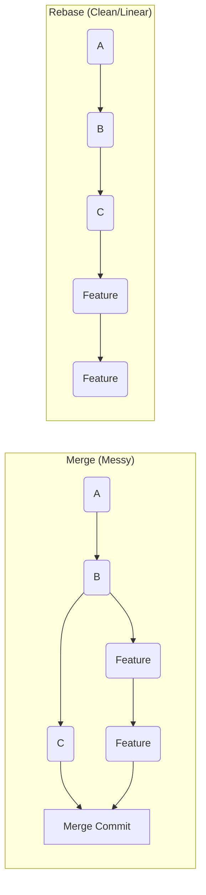

# Advanced Git: The Power User's Toolkit

Version: 1.0.0
Last Updated: 2026-03-09
Prerequisites: Module 5.1 & 5.2

## 1. Rebase: Rewriting History for a Cleaner Forest

### Story Introduction

Imagine **Editing a Documentary Film**.

*   **Merge**: When you merge, you take raw footage from two cameras and splice them together. You can see exactly when you switched from Camera A to Camera B. It's realistic, but it can look "Messy" in the timeline.
*   **Rebase**: You take the footage from Camera B and "Move" it so it starts *after* Camera A finishes. The timeline looks like one long, straight, beautiful shot. 

In Git, **Rebase** moves your entire branch so it starts from the *latest* commit on `main`. It creates a linear history that is much easier to read!

### Concept Explanation

**Rebase** effectively "re-plants" your branch on a new base commit.

#### Merge vs Rebase:
*   **Merge**: Creates a new "Merge Commit." Preserves exact history. Good for "Public" branches.
*   **Rebase**: Moves your commits to the tip of main. Creates a clean, linear history. Good for "Feature" branches before they are finished.

**The Golden Rule of Rebase**: Never rebase a branch that has been pushed to a shared repository (like a public `main` branch). It will rewrite history and break your teammates' repos!

### Code Example (Rebase & Stash)

```bash
# 1. Stashing: "Pause" your work without committing
git stash 
# (Now your working tree is clean. You can fix a bug elsewhere.)
git stash pop # Bring your work back!

# 2. Rebase your feature branch
git checkout feature-A
git rebase main

# 3. Interactive Rebase (Combine 5 messy commits into 1 clean one)
git rebase -i HEAD~5
# (Follow the instructions in the editor: change 'pick' to 'squash')
```

### Step-by-Step Walkthrough

1.  **`git stash`**: This is like "Putting your tools in a drawer." It saves your current changes in a secret place so you can switch branches without committing "Half-finished" work.
2.  **`git rebase main`**: Git takes all your feature commits, puts them aside, brings in the latest work from `main`, and then "Re-applies" your commits one by one on top.
3.  **`rebase -i` (Interactive)**: This is "Squashing." It allows you to delete embarrassing commits (like "Fixed typo 1", "Fixed typo 2") and merge them into one professional commit ("Completed Login Service").

### Diagram



### Real World Usage

In **Large Open Source Projects (like the Linux Kernel)**, maintainers often demand that you rebase your code before they accept it. They don't want a "diamond" shape in their logs; they want a single straight line so they can track down exactly when a bug was introduced.

### Best Practices

1.  **Rebase before Merging**: Always rebase your feature branch against `main` before you open a Pull Request. This makes the final merge much smoother.
2.  **One Commit per Feature**: Use `rebase -i` to "Squash" your 20 tiny commits into 1 meaningful commit before you share your work.
3.  **Use `git stash` instead of "Temp" Commits**: Don't commit with messages like "Saving for later." Use the stash.

---

## 2. Git Hooks: Automating the Safeguards

### Concept Explanation

**Git Hooks** are scripts that run automatically when a specific event happens (like before you commit, or before you push).

### Code Example (Pre-commit Hook)

Create a file at `.git/hooks/pre-commit`:
```bash
#!/bin/bash
# pre-commit - A script to check for "TODO"s before committing

if grep -q "TODO" $(git diff --cached --name-only); then
    echo "ERROR: You left a 'TODO' in your code! Fix it before committing."
    exit 1
fi
```

### Exercises

1.  **Beginner**: What is the command to temporarily hide your changes without committing them?
2.  **Intermediate**: What does it mean to "Squash" commits?
3.  **Advanced**: Why is it dangerous to rebase a branch that others are also working on?

### Mini Projects

#### Beginner: The Stash Master
**Task**: Make a change to a file. Use `git stash`. Prove the change is gone with `cat`. Use `git stash pop`. Prove the change is back.
**Deliverable**: A session log showing the hidden and revealed changes.

#### Intermediate: The History Cleaner
**Task**: Make 3 commits in a row. Use `git rebase -i` to squash them into a single commit with a new, better message.
**Deliverable**: The output of `git log --oneline` showing 1 commit where there used to be 3.

#### Advanced: The Security Guard Hook
**Task**: Write a Git Hook (pre-push) that prevents you from pushing to the `main` branch directly. (Hint: check `git branch --show-current`).
**Deliverable**: The hook script and a demonstration of it blocking a push to `main`.
