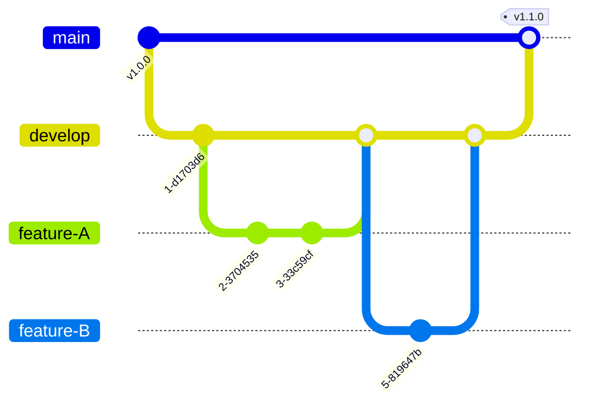

# Git Collaboration and Flow: The Team Assembly Line

Version: 1.0.0
Last Updated: 2026-03-09
Prerequisites: Module 5.1 - 5.3

## 1. Remote Repositories (GitHub, GitLab, Bitbucket)

### Story Introduction

Keep in mind **A Shared Google Doc**.

Until now, your Git book was in your private room. But if you want a team to help you write it, you need to put a copy in a **Central Library (Remote)**.
1.  **Clone**: A teammate takes a photocopy of the whole book to their own house.
2.  **Pull**: Every morning, the teammate checks the Central Library for any new pages you wrote and copies them into their book.
3.  **Push**: When the teammate finishes a page, they send it to the Central Library for everyone else to see.

The Central Library (like **GitHub**) is the "Single Source of Truth."

### Concept Explanation

Working with a team requires syncing your local work with a remote server.

#### Common Remote Commands:
*   **`git clone [url]`**: Download a repository for the first time.
*   **`git remote -v`**: See where your project is synced to.
*   **`git push [remote] [branch]`**: Send your local commits to the server.
*   **`git pull [remote] [branch]`**: Fetch changes from the server AND merge them into your local branch.
*   **`git fetch`**: Only download the changes (doesn't merge). Safe to use to "see" what's new.

---

## 2. Git Flow and Branching Strategies

### Concept Explanation

In a professional environment, you need a "Process" for how everyone uses branches. This is a **Branching Strategy**.

#### The "Git Flow" Model:
*   **Main**: Only production-ready code.
*   **Develop**: Integration branch for features. This is where the code stays before it's released.
*   **Feature Branches**: Individual tasks (e.g., `feature/login-page`).
*   **Hotfix Branches**: Emergency bug fixes for production (e.g., `hotfix/security-patch`).
*   **Release Branches**: Preparation for a new production release.

#### The "GitHub Flow" (Simpler):
Just `main` and feature branches. You use **Pull Requests (PRs)** to merge everything into main. This is the modern standard for fast-moving startups.

### Code Example (Collaboration Workflow)

```bash
# 1. Get the code
git clone https://github.com/my-org/my-app.git
cd my-app

# 2. Before starting, always catch up with the team
git pull origin main

# 3. Create a feature branch
git checkout -b feature/new-button

# 4. Do work and Push to the server
git commit -m "Added a shiny new button"
git push origin feature/new-button

# 5. On GitHub.com, click "Create Pull Request"
```

### Step-by-Step Walkthrough

1.  **`origin`**: This is the default name for the remote server (usually GitHub).
2.  **`git pull`**: This is actually two commands in one: `git fetch` + `git merge`. It ensures your "Main" is the same as the team's "Main."
3.  **`git push origin feature/...`**: You are pushing your private branch to the public server so others can see it and review it.
4.  **Pull Request (PR)**: This is a **Web-based tool**, not a Git command. It's a "Merge Request" where the team can comment on your code, ask for changes, and finally approve the merge.

### Diagram



### Real World Usage

In **DevOps and CI/CD**, the **Pull Request** is a "Trigger." When a PR is opened, an automated system (like GitHub Actions) instantly wakes up and runs your tests. If the tests fail, the "Merge" button is disabled. This is how we ensure that a single developer can't "break the build" for the whole company.

### Best Practices

1.  **Pull before you Push**: Always sync with the team before trying to send your changes. This catches conflicts early.
2.  **Delete branches after Merge**: Once a PR is closed, delete the branch on both local and remote to keep the repo clean.
3.  **Use `.gitignore` across the team**: Ensure everyone uses the same ignore rules so no one accidentally commits Mac-specific files (`.DS_Store`) or node modules.

### Common Mistakes

*   **Pushing to the wrong branch**: Accidentally pushing your work to `main` instead of your feature branch.
*   **Force Pushing (`--force`)**: This is a "Nuclear Weapon." It overwrites the history on the server and can delete your teammates' work. Use it with extreme caution (only on your private feature branches).
*   **Huge Pull Requests**: Opening a PR with 50 files and 2,000 lines of code. No one will want to review it!

### Exercises

1.  **Beginner**: What is the name of the default remote repository in Git?
2.  **Intermediate**: What is the difference between `git pull` and `git fetch`?
3.  **Advanced**: Why do we use "Hotfix" branches instead of just fixing the bug in the `develop` branch?

### Mini Projects

#### Beginner: The Remote Sync
**Task**: Create a repo on GitHub. Add it as a remote to your local repo using `git remote add origin`. Push your code.
**Deliverable**: A link to your GitHub repo (or a screenshot) showing your local commits appearing on the website.

#### Intermediate: The Pull Request Simulation
**Task**: Collaborate with yourself! Create a second folder and clone your own repo into it. Make a change in the first folder, push it. Go to the second folder and run `git pull`.
**Deliverable**: Proven proof that the second folder now contains the change you made in the first one.

#### Advanced: The Git Flow Audit
**Task**: Research the "Trunk-Based Development" strategy. Compare it to the "Git Flow" strategy.
**Deliverable**: A table showing the Pros and Cons of each strategy for a team of 100 people.
