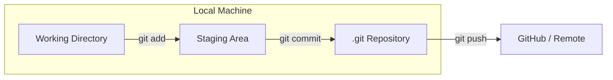

# Git Fundamentals: The Time Machine for Code

Version: 1.0.0
Last Updated: 2026-03-09
Prerequisites: Module 1.1 (DevOps Philosophy)

## 1. What is Git? (Distributed Version Control)

### Story Introduction

Imagine **A Magical Book**.

1.  **Every Page is a Version**: When you finish writing a page and save it (Commit), it's locked forever. 
2.  **Back to the Past**: If you mess up on Page 10, you can instantly flip back to Page 5 and see exactly what you wrote.
3.  **Cloning the Book**: Every person on your team has an *exact copy* of the same book. If you write a new page, you can "Sync" (Push) it to their books.
4.  **No Master Library**: You don't need a central office to work on the book. You can write your pages in a forest, and when you get back to town, you can sync with everyone else.

This is **Git**. It is the ultimate "Undo" button and collaboration tool for engineers.

### Concept Explanation

**Git** is a Distributed Version Control System (DVCS).

#### The 3 Stages of Git:
1.  **Working Directory**: Where you are currently typing your code. Files here are "Untracked."
2.  **Staging Area (The Index)**: A "Packing Box." You put the files you want to save into the box (`git add`).
3.  **Repository (.git folder)**: The "Safe." Once you `git commit`, the files in the box are locked into the history of the project.

#### Key Terminology:
*   **Repository (Repo)**: The project folder.
*   **Commit**: A snapshot of your code at a specific point in time.
*   **Hash**: A unique ID (e.g., `a1b2c3d`) for every commit.

### Code Example (Your First Repo)

```bash
# 1. Initialize a new project
mkdir my-project && cd my-project
git init

# 2. Check the status
git status

# 3. Create a file and "Stage" it
echo "Hello Git" > index.html
git add index.html

# 4. Save the snapshot
git commit -m "Initial commit: Added index.html"

# 5. View history
git log --oneline
```

### Step-by-Step Walkthrough

1.  **`git init`**: This creates a hidden `.git` folder. This folder IS the time machine. If you delete it, you lose your history!
2.  **`git status`**: The "Map." It tells you which files are new, which are changed, and which are ready to be committed.
3.  **`git add`**: This moves files from the "Working Directory" to the "Staging Area." It allows you to choose exactly which changes you want to save.
4.  **`git commit -m "..."`**: This saves the snapshot. The `-m` stands for "Message." Always write a meaningful message explaining *why* you made the change.

### Diagram



### Real World Usage

In **DevOps**, we don't just put "App Code" in Git. we put *everything* in Git. This is called **GitOps**. Your server configurations (Terraform), your container definitions (Dockerfiles), and your automation scripts (Jenkinsfiles) all live in Git. If a server dies, we don't fix it; we just re-run the code from Git to spin up a perfect replacement.

### Best Practices

1.  **Commit Often, Perfect Later**: Don't wait three days to commit. Save your work every few hours.
2.  **Write Meaningful Commit Messages**: "Fixed bug" is bad. "Fixed memory leak in login service" is good.
3.  **Don't Commit Secrets**: Never put passwords, API keys, or `.env` files in Git. Use a `.gitignore` file to tell Git to ignore them.
4.  **One Commit = One Logical Change**: Don't fix a bug, add a feature, and change your profile picture in one single commit.

### Common Mistakes

*   **Forgetting to `add`**: Trying to commit without adding files first. Git will say "nothing to commit, working tree clean."
*   **The "Detached HEAD"**: Navigating to an old version and trying to make changes there without creating a branch.
*   **Committing Binary Files**: Putting giant images, videos, or `.exe` files in Git. This makes the repository slow and massive. Use **Git LFS** for large files.

### Exercises

1.  **Beginner**: What is the command to check the status of your current repository?
2.  **Intermediate**: Create a `.gitignore` file and add the word `secrets.txt` to it. Verify that Git no longer sees `secrets.txt` as a new file.
3.  **Advanced**: What is the difference between `git commit` and `git push`?

### Mini Projects

#### Beginner: The "Daily Journal" Repo
**Task**: Create a folder called `journal`. Initialize a Git repo. Every day for 3 days, add a text file with a "Thought of the day" and commit it.
**Deliverable**: Run `git log` and show your 3 commits with their unique hashes.

#### Intermediate: The .gitignore Guard
**Task**: Create a project with an `index.html` and a `db_password.txt`. Write a `.gitignore` file that hides the password file but keeps the HTML.
**Deliverable**: The output of `git status` showing that only the HTML and .gitignore are being tracked.

#### Advanced: The History Explorer
**Task**: Commit a file. Then, delete all the text inside the file and commit again. Use `git checkout [hash] -- [filename]` to bring back the deleted text from the first commit.
**Deliverable**: A short log of the commands you used to "travel back in time" and rescue your data.
