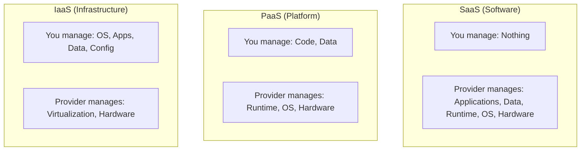

# Cloud Computing Concepts: The Infinite Data Center

Version: 1.0.0
Last Updated: 2026-03-09
Prerequisites: Module 1.1 (DevOps Philosophy)

## 1. What is Cloud Computing? (NIST Definition)

### Story Introduction

Imagine **The Evolution of Electricity**.

1.  **The Old Way (On-Premise)**: You have a private generator in your backyard. You have to buy it, fix it, pay for the fuel, and if it breaks at 3 AM, your house goes dark. If you want more power to run a big party, you have to buy *another* generator.
2.  **The New Way (Cloud)**: You plug your house into the city power grid. You don't care where the power comes from or who fixes the turbines. You only pay for the exact amount of electricity you use. If you have a party, you just turn on more lights, and the grid handles the load instantly.

This is **Cloud Computing**. It's the "Utility Model" for computing power, storage, and databases.

### Concept Explanation

Cloud computing is the on-demand delivery of IT resources over the internet with pay-as-you-go pricing.

#### The 5 Essential Characteristics:
1.  **On-demand Self-service**: You don't need to call a human; you just click a button or write a script to get a server.
2.  **Broad Network Access**: You can access your resources from anywhere.
3.  **Resource Pooling**: Many customers share the same physical hardware (Multi-tenancy).
4.  **Rapid Elasticity**: You can scale up (add more power) or scale down (save money) instantly.
5.  **Measured Service**: You are billed like a utility (by the second or by the GB).

---

## 2. Service Models: IaaS, PaaS, and SaaS

### Concept Explanation

The "Cloud" isn't just one thing. It's a "Shared Responsibility" model.

*   **IaaS (Infrastructure as a Service)**: "The Unfurnished House." The cloud provider gives you the foundation (Networking, Storage, Servers). You are responsible for the walls, the furniture, and the security system (OS, Apps, Data). 
    *   *Examples*: AWS EC2, Google Compute Engine, DigitalOcean Droplets.
*   **PaaS (Platform as a Service)**: "The Hotel Room." The provider handles the foundation AND the furniture (OS, Runtime). You just bring your clothes (Your Code).
    *   *Examples*: AWS Elastic Beanstalk, Heroku, Google App Engine.
*   **SaaS (Software as a Service)**: "The All-Inclusive Resort." You don't worry about anything. You just use the service.
    *   *Examples*: Gmail, Salesforce, Slack, Dropbox.

### Code Example (Provisioning with AWS CLI vs. Manual)

Instead of manually clicking buttons (SaaS style), DevOps engineers use code to get IaaS resources:

```bash
# Provisioning an IaaS server (EC2) via command line
aws ec2 run-instances \
    --image-id ami-0abcdef1234567890 \
    --count 1 \
    --instance-type t2.micro \
    --key-name MyKeyPair \
    --security-group-ids sg-00001
```

### Step-by-Step Walkthrough

1.  **`aws ec2 run-instances`**: This is the "On-demand" part. It sends a request to the cloud provider's API.
2.  **`--instance-type t2.micro`**: This specifies the size of the "Generator." In this case, a small, cheap server.
3.  **`--image-id`**: This is the OS (e.g., Ubuntu).
4.  **Result**: In less than 60 seconds, a physical server in a data center thousands of miles away is powered on and assigned to your account.

### Diagram



### Real World Usage

Most companies use a **Mix**. They host their custom web app on **IaaS/PaaS**, store their customer files on **SaaS** (Google Drive), and manage their communication on **SaaS** (Slack). This allows them to focus 90% of their energy on their *own* product rather than managing "Plumbing."

### Best Practices

1.  **Go Cloud-Native if possible**: Use PaaS (like AWS Lambda) to avoid managing servers. No servers = No patching = Fewer security risks.
2.  **Pay-As-You-Go Awareness**: Always set "Billing Alarms." The cloud is infinite, and so is the potential bill if you leave an expensive server running by mistake.
3.  **Tag Everything**: Use tags (e.g., `Environment=Prod`) to track which department is spending what.

### Common Mistakes

*   **Treating the Cloud like a Data Center**: Moving your servers to the cloud but never turning them off or scaling them down. This is usually more expensive than staying on-premise!
*   **Shadow IT**: Employees starting cloud accounts without the security team knowing, leading to unprotected data being exposed on the internet.
*   **The "All-In" Fallacy**: Assuming that moving to the cloud fixes your bad code. If your app is slow on your laptop, it will be slow in the cloud (just more expensive).

### Exercises

1.  **Beginner**: What are the three main service models of cloud computing?
2.  **Intermediate**: In which service model is the user responsible for managing the Operating System (OS)?
3.  **Advanced**: Explain the term "Multi-tenancy." How does it benefit both the provider and the customer?

### Mini Projects

#### Beginner: The SaaS Scavenger Hunt
**Task**: Identify 5 SaaS applications you use in your daily life. For each, identify "Who manages the data?" and "Who manages the server?"
**Deliverable**: A simple list of 5 apps.

#### Intermediate: The Cost Of Cloud
**Task**: Use the [AWS Pricing Calculator](https://calculator.aws/). Estimate the monthly cost of running 2 small servers (t3.medium) for 24/7 and one database (rds.t3.small).
**Deliverable**: A short summary of the estimated monthly cost.

#### Advanced: Designing a Migration Strategy
**Task**: A company has an old Java app running on a server in their basement. Design a plan to move it to the cloud. Decide if they should use IaaS or PaaS and explain why.
**Deliverable**: A 1-page "Cloud Proposal" justifying your choice of service model.
