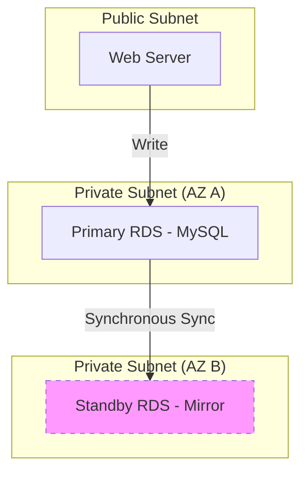

# RDS and Databases: Managed Data at Scale

Version: 1.0.0
Last Updated: 2026-03-09
Prerequisites: Module 7.1 & 7.2

## 1. Amazon RDS (Relational Database Service)

### Story Introduction

Imagine **Hiring a Personal Librarian for your Books**.

*   **The Old Way (Self-Managed)**: You buy a giant bookshelf (The Server), you organize the books yourself, you clean the dust, and if the shelf breaks, you have to buy a new one and carefully move all the books. You spend half your time cleaning instead of reading.
*   **The RDS Way (Managed Service)**: You hire a librarian. You tell them, "I want a shelf of 500 books." They build it, they clean it every day, they make photocopies of every book just in case there's a fire (Backups), and if the shelf gets too full, they instantly upgrade it to a bigger one.
*   **Your Job**: You just enjoy reading and writing your books (Your Data).

RDS handles the "Undifferentiated Heavy Lifting" of database administration.

### Concept Explanation

**RDS** is a managed service that makes it easy to set up, operate, and scale a relational database in the cloud.

#### Supported Engines:
*   MySQL, PostgreSQL, MariaDB, Oracle, Microsoft SQL Server, and Amazon Aurora.

#### Key Features:
1.  **Multi-AZ Deployment (High Availability)**: AWS automatically maintains a "Standby" copy of your database in a different building (AZ). If the main one dies, the standby takes over in seconds.
2.  **Read Replicas (Scalability)**: If your website has millions of people *reading* posts but only a few *writing* them, you can create copies of your database that only handle "Read" traffic.
3.  **Automated Backups**: RDS saves a snapshot of your data every day. You can "travel back in time" (Point-In-Time-Recovery) to any specific second in the last 35 days.

### Code Example (Connecting to RDS via CLI)

Once your database is running, you connect to its "Endpoint" just like a local DB:

```bash
# Connect to your MySQL RDS instance from your EC2 server
mysql -h my-db-instance.abcdef123.us-east-1.rds.amazonaws.com \
      -P 3306 \
      -u admin \
      -p
```

### Step-by-Step Walkthrough

1.  **The Endpoint**: `my-db-instance.abcdef...` is the DNS address of your librarian's desk. You never use an IP address with RDS because the IP might change during a maintenance window.
2.  **`-h` (Host)**: This tells the MySQL client where to look.
3.  **Security Check**: For this to work, the **Security Group** for the RDS instance must allow traffic on Port 3306 from the **Security Group** of the EC2 server (Module 7.2).

### Diagram



### Real World Usage

**Airbnb** uses RDS (specifically MySQL) to store all its listings and bookings. Because they have thousands of bookings per minute, they use **Amazon Aurora**, which is AWS's high-performance version of RDS. It can handle massive traffic spikes and automatically repairs itself if a disk fails, ensuring that nobody loses their holiday reservation.

### Best Practices

1.  **Never put RDS in a Public Subnet**: Your database should have NO internet access. Only your application servers (in the same VPC) should be able to talk to it.
2.  **Use Multi-AZ for Production**: It costs double, but it saves your business from a total outage if a data center fails.
3.  **Monitor Storage Usage**: Enable **Storage Autoscaling** so that if your database fills up, RDS automatically adds more space.
4.  **Enforce SSL**: Use encryption for the data traveling between your app and the database.

### Common Mistakes

*   **Hardcoding Passwords**: Putting the database password in your application's `app.config` file in Git. Use **AWS Secrets Manager** instead.
*   **Ignored Maintenance Windows**: AWS sometimes needs to update your DB's software. If you don't schedule this, it might happen during your busiest time of day!
*   **Performing heavy analytics on the Primary DB**: If you have a huge report to run, do it on a **Read Replica**. Don't slow down your website's main "Write" operations.

### Exercises

1.  **Beginner**: Which database engines does Amazon RDS support?
2.  **Intermediate**: What is the difference between Multi-AZ and Read Replicas?
3.  **Advanced**: How does "Point-In-Time Recovery" work in RDS?

### Mini Projects

#### Beginner: The RDS Creator
**Task**: Sign in to the AWS Console. Use the "Free Tier" to launch a tiny MySQL database. 
**Deliverable**: A screenshot of the RDS dashboard showing your database status as "Available" and its "Endpoint."

#### Intermediate: The Read-Only Scaling
**Task**: Create a Read Replica of your DB from the previous task. Verify that it has its own unique Endpoint.
**Deliverable**: A short message explaining why you would give the "Read Replica" endpoint to your data analysis team instead of the main one.

#### Advanced: The Secure Connection Lab
**Task**: Launch an EC2 instance and an RDS instance. Configure the Security Groups so that you can ONLY connect to the database from the EC2 instance, and NOT from your personal laptop.
**Deliverable**: A successful login log from the EC2 and a "Timeout" error log from your personal laptop.
