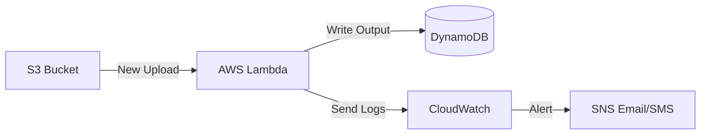

# Serverless and Monitoring: Efficiency and Observability

Version: 1.0.0
Last Updated: 2026-03-09
Prerequisites: Module 7.1 - 7.5

## 1. AWS Lambda and the "No-Server" Future

### Story Introduction

Imagine **A Light that Only Turns On When Someone Enters the Room**.

*   **The Old Way (EC2)**: You leave the light on 24 hours a day, 7 days a week, just in case someone walks in. You pay for the electricity all day, even if the room is empty 90% of the time.
*   **The Serverless Way (Lambda)**: The light is off. When the door opens (An Event), the light instantly turns on. When the person leaves, the light turns off. 
*   **Your Bill**: You only pay for the exact seconds the light was actually on. If no one enters the room all month, your bill is $0.

This is **Serverless Computing**. You focus on the "Function" (the light), and AWS handles the "Room" (the infrastructure).

### Concept Explanation

**AWS Lambda** is an event-driven, serverless computing service that lets you run code without provisioning or managing servers.

#### Key Characteristics:
1.  **Event-Driven**: It only runs in response to a trigger (e.g., a new file in S3, a web request via API Gateway, or a message in a queue).
2.  **Stateless**: Each run is fresh. It doesn't "remember" anything from the last time it ran.
3.  **Automatic Scaling**: If 1,000,000 people trigger your function at once, AWS will instantly start 1,000,000 copies of your code.
4.  **Short-Lived**: A function can only run for a maximum of 15 minutes.

---

## 2. CloudWatch: Remote Eyes for your Cloud

### Concept Explanation

If you have 100 servers and 50 databases, you can't log in to each one to see if they are okay. You use **Amazon CloudWatch**.

#### The 3 Pillars of CloudWatch:
1.  **Metrics**: Numbers over time (e.g., "CPU is at 45%," "Database has 10GB free").
2.  **Logs**: Text messages from your code (e.g., "Error: User login failed at 10:05 PM").
3.  **Alarms**: If a **Metric** hits a certain limit, send a notification or take action (e.g., "Send me an email if CPU > 90%").

### Code Example (A Simple Lambda Function in Python)

```python
import json

def lambda_handler(event, context):
    # This function is triggered when a file is uploaded to S3
    bucket_name = event['Records'][0]['s3']['bucket']['name']
    file_name = event['Records'][0]['s3']['object']['key']
    
    print(f"I see a new file: {file_name} in bucket: {bucket_name}")
    
    return {
        'statusCode': 200,
        'body': json.dumps('File processed successfully!')
    }
```

### Step-by-Step Walkthrough

1.  **`lambda_handler`**: This is the "Entry Point." When the event happens, AWS sends the "Details" (JSON) into the `event` variable.
2.  **`print(...)`**: Anything you print here automatically disappears from the server but is captured and saved in **CloudWatch Logs** for you to read later.
3.  **Billing**: AWS calculates that this function ran for exactly `150ms`. You are billed exactly for that time.

### Diagram



### Real World Usage

**The Coca-Cola Company** uses Lambda for their smart vending machines. When you buy a drink, an event is sent to AWS. A Lambda function processes the payment, another function updates the inventory in a database, and a third function sends a CloudWatch alert if the machine is running low on Diet Coke. No servers are needed to manage the millions of machines.

### Best Practices

1.  **Write Tiny Functions**: One Lambda should do one thing perfectly. Don't build a giant "Monolith" inside a Lambda.
2.  **Use Environment Variables**: Don't hardcode your database name in your code. Use AWS Lambda Environment Variables so you can change them easily.
3.  **Cold Starts**: Be aware that if a function hasn't run in a while, the first run might be slightly slow (1-2 seconds) as AWS prepares the environment.
4.  **Alarms on Everything**: Set a CloudWatch alarm for "Lambda Errors." If your code crashes, you need to know immediately!

### Common Mistakes

*   **Recursive Loops**: Writing a Lambda that uploads a file to S3, which triggers the same Lambda again... forever. This can cost thousands of dollars in an hour!
*   **Timeouts**: Trying to perform a 1-hour data export in a Lambda (it will die at 15 minutes).
*   **Missing Permissions**: Forgetting to give your Lambda's **IAM Role** (Module 7.1) permission to read from S3 or write to CloudWatch.

### Exercises

1.  **Beginner**: What is the main difference between EC2 and Lambda?
2.  **Intermediate**: What are the three pillars of CloudWatch?
3.  **Advanced**: How does "Event-Driven" architecture save money compared to traditional server-hosting?

### Mini Projects

#### Beginner: The Lambda Logger
**Task**: Create a simple "Hello World" Lambda function in the AWS Console. Test it manually. Go to CloudWatch and find the log message created by your function.
**Deliverable**: A screenshot of the CloudWatch Log Stream showing your "Hello World!" message.

#### Intermediate: The S3 Automated Assistant
**Task**: Configure an S3 bucket to trigger a Lambda function whenever a new file is uploaded. The Lambda should simply print the name of the file it received.
**Deliverable**: Upload a file called `test_success.txt` and provide the log snippet showing the Lambda recognized the filename.

#### Advanced: The High-CPU Alarm
**Task**: Create a CloudWatch Alarm for one of your EC2 instances. Set it to send an email (via Amazon SNS) if the CPU usage is greater than 1% for 1 minute (easy to trigger for testing).
**Deliverable**: A screenshot of the email notification you received from AWS.
