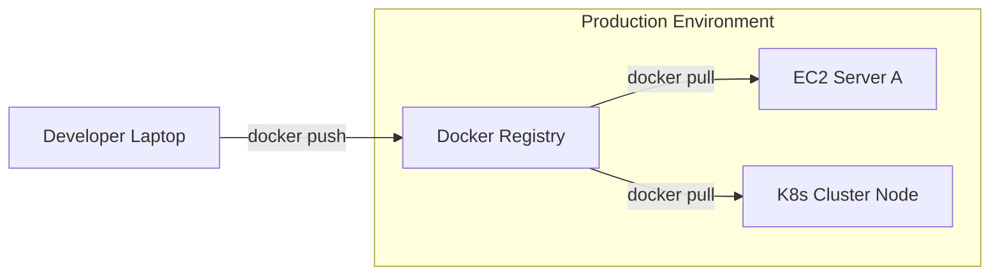

# Container Registries: The Warehouse for Images

Version: 1.0.0
Last Updated: 2026-03-09
Prerequisites: Module 8.1 - 8.4

## 1. Docker Hub and Private Registries

### Story Introduction

Keep in mind **An App Store for Infrastructure**.

1.  **The Code (Raw Materials)**: Lives in GitHub.
2.  **The Build (The Finished Product)**: Lives in a **Registry**. 
3.  **The Consumer (The Server)**: When a server wants to run your app, it doesn't download your code and "build" it. That takes too long and might fail. Instead, it goes to the App Store (The Registry), finds your app's version, and downloads the "Ready-to-Run" image.

**Docker Hub** is the public store where everyone shares images (like Nginx, Python, MySQL). But most companies also have a "Private Store" (like **Amazon ECR**) for their secret business code.

### Concept Explanation

A **Registry** is a repository for Docker images.

#### Key Registries:
*   **Docker Hub**: The default public registry.
*   **Amazon ECR (Elastic Container Registry)**: AWS's private registry.
*   **Artifact Registry (Google Cloud)** / **Azure Container Registry**.
*   **Self-Hosted**: Using a tool like **Harbor** or the official `registry` image.

#### Tagging Strategy:
An image name has three parts: `registry-url / username / app-name : tag`
Example: `public.ecr.aws/a1b2c3d/my-app:v1.0.2`

### Code Example (Tagging and Pushing)

```bash
# 1. Login to the registry
docker login --username abhishek

# 2. Build your image with a 'local' name
docker build -t my-web-app .

# 3. 'Re-label' (Tag) the image for the registry
# FORMAT: docker tag [local-name] [registry-path]/[repo-name]:[tag]
docker tag my-web-app abhishek/my-web-app:v1.0.0

# 4. Push the image to the registry
docker push abhishek/my-web-app:v1.0.0

# 5. On a DIFFERENT server, you can now run it:
docker run -d abhishek/my-web-app:v1.0.0
```

### Step-by-Step Walkthrough

1.  **`docker login`**: This stores a secure "Token" on your laptop so you don't have to type your password every time you push.
2.  **`docker tag`**: This doesn't change the image. it just adds a new "Sticker" to it. Imagine you have a box called "MyLunch." You add a sticker that says "Abhishek's Lunch for Friday." It's the same box, but now the fridge knows who it belongs to and when it expires.
3.  **`docker push`**: This uploads the individual "Layers" (Module 8.2) to the server. If the server already has the "Ubuntu" layer, it will only download the new code you wrote, making the push very fast.

### Diagram



### Real World Usage

In **Production Pipelines**, no one ever logs into a server to "Build" an image.
1.  Developer pushes code to Git.
2.  **GitHub Actions** builds the Docker image and tags it with the **Git Commit Hash** (e.g., `my-app:a1b2c3d`).
3.  The image is pushed to **Amazon ECR**.
4.  The server is told: "Hey, go download `my-app:a1b2c3d` and run it."
This ensures that the *exact same* code that passed tests in CI is what runs in production.

### Best Practices

1.  **Use Content Trust**: Modern registries allow you to "Sign" your images. The server will refuse to run an image if the signature doesn't match, preventing hackers from "Swapping" your image with a malicious one.
2.  **Vulnerability Scanning**: Most registries (like ECR) can automatically scan your images for old libraries with security holes (CVEs). Read these reports every morning!
3.  **Purge Old Images**: Don't keep every version of your image forever. Use a policy to delete images older than 90 days to save storage costs.
4.  **Immutability**: Once an image is pushed with a tag like `v1.0.0`, **NEVER** overwrite it. If you fix a bug, push it as `v1.0.1`.

### Common Mistakes

*   **Registry URL Typos**: Forgetting that private registries (like ECR) require their full URL in the tag (e.g., `123456789.dkr.ecr.us-east-1.amazonaws.com/...`).
*   **Pushing Huge Layers**: Including your `.git` folder or large test data in the image. Use a `.dockerignore`!
*   **Authentication Expiry**: Being confused when `docker push` fails after 12 hours because your temporary AWS login token expired.

### Exercises

1.  **Beginner**: What is the command to download an image from a registry without running it?
2.  **Intermediate**: What is the difference between a "Public" and "Private" registry?
3.  **Advanced**: How can you use "Image Digest" (the SHA256 hash) to ensure you are running the exact same bits of code every time?

### Mini Projects

#### Beginner: The Docker Hub Account
**Task**: Create a free account on [hub.docker.com](https://hub.docker.com). Run `docker login` on your machine.
**Deliverable**: A short message confirming you successfully logged in from your terminal.

#### Intermediate: The First Push
**Task**: Take the image you built in Module 8.2. Tag it with your Docker Hub username and push it.
**Deliverable**: A link to your public image on Docker Hub.

#### Advanced: The Private Registry Simulation
**Task**: Research how to run a "Local Registry" using the command `docker run -d -p 5000:5000 registry:2`. Push one of your images to this local registry (`localhost:5000/my-image`).
**Deliverable**: A screenshot of your terminal showing the push to `localhost:5000`.
