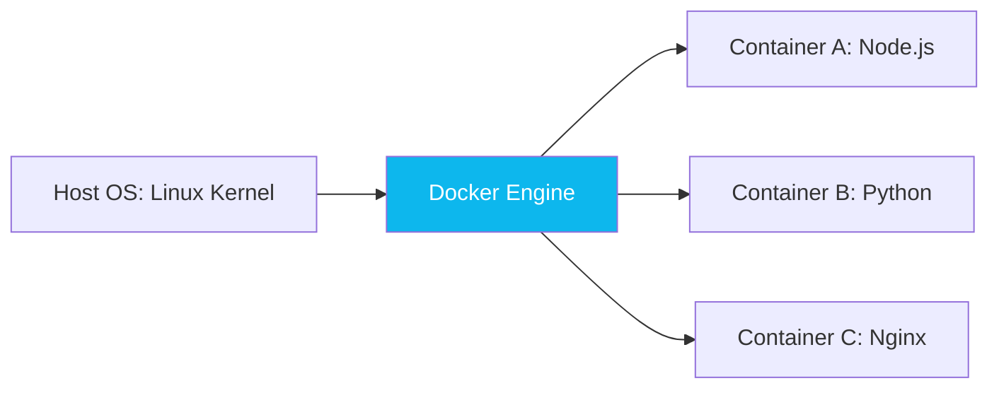

# Docker Fundamentals: The Shipping Container of Code

Version: 1.0.0
Last Updated: 2026-03-09
Prerequisites: Module 2 (Linux) & Module 6.2 (Virtualization)

## 1. What is Docker? (Containers vs VMs)

### Story Introduction

Imagine **Shipping Goods across the Ocean**.

1.  **The Old Way (Matrix of Pain)**: You have separate boxes for tea, spices, and silk. If you want to put them on a ship, you have to pack them carefully so they don't break. Then you have to hire a specific crane for each box. If you switch from a Ship to a Train, you have to unpack everything and repack it according to the train's rules.
2.  **The Docker Way (The Shipping Container)**: You put everything in a standard metal box (The Container). The ship doesn't care what's inside. The crane only knows how to grab the metal box. The train also knows how to grab the metal box. 

This "Standard Box" is **Docker**. You put your code, your libraries, and your settings inside the container. It runs exactly the same on your laptop, on your coworker's Mac, and on a production Linux server in the cloud.

### Concept Explanation

Docker is a platform for developing, shipping, and running applications inside **Containers**.

#### Key Differences:
*   **Virtual Machines (VMs)**: Include a whole Operating System. They are slow to start and use a lot of RAM. (Module 6.2).
*   **Containers**: Share the Host's OS kernel. They are "Thin," start in milliseconds, and use almost no overhead.

#### Docker Architecture:
1.  **Docker Client**: The CLI tool you use (`docker build`, `docker run`).
2.  **Docker Host (Daemon)**: The background engine that does the actual work of building and running containers.
3.  **Docker Registry**: A library of pre-made containers (like **Docker Hub**).

### Code Example (Your First Container)

```bash
# 1. Pull a pre-made image from Docker Hub
docker pull hello-world

# 2. Run a container
docker run hello-world

# 3. List running containers
docker ps -a

# 4. Run an interactive shell inside a container
docker run -it ubuntu bash
```

### Step-by-Step Walkthrough

1.  **`docker pull`**: This downloads the "Recipe" (The Image) from the cloud.
2.  **`docker run`**: This takes the recipe and turns it into a living "Dish" (The Container).
3.  **`docker ps -a`**: This shows you all containers, even the ones that finished their job and "died."
4.  **`-it ubuntu bash`**: This is a powerful command:
    *   `-i` = Interactive (stay connected).
    *   `-t` = Terminal (make it look like a real shell).
    *   `bash` = The specific program to run inside the container.

### Diagram



### Real World Usage

In **Microservices**, we use Docker to prevent the "It works on my machine" excuse. A developer might write code on Windows. They package it as a Docker image. The production server in AWS pulls that exact same image. Because the container includes every single library the code needs, the app works perfectly without the dev having to "install" anything on the server.

### Best Practices

1.  **Keep Images Small**: Use "Alpine" Linux versions of images (e.g., `node:alpine`) to save disk space and speed up deployments.
2.  **One Process Per Container**: Don't put your database and your web app in the same container. Use two separate containers.
3.  **Use `.dockerignore`**: Just like `.gitignore`, tell Docker to ignore your `node_modules` or `.env` files when building an image.
4.  **Tag your images**: Never use `latest`. Use specific versions like `myapp:v1.2.3` so you know exactly what is running.

### Common Mistakes

*   **Forgetting `sudo`**: On Linux, Docker usually requires root. (Solution: Add your user to the `docker` group).
*   **Mixing up Images vs Containers**: Thinking they are the same. An image is the "App Build" (Static); a container is the "Running App" (Alive).
*   **Ignoring Container Exit Codes**: If a container starts and then immediately stops, it means your code crashed. Use `docker logs [container_id]` to see the error.

### Exercises

1.  **Beginner**: What is the command to list only the *currently running* containers?
2.  **Intermediate**: What is the difference between an Image and a Container?
3.  **Advanced**: Why do containers use significantly less RAM than Virtual Machines?

### Mini Projects

#### Beginner: The Container Explorer
**Task**: Run a container using the image `busybox`. Run the command `ls /` inside it.
**Deliverable**: The list of folders you saw inside the container.

#### Intermediate: The Web Server in a Box
**Task**: Use Docker to run an Nginx web server on port 8080 of your local machine. (`docker run -d -p 8080:80 nginx`).
**Deliverable**: A screenshot of your browser visiting `localhost:8080` showing the "Welcome to nginx!" page.

#### Advanced: The Interactive Debugger
**Task**: Start an Ubuntu container in the background. "Exec" into it while it's running (`docker exec -it [id] bash`). Create a file called `debug.txt` inside it.
**Deliverable**: A session log showing you entering the container, creating the file, and then exiting.
