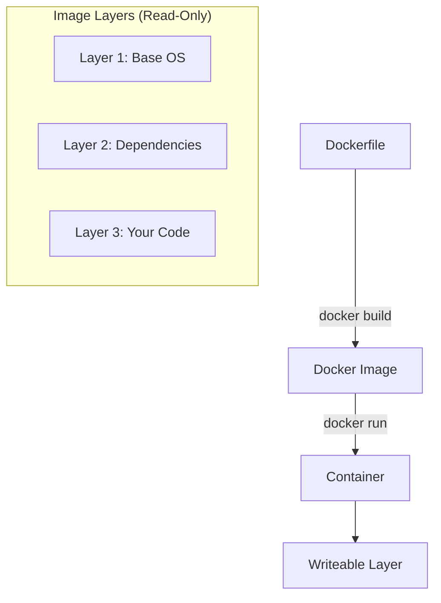

# Dockerfile and Images: Building the Blueprint

Version: 1.0.0
Last Updated: 2026-03-09
Prerequisites: Module 8.1 (Docker Fundamentals)

## 1. The Dockerfile: Automating the Build

### Story Introduction

Imagine **A Recipe for a Perfect Cake**.

1.  **FROM**: Get the basic ingredients (The Base OS).
2.  **WORKDIR**: Clear a space on the kitchen counter.
3.  **COPY**: Bring the flour and eggs (Your Code) from the pantry to the counter.
4.  **RUN**: Bake the cake (Install dependencies).
5.  **CMD**: The cake is ready. The final instruction is "Eat the cake" (Run the application).

Instead of telling your friend *how* to bake the cake over the phone, you give them the piece of paper (The **Dockerfile**). They put it in their "Cloud Oven" (The Docker Build engine) and get the exact same cake every time.

### Concept Explanation

A **Dockerfile** is a text document that contains all the commands a user could call on the command line to assemble an image.

#### Key Instructions:
*   **`FROM`**: Sets the Base Image (e.g., `FROM python:3.9-slim`).
*   **`WORKDIR`**: Sets the directory for any subsequent commands.
*   **`COPY` / `ADD`**: Moves files from your laptop to the image.
*   **`RUN`**: Executes commands while the image is being built (e.g., `apt-get install`).
*   **`EXPOSE`**: Tells Docker which port the app listens on (informational).
*   **`ENV`**: Sets environment variables.
*   **`CMD`**: The command that runs when the container starts. There can only be one!

### Code Example (Building a Python Web App)

```dockerfile
# 1. Start with a light Python version
FROM python:3.9-slim

# 2. Set the working directory
WORKDIR /app

# 3. Copy our requirements file
COPY requirements.txt .

# 4. Install dependencies (This layer is cached)
RUN pip install --no-cache-dir -r requirements.txt

# 5. Copy the rest of the code
COPY . .

# 6. Tell Docker we use port 5000
EXPOSE 5000

# 7. Start the app
CMD ["python", "app.py"]
```

### Step-by-Step Walkthrough

1.  **Layering**: Every line in the Dockerfile creates a "Layer." Docker is smart; if you don't change `requirements.txt`, it will **Skip** step 4 the next time you build, making it much faster.
2.  **`COPY requirements.txt .`**: We copy the requirements *before* the rest of the code so that we can cache the `pip install` step. This is a pro-dev move!
3.  **`CMD` vs `RUN`**: `RUN` happens while you are *building* the car. `CMD` happens when you *turn the key* to start the car.
4.  **`.dockerignore`**: Ensure you have a file that says `node_modules` or `.git` so you don't accidentally copy 1GB of useless files into your image.

### Diagram



### Real World Usage

In **Jenkins or GitHub Actions**, the Dockerfile is the "Build Script." When a developer pushes code, the CI/CD pipeline runs `docker build -t my-app:v1 .`. This image is then uploaded to a registry. This means your "Testing environment" uses the exact same artifact as your "Production environment," eliminating the "It worked in Testing but failed in Prod" problem.

### Best Practices

1.  **Use Multi-Stage Builds**: Build your code in a large image, then "Copy" the final result into a tiny image. This can reduce an image from 1GB to 50MB.
2.  **Specific Tags**: Avoid `FROM node:latest`. Use `FROM node:18.16.0-alpine`. This prevents your build from breaking when a new version of Node is released.
3.  **Clean up in the same RUN**: If you download a zip file to install something, delete the zip file in the same `RUN` command to keep the layer small.
4.  **Order Matters**: Put the things that change least at the top, and the things that change most (like your code) at the bottom to maximize caching.

### Common Mistakes

*   **Bloated Images**: Forgetting to use a `-slim` or `-alpine` base, resulting in a 2GB image for a simple script.
*   **Secrets in the Dockerfile**: Writing `ENV DB_PASSWORD=123`. Anyone who has the image can see this password. Use secrets at runtime instead.
*   **Running as Root**: Containers should ideally run as a non-root user for security. Use the `USER` instruction.

### Exercises

1.  **Beginner**: Which Dockerfile instruction is used to set the base image?
2.  **Intermediate**: What is the difference between `COPY` and `ADD`? (Hint: See URL support).
3.  **Advanced**: How does Docker Layer Caching speed up your builds?

### Mini Projects

#### Beginner: The Hello Dockerfile
**Task**: Write a Dockerfile based on `alpine`. Use `CMD` to print "Hello from the custom image!". Build it and run it.
**Deliverable**: The Dockerfile and the command you used to build it.

#### Intermediate: The App Packager
**Task**: Take a simple HTML file. Write a Dockerfile using `nginx:alpine` that copies your HTML file into the default Nginx folder (`/usr/share/nginx/html`).
**Deliverable**: The Dockerfile and a screenshot of the container serving your custom HTML.

#### Advanced: Multi-Stage Optimization
**Task**: Research "Multi-stage builds." Write a Dockerfile that builds a Go or Java application in one stage and then copies the binary to a `scratch` or `alpine` image.
**Deliverable**: A Dockerfile showing two `FROM` instructions and a significant reduction in the final image size.
