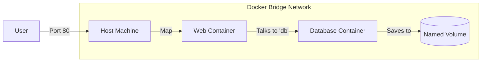

# Volumes and Networking: Storage and Communication

Version: 1.0.0
Last Updated: 2026-03-09
Prerequisites: Module 8.1 & 8.2

## 1. Docker Volumes: Persistent Storage

### Story Introduction

Imagine **Renting a Computer in a Cyber Cafe**.

When you log into the computer, you create files and save game progress. But the moment you log out (The Container stops), the computer is "Wiped Clean" for the next user. Everything you did is gone.

If you want to keep your files, you plug in a **USB Thumb Drive (The Volume)**.
1.  You work on the computer.
2.  You save your files directly to the USB drive.
3.  When you "Stop" the computer, the files are safe on the USB drive.
4.  Tomorrow, you can plug that same USB drive into a *different* computer, and all your files will be there.

In Docker, containers are **Ephemeral** (disposable). **Volumes** are the only way to save your database or user uploads forever.

### Concept Explanation

By default, data inside a container is deleted when the container is deleted.

#### Types of Storage:
1.  **Named Volumes**: Managed by Docker. The best choice for databases. (e.g., `docker run -v my-db:/var/lib/mysql`).
2.  **Bind Mounts**: Maps a specific folder on your host (laptop) to the container. Great for development (e.g., `docker run -v $(pwd):/app`).
3.  **Tmpfs**: Stores data in the host's RAM. It's never written to disk. Very fast but temporary.

---

## 2. Docker Networking: How Containers Talk

### Concept Explanation

Containers are isolated by default. To make them talk to each other or to the internet, we use **Networks**.

#### Network Drivers:
*   **Bridge (Default)**: Creates a private network inside your laptop. Containers can talk to each other using their names (e.g., `web` talks to `db`).
*   **Host**: Removes isolation. The container uses your laptop's IP directly. Fast but less secure.
*   **None**: Total isolation. No network.
*   **Overlay**: Used to connect containers across *different* physical servers (Docker Swarm/Kubernetes).

### Code Example (Connecting a Web App to a DB)

```bash
# 1. Create a private "Backyard" network
docker network create my-app-net

# 2. Start a Database on that network
docker run -d --name db --network my-app-net mysql

# 3. Start a Web App on the same network
# We don't need to know the DB's IP! We just use the name 'db'.
docker run -d --name web --network my-app-net -p 80:80 my-web-app
```

### Step-by-Step Walkthrough

1.  **`docker network create`**: This sets up a virtual switch.
2.  **`--name db`**: This is very important. Docker has a built-in **DNS Server**. When the `web` container looks for `db`, Docker automatically gives it the correct private IP.
3.  **`-p 80:80`**: This is **Port Mapping**. It maps your laptop's Port 80 to the container's Port 80. This is how the "Outside World" gets in.
4.  **Isolation**: Even though `web` is on the internet (via port 80), `db` is hidden. No one from the internet can talk to the database directly.

### Diagram



### Real World Usage

In **Stateful Applications** (like MySQL, MongoDB, or WordPress), we NEVER run without volumes. In a cloud environment, if a physical disk fails, AWS might move your container to a different server. Without a **Persistent Volume** (like AWS EBS or EFS), your company would lose all its data during that move.

### Best Practices

1.  **Use Named Volumes for Production**: They are easier to back up and manage than bind mounts.
2.  **User Custom Networks**: Don't use the default "bridge" network. Create your own for each project to ensure better isolation and DNS.
3.  **Read-Only Mounts**: If a container only needs to *read* a config file, mount it as read-only (`-v config.json:/app/config.json:ro`) for better security.
4.  **Clean up unused volumes**: Run `docker volume prune` regularly. Unused database volumes can take up gigabytes of space.

### Common Mistakes

*   **Deleting the Volume**: Thinking `docker rm [container]` also deletes the data. It doesn't, but if you run `docker rm -v`, it will!
*   **Permissions Issues**: Trying to mount a folder from your Mac/Windows into a Linux container and getting "Access Denied" because the User IDs don't match.
*   **Assuming IPs are Static**: Never use a container's IP address (e.g., `172.17.0.2`) in your config files. Use the container name (`db`).

### Exercises

1.  **Beginner**: What is the command to create a new Docker volume?
2.  **Intermediate**: What is the difference between a "Named Volume" and a "Bind Mount"?
3.  **Advanced**: Why is it safer to use a custom network instead of the default bridge network?

### Mini Projects

#### Beginner: The Persistent Note-Taker
**Task**: Run a `busybox` container and mount a volume to `/data`. Create a file inside `/data`. Stop the container, delete it, and run a *new* container with the same volume. Check if the file is still there.
**Deliverable**: A session log showing the file survived the "Death" of the first container.

#### Intermediate: The Bind Mount Developer
**Task**: Create an `index.html` on your laptop. Run an Nginx container and "Bind Mount" your local folder to `/usr/share/nginx/html`. Change the HTML file on your laptop and refresh your browser.
**Deliverable**: A 1-sentence confirmation that the website changed without you needing to rebuild the Docker image.

#### Advanced: The Two-Tier Network
**Task**: Create two networks: `frontend` and `backend`. Start a "Proxy" container on *both*. Start a "Web" container on `frontend`. Start a "DB" container on `backend`.
**Deliverable**: Explain why the "Web" container cannot talk directly to the "DB" container in this setup.
