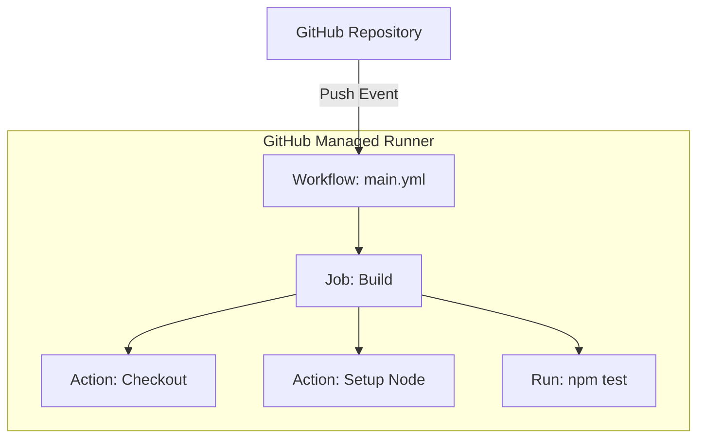

# GitHub Actions: Modern Cloud Automation

Version: 1.0.0
Last Updated: 2026-03-09
Prerequisites: Module 5 (Git) & Module 9.1 (CI/CD Fundamentals)

## 1. What is GitHub Actions? (GitHub's Built-in Engine)

### Story Introduction

Imagine **A Smart To-Do List that Does the Work for You**.

1.  **The Trigger**: You write on your list, "If I finish my essay (Git Push)..."
2.  **The Action**: "...then go to the park, print out a copy, and mail it to my teacher."
3.  **The Magic**: You don't have to hire a Butler (Jenkins) to do this. The list itself is smart. It "Wakes Up" the moment you finish the essay and handles the task instantly.

**GitHub Actions** is "Serverless" automation. You don't manage any servers; you just write a YAML file in your repository, and GitHub provides the machines (Runners) to do the work.

### Concept Explanation

GitHub Actions makes it easy to automate all your software workflows, now with world-class CI/CD.

#### Core Components:
*   **Workflow**: The entire automated process (e.g., "Build and Test website"). Stored in `.github/workflows/`.
*   **Event**: The trigger (e.g., `push`, `pull_request`, `release`).
*   **Job**: A set of steps that run on the same runner.
*   **Step**: An individual task (e.g., "Set up Python," "Run tests").
*   **Action**: A reusable block of code (like a plugin) created by the community.
*   **Runner**: The computer that executes the job (Linux, Windows, or Mac).

---

## 2. Writing Your First Workflow (YAML)

### Concept Explanation

GitHub Actions uses **YAML** files. They are stored in your project folder under `.github/workflows/main.yml`.

### Code Example (Auto-Testing a Node.js App)

```yaml
name: Node.js CI

on:
  push:
    branches: [ "main" ]
  pull_request:
    branches: [ "main" ]

jobs:
  build:
    runs-on: ubuntu-latest

    steps:
    - name: Checkout Code
      uses: actions/checkout@v3

    - name: Set up Node.js
      uses: actions/setup-node@v3
      with:
        node-version: '18'

    - name: Install dependencies
        run: npm install

    - name: Run Tests
      run: npm test
```

### Step-by-Step Walkthrough

1.  **`on: [push, pull_request]`**: This defines the "Triggers." The code will run whenever someone pushes to `main` or opens a PR.
2.  **`runs-on: ubuntu-latest`**: You are telling GitHub, "I need a fresh Linux laptop for this job." GitHub provides this for free!
3.  **`uses: actions/checkout@v3`**: This is a pre-made **Action**. It handles the boring task of downloading your code onto the runner.
4.  **`run: npm test`**: This is where your real work happens. If `npm test` fails (returns a non-zero exit code - Module 3.5), GitHub will mark the build as "Failed" with a big red 'X'.

### Diagram



### Real World Usage

**Fast-moving Startups** and **Open Source Projects** love GitHub Actions. If you go to a popular project on GitHub (like VS Code or React), you'll see a small green checkmark next to every commit. That checkmark means the "GitHub Actions" pipeline ran, and the code is safe to merge. It prevents breaking changes from ever entering the main code.

### Best Practices

1.  **Use GitHub Secrets**: Never put your AWS keys or database passwords in your YAML file. Go to "Settings -> Secrets" and use `${{ secrets.MY_KEY }}` in your code.
2.  **Use Third-Party Actions**: Don't write everything from scratch. Use official actions from Docker, AWS, and Google Cloud to simplify your workflow.
3.  **Path Filtering**: If you have a "Frontend" and "Backend" in the same repo, configure your workflow to only run if the files *in that specific folder* are changed (`paths: ['frontend/**']`).
4.  **Matrix Builds**: You can test your code on Node 14, 16, and 18 simultaneously using a single job.

### Common Mistakes

*   **Indentation Errors**: Like Docker Compose, YAML will fail if you use tabs instead of spaces or have incorrect nesting.
*   **Running Too Many Jobs**: Triggering a massive, expensive build on every single commit. (Solution: Use `on: pull_request` to only run when the work is "almost done").
*   **Not Pinning Action Versions**: Using `uses: node/setup-node@latest` (Use specific versions like `@v3` to prevent breaking changes).

### Exercises

1.  **Beginner**: Where in your project folder must you store GitHub Actions workflow files?
2.  **Intermediate**: What is the purpose of the `uses` keyword in a workflow?
3.  **Advanced**: How can you prevent a GitHub Action from running unless a specific "Secret" is available?

### Mini Projects

#### Beginner: The Greeting Action
**Task**: Create a `.github/workflows/hello.yml` file in a GitHub repo. Have it print a message of your choice whenever you push code.
**Deliverable**: A screenshot of the "Actions" tab on GitHub showing a green checkmark for your "Greeting" workflow.

#### Intermediate: The Docker Publisher
**Task**: Write a workflow that builds your Docker image whenever a new "Tag" (version) is created in Git and pushes it to Docker Hub.
**Deliverable**: The YAML workflow file showing the "Build" and "Push" steps.

#### Advanced: The Security Guard
**Task**: Research the `actions/stale` action. Create a workflow that automatically closes old, inactive Issues or Pull Requests on your GitHub repository.
**Deliverable**: The YAML file configured to mark issues as "stale" after 30 days of inactivity.
