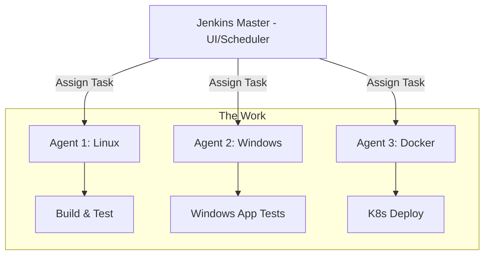

# Jenkins Basics: The Butler of DevOps

Version: 1.0.0
Last Updated: 2026-03-09
Prerequisites: Module 9.1 (CI/CD Fundamentals)

## 1. What is Jenkins? (The Automation Butler)

### Story Introduction

Keep in mind **A 24/7 Butler in a High-Tech Mansion**.

1.  **The Master (Jenkins Master)**: He sits in the lobby. He has a giant calendar and a list of chores. He doesn't do the cleaning himself; he's too important. 
2.  **The Workers (Jenkins Agents/Nodes)**: These are the people who actually scrub the floors and wash the windows. The Master says "Go paint the fence," and he sends a Worker to the backyard to do it.
3.  **The To-Do List (Jobs)**: When you leave a note saying "If the mail arrives, put it on my desk," the Butler watches the door. As soon as the mailman (Git Push) arrives, he kicks off the "Process Mail" job.

Jenkins is the old-school, powerful, and highly flexible "Butler" who has been serving the DevOps world for over 15 years.

### Concept Explanation

Jenkins is an open-source automation server written in Java. It is used to automate all sorts of tasks related to building, testing, and deploying software.

#### The Master-Agent Architecture:
*   **Jenkins Master**: The control plane. It handles the UI, manages plugins, schedules builds, and dispatches them to agents.
*   **Jenkins Agent (Node)**: A separate machine (or container) that does the heavy lifting. This keeps the Master stable and fast.

#### The Plugin Ecosystem:
Jenkins' greatest strength and weakness is its **Plugins**. It has over 1,800 plugins. If you want to connect Jenkins to Slack, there's a plugin. If you want to connect it to an old mainframe from 1980, there's likely a plugin for that too.

---

## 2. Setting Up Your First Job (Freestyle)

### Concept Explanation

A **Freestyle Job** is a simple, web-based way to configure a task. You click buttons to say:
1.  **Source Code Management**: "Pull this Git repo."
2.  **Triggers**: "Watch for changes every minute."
3.  **Build Steps**: "Run this shell script."
4.  **Post-build Actions**: "Send an email if it fails."

### Code Example (Jenkins Shell Command)

Inside a Jenkins job, you usually run a series of shell commands. For example, to build a Docker image:

```bash
# Jenkins will run this automatically on the Agent
echo "Building version ${BUILD_NUMBER}..."
docker build -t my-app:${BUILD_NUMBER} .
docker push my-app:${BUILD_NUMBER}
```

### Step-by-Step Walkthrough

1.  **`${BUILD_NUMBER}`**: This is a **Jenkins Environment Variable**. Jenkins automatically gives every run a unique number (1, 2, 3...). We use this to tag our Docker images so each one is unique (Module 8.5).
2.  **Plugin Dependency**: For this command to work, the "Docker Plugin" must be installed and the Jenkins user must have permission to run `docker` on the agent.
3.  **The Build Console**: When the job runs, Jenkins captures the output of the shell and shows it to you in a "Real-time Console." If the `docker build` fails, the "Light" for the job turns red.

### Diagram



### Real World Usage

Most **Enterprise Companies** (Banks, Insurance, Large Retail) use Jenkins because they have complex, "Legacy" systems. Jenkins allows them to connect their modern GitHub code to their old "On-premise" databases through custom plugins. It's the "Swiss Army Knife" of automation.

### Best Practices

1.  **Backup your JENKINS_HOME**: All your jobs and settings are in one folder. If that folder is deleted, your whole "Butler" is gone. Back it up to S3 (Module 7.3) every night.
2.  **Don't run jobs on the Master**: Always use Agents. If a build crashes a server, you want it to crash the "Worker," not the "Master."
3.  **Use Blue Ocean**: Install the "Blue Ocean" plugin for a modern, beautiful UI that makes understanding complex pipelines much easier.
4.  **Practice Plugin Hygiene**: Don't install 500 plugins. More plugins = more security holes and slower updates. Only install what you need.

### Common Mistakes

*   **Plugin Version Hell**: Updating one plugin and having it break 10 other plugins. (Always test updates in a "Dev Jenkins" first).
*   **The "Hanging" Master**: Memory leaks caused by too many old build logs. (Solution: Set a policy to "Discard Old Builds" after 30 days).
*   **Plain-text Secrets**: Typing passwords directly into the job configuration. Use the **Jenkins Credentials Provider** instead.

### Exercises

1.  **Beginner**: What is the difference between a Jenkins Master and a Jenkins Agent?
2.  **Intermediate**: How does a "Freestyle Job" differ from a "Pipeline" (we will learn about Pipelines next)?
3.  **Advanced**: Why contributes to Jenkins being considered "Flexible" compared to a SaaS tool like GitHub Actions?

### Mini Projects

#### Beginner: The Console Greeting
**Task**: Install Jenkins locally (via Docker: `docker run -p 8080:8080 jenkins/jenkins:lts`). Create a Freestyle job. Add a build step to "Execute Shell" and type `echo "Hello from my first Jenkins Job"`.
**Deliverable**: A screenshot of the "Console Output" showing your message.

#### Intermediate: The Automated Weather Report
**Task**: Create a Jenkins job that runs every hour (using Cron syntax: `H * * * *`). It should use `curl` to fetch the weather for your city and print it to the console.
**Deliverable**: The job configuration (Cron) and a successful build log.

#### Advanced: The Agent Link
**Task**: Research how to connect a separate machine (or another container) as a "Jenkins Agent" via SSH.
**Deliverable**: A short message explaining how the Master "talks" to the agent and what happens if the agent goes offline.
