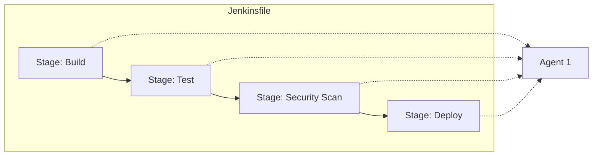

# Jenkins Pipelines: Pipeline as Code

Version: 1.0.0
Last Updated: 2026-03-09
Prerequisites: Module 9.2 (Jenkins Basics)

## 1. What is a Jenkins Pipeline?

### Story Introduction

Imagine **The Blueprints for an Airplane Factory**.

In the beginning, you told the robots where to go by clicking buttons on a screen (Freestyle Jobs). But as your factory grew to 100 rooms, you realized you couldn't remember which buttons you clicked.

So, you decided to write everything down in a master **Blueprint (The Jenkinsfile)**.
1.  The blueprint is kept in the main library (Git).
2.  If you want to change how a wing is built, you change the blueprint and "Commit" it.
3.  The factory automatically reads the new blueprint and updates all the robots at once.

Writing your automation in a script instead of clicking buttons is called **Pipeline as Code**.

### Concept Explanation

A **Jenkins Pipeline** is a suite of plugins that supports implementing and integrating continuous delivery pipelines into Jenkins.

#### Declarative vs. Scripted:
*   **Declarative (Modern)**: Easy to read, structured with "Stages" and "Steps." It's like a checklist.
*   **Scripted (Legacy/Advanced)**: Written in Groovy code. Powerful but complex. Harder to maintain.

#### The `Jenkinsfile`:
A text file that contains the definition of a Jenkins Pipeline and is checked into source control (Git). This ensures your "Automation" follows the same rules (Code Review, Versioning) as your "Software."

### Code Example (A Declarative Pipeline)

```groovy
pipeline {
    agent any // Run on any available worker

    stages {
        stage('Checkout') {
            steps {
                git 'https://github.com/my-org/my-app.git'
            }
        }

        stage('Build') {
            steps {
                echo 'Compiling code...'
                sh 'make build'
            }
        }

        stage('Test') {
            steps {
                echo 'Running Unit Tests...'
                sh 'make test'
            }
        }

        stage('Deploy') {
            steps {
                echo 'Deploying to Staging...'
                sh 'scp build/app user@staging:/var/www/'
            }
        }
    }

    post {
        always {
            echo 'I will always run, even if the build fails!'
        }
        success {
            echo 'Everything worked!'
        }
        failure {
            echo 'Send an alert! Something broke.'
        }
    }
}
```

### Step-by-Step Walkthrough

1.  **`pipeline { ... }`**: This wraps the whole blueprint.
2.  **`agent any`**: This tells Jenkins, "I don't care which machine builds this, just find one."
3.  **`stages`**: This is the visual layout of your pipeline. When you look at the Jenkins UI, you will see 4 boxes: Checkout, Build, Test, and Deploy.
4.  **`sh`**: This is the "shell" step. It’s what connects the Groovy pipeline to the real world (Module 3.1).
5.  **`post { ... }`**: This is your "Cleanup and Notification" area. It ensures you know exactly when a build fails.

### Diagram



### Real World Usage

In **Large Microservice Architectures**, developers don't have time to create a "Job" in Jenkins for every service. Instead, they write one shared "Pipeline Template." Each microservice just has a small `Jenkinsfile`. Jenkins automatically detects the file and builds the service. This allows a team to manage 500 different apps with a single, central automation strategy.

### Best Practices

1.  **Use Declarative Syntax**: It is the modern standard. Only use Scripted if you have extremely complex logic that regular pipelines can't handle.
2.  **Modularize with Shared Libraries**: If you find yourself copying the same 50 lines of code into every `Jenkinsfile`, move them to a "Shared Library" that everyone can import.
3.  **Check in your Jenkinsfile**: Never store your pipeline logic only inside the Jenkins UI. If the UI gets messed up, your script is safe in Git.
4.  **Use Parallelism**: If you have 10 types of tests, run them in `parallel` to save time.

### Common Mistakes

*   **Logic in the Jenkinsfile**: Putting too much programming logic (loops, math) in the pipeline. Keep the pipeline for "Orchestration" and move the logic into a separate shell script or Python script.
*   **Forgetting `post` blocks**: Not having a way to notify developers when a build fails.
*   **Security Gaps**: Printing a database password into the console logs during a build. (Always use the `credentials()` function in Jenkins).

### Exercises

1.  **Beginner**: What is a `Jenkinsfile`?
2.  **Intermediate**: What is the difference between `sh` and `echo` in a Jenkins pipeline?
3.  **Advanced**: How can you run two stages at the same time in Jenkins? (Hint: See the `parallel` keyword).

### Mini Projects

#### Beginner: The Stage Designer
**Task**: In a Jenkins instance, create a "Pipeline" job. Paste the Groovy code from the example above. Run it.
**Deliverable**: A screenshot of the "Stage View" in Jenkins showing the blue/green boxes representing each stage.

#### Intermediate: The Conditional DeployER
**Task**: Modify the `Jenkinsfile` example to only run the "Deploy" stage if the branch is `main`. (Hint: Use `when { branch 'main' }`).
**Deliverable**: The updated `Jenkinsfile` code.

#### Advanced: The Slack Notifier
**Task**: Research the Jenkins "Slack Notification" plugin. Add a `post` block to your `Jenkinsfile` that sends a message to a Slack channel only when the build fails.
**Deliverable**: A snippet showing the `slackSend` command inside a `failure` block.
