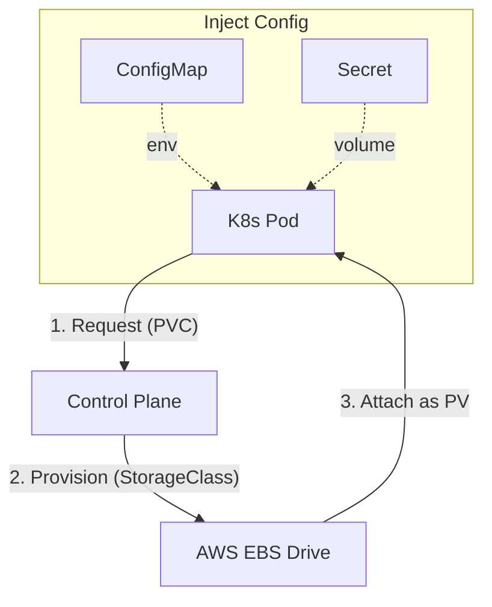

# Configuration and Storage: Persistence in Chaos

Version: 1.0.0
Last Updated: 2026-03-09
Prerequisites: Module 10.1 - 10.3

## 1. ConfigMaps and Secrets: Application Settings

### Story Introduction

Imagine **A Universal Remote Control**.

Your Remote (The Container) can talk to any TV. But it needs to know the "Brand" and "Code" for the specific TV it's currently facing.
*   **The Problem**: If you hardcode the brand "Sony" inside the remote, it's useless for a "Samsung" TV. 
*   **The Solution**: You write the codes on a piece of paper and tape it to the back of the remote.
    *   **ConfigMap**: The piece of paper for the brand name (Public information).
    *   **Secret**: A locked box for the owner's password (Private information).

When the remote "Wakes Up" (Starts as a Pod), it reads the paper and the box and then knows exactly how to behave.

### Concept Explanation

In K8s, we separate the **Application Code** from its **Configuration**.

#### ConfigMap:
*   Used for non-sensitive data (e.g., `DATABASE_HOST: "db.myapp.com"`).
*   Can be injected as environment variables or mounted as files.

#### Secret:
*   Used for sensitive data (e.g., passwords, API keys).
*   K8s stores these in a slightly more secure way (Base64 encoded) and only sends them to the pods that strictly need them.

---

## 2. PV and PVC: Persistent Storage

### Concept Explanation

Recall the "USB Drive" (Module 8.3). In K8s, pods are constantly moving. If a node crashes, the Pod is moved to a new node. How does the data follow it?

1.  **Persistent Volume (PV)**: A "Chunk" of physical storage. Like a hard drive sitting on a shelf.
2.  **Persistent Volume Claim (PVC)**: A "Ticket" or a request. A pod says, "I need 10GB of storage for my database."
3.  **StorageClass**: The "Factory" that creates PVs automatically when it sees a PVC.

K8s "Matches" the Ticket (PVC) to the Hard Drive (PV). If the Pod moves, K8s "Unplugs" the drive from the old server and "Plugs" it into the new one.

### Code Example (ConfigMap and PVC YAML)

```yaml
# configmap.yml
apiVersion: v1
kind: ConfigMap
metadata:
  name: app-config
data:
  LOG_LEVEL: "DEBUG"
  API_URL: "https://api.example.com"
```

```yaml
# pvc.yml
apiVersion: v1
kind: PersistentVolumeClaim
metadata:
  name: db-disk
spec:
  accessModes:
    - ReadWriteOnce
  resources:
    requests:
      storage: 1Gi
```

### Step-by-Step Walkthrough

1.  **`data`**: In a ConfigMap, this is a simple Key-Value pair. Your app can read `LOG_LEVEL` just like any regular variable.
2.  **`ReadWriteOnce`**: This tells K8s, "Only one Pod can use this storage at a time." (Crucial for databases to prevent data corruption).
3.  **Dynamic Provisioning**: Because we don't define a specific `PV`, K8s will look at its **StorageClass** (e.g., AWS EBS) and automatically buy a 1GB disk from Amazon to satisfy the request.

### Diagram



### Real World Usage

In **E-Learning Platforms**, videos are stored in S3, but "User Session Data" or "Upload Queues" might live in a local Redis database. We use **PVCs** to ensure that even if the Redis Pod crashes, the 10,000 active student sessions aren't lost. The data stays on the disk, waits for the new Pod to start, and re-attaches instantly.

### Best Practices

1.  **Don't store secrets in Git**: Use tools like **External Secrets Operator** or **HashiCorp Vault** to securely sync your real passwords into K8s Secrets.
2.  **Use SubPaths for ConfigMaps**: If you mount a ConfigMap as a volume, it will overwrite the whole folder! Use `subPath` to only add a single file.
3.  **Reclaim Policy**: Set your StorageClass reclaim policy to `Retain` for production databases. This ensures that if the PVC is deleted by mistake, the data is NOT deleted from the cloud.
4.  **Least Privilege for Secrets**: Ensure your Pod's ServiceAccount only has permission to read the secrets it actually needs.

### Common Mistakes

*   **ConfigMap Changes don't apply**: Changes to ConfigMaps injected as Environment Variables require a **Pod Restart** to take effect. If mounted as a File, they take about 60 seconds to update.
*   **Pending PVCs**: Creating a PVC for 100GB but your cluster only has 50GB of disk space available. The PVC will stay "Pending" forever.
*   **Sharing a Drive (RWO vs RWX)**: Trying to use a `ReadWriteOnce` disk with two different Pods at the same time. The second Pod will fail to start.

### Exercises

1.  **Beginner**: What is the difference between a ConfigMap and a Secret?
2.  **Intermediate**: What does "Dynamic Provisioning" mean in terms of K8s storage?
3.  **Advanced**: How do you inject a ConfigMap into a container as an Environment Variable?

### Mini Projects

#### Beginner: The Variable Injector
**Task**: Create a ConfigMap with your name. Start a Pod and inject that ConfigMap as an environment variable called `MY_NAME`.
**Deliverable**: Run `kubectl exec [pod] -- env | grep MY_NAME` and show the output.

#### Intermediate: The Password Box
**Task**: Create a Secret containing a mock API Key. Mount it as a file inside a Pod at `/etc/secrets/api-key`.
**Deliverable**: Run `kubectl exec [pod] -- cat /etc/secrets/api-key` and show the result.

#### Advanced: The Data Survivor
**Task**: Create a PVC. Start a Pod that writes "I was here" to a file in the mounted PVC. Delete the Pod. Start a second Pod using the *same* PVC and read the file.
**Deliverable**: A session log proving the text survived between the two pods.
