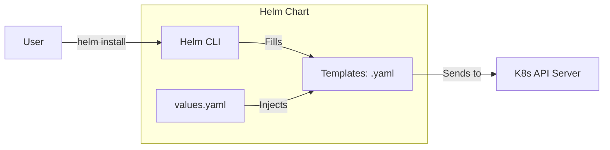

# K8s Ecosystem and Helm: Leveling Up

Version: 1.0.0
Last Updated: 2026-03-09
Prerequisites: Module 10.1 - 10.4

## 1. Namespaces: Virtual Clusters

### Story Introduction

Imagine **A Giant Coworking Space**.

1.  **The Space (The Cluster)**: Everyone shares the same building, the same internet, and the same coffee machine.
2.  **The Problem**: If a startup called "Team Blue" names their meeting room "The Den," and another startup called "Team Green" also names their room "The Den," people will get lost. If Team Blue accidentally uses all the Wi-Fi, Team Green can't work.
3.  **The Solution (Namespaces)**: You give Team Blue their own floor (Namespace) and Team Green their own floor.
    *   They can both have a room called "The Den" because they are on different floors.
    *   You can set a rule: "Team Blue is only allowed 10 chairs and 5 desks."

**Namespaces** allow you to slice one physical Kubernetes cluster into many "Virtual Clusters."

### Concept Explanation

A **Namespace** is a logical partition of a cluster.

#### Default Namespaces:
*   **`default`**: Where your pods go if you don't specify a floor.
*   **`kube-system`**: Where K8s keeps its own internal "Peas" (The API server, etc.).
*   **`kube-public`**: Data meant for everyone to read.

#### Why use them?
*   **Isolation**: Keep the `development` team away from the `production` team.
*   **Resource Quotas**: Prevent a single app from hogging all the cluster's RAM.

---

## 2. Helm: The Package Manager for K8s

### Concept Explanation

If you want to install a complex app like **WordPress**, you need a Deployment, a Service, a ConfigMap, and a Secret (4-5 different YAML files). Copying and pasting these manifests for every new project is slow and leads to errors.

**Helm** is like `apt` (Module 2.2) or `npm` but for Kubernetes.
1.  **Charts**: A collection of YAML templates that describe an application.
2.  **Values**: A separate file where you put your specific settings (like the Website Name or DB Password).
3.  **Releases**: A specific "Installation" of a Chart. You can have 3 "Releases" of the WordPress Chart on one cluster.

### Code Example (Installing an App with Helm)

```bash
# 1. Add the "Bitnami" warehouse to your list
helm repo add bitnami https://charts.bitnami.com/bitnami

# 2. Search for the app you want
helm search repo wordpress

# 3. Install it with one command
helm install my-blog bitnami/wordpress

# 4. List your "Releases"
helm list

# 5. Upgrade the app (e.g., change the version)
helm upgrade my-blog bitnami/wordpress --set wordpressUsername=admin_new
```

### Step-by-Step Walkthrough

1.  **`helm install`**: Helm reads the 5-10 YAML files inside the "Chart," replaces the variables (like port numbers or names) with your specific **Values**, and sends everything to Kubernetes at once.
2.  **`--set`**: This is how you "fill in the blanks" of the template without ever touching the YAML files themselves.
3.  **Rollbacks**: This is Helm's superpower. If an upgrade fails, you can run `helm rollback my-blog 1`, and Helm will restore the exact YAML configuration of your first successful installation.

### Diagram



### Real World Usage

In **SaaS Companies**, they use Helm to deploy "Tenant Environments." When a new customer signs up, a script runs `helm install customer-123 ./my-saas-chart`. This instantly creates a private Namespace, a custom database, and a custom web server for that specific customer, all using the same template. It takes 30 seconds instead of hours of manual YAML editing.

### Best Practices

1.  **Use Namespaces for everything**: Never put your production apps in the `default` namespace.
2.  **Version your Helm Charts**: Just like your code (Module 5), your Charts should have version numbers (e.g., `v1.2.0`).
3.  **Write your own `values.yaml`**: Don't use `--set` for everything. Keep a file in Git called `prod-values.yaml` for each environment.
4.  **Dry Run**: Before installing a complex chart, run `helm install --dry-run --debug` to see the generated YAML without actually applying it.

### Common Mistakes

*   **Namespace Mixups**: Running `kubectl get pods` and thinking your app is gone, only to realize you forgot to add `-n my-namespace`.
*   **Forgotten Values**: Installing a chart without setting the "required" passwords, resulting in a crashing Pod.
*   **Version Drift**: Updating the app via `kubectl edit` instead of `helm upgrade`. Helm will "forget" your manual changes the next time you use it!

### Exercises

1.  **Beginner**: What is a Kubernetes Namespace?
2.  **Intermediate**: What is a "Helm Chart"?
3.  **Advanced**: How does a `values.yaml` file interact with the templates inside a Helm chart?

### Mini Projects

#### Beginner: The Namespace Architect
**Task**: Create a namespace called `staging`. Start a pod in that namespace.
**Deliverable**: Run `kubectl get pods -n staging` and show the output.

#### Intermediate: The Helm Explorer
**Task**: Install the "Nginx" chart from the Bitnami repository.
**Deliverable**: Run `helm list` and show that your Nginx release is "Deployed."

#### Advanced: The Custom Value Specialist
**Task**: Download a simple Helm chart locally. Change the "ReplicaCount" in the `values.yaml` from 1 to 3. Install the chart.
**Deliverable**: Show with `kubectl get pods` that 3 pods were created using your custom values.
