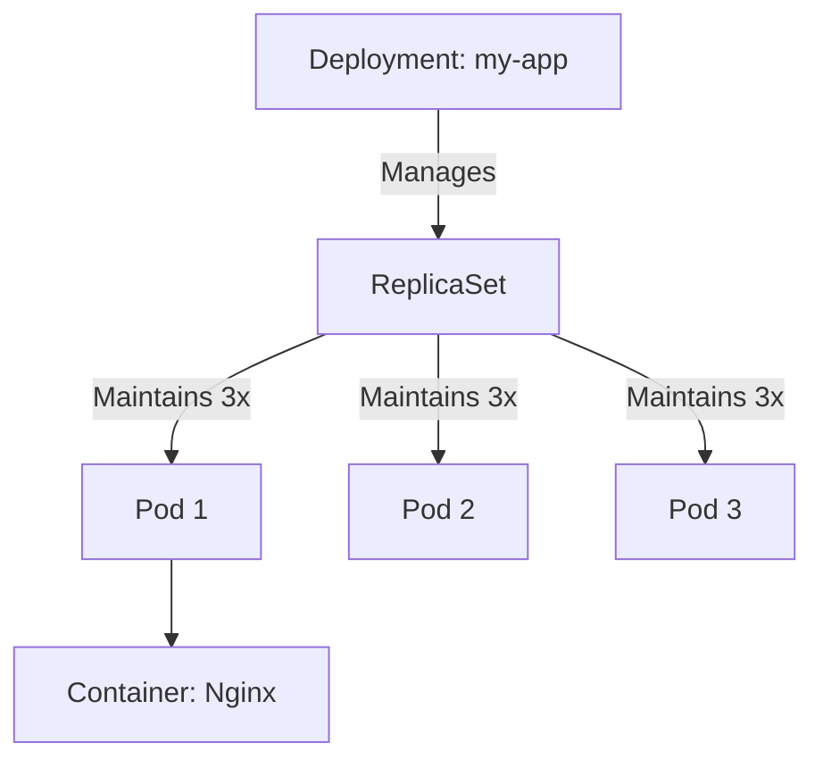

# K8s Objects and Workloads: The Building Blocks

Version: 1.0.0
Last Updated: 2026-03-09
Prerequisites: Module 10.1 (K8s Fundamentals)

## 1. Pods: The Smallest Unit

### Story Introduction

Keep in mind **A Pea Pod**.

A single pea (Your Container) can't easily roll around or be moved. So, nature puts it in a **Pod**. Inside the pod, there might be one pea or two peas. 
*   **They share the same air (Networking)**.
*   **They live in the same space (Storage)**.
*   **If the pod falls, both peas fall together**.

In Kubernetes, we never run a "Container" directly. We run a **Pod**. The Pod is the "Space Suit" that keeps your container alive in the vast vacuum of the cloud.

### Concept Explanation

A **Pod** is the smallest deployable unit in Kubernetes.

#### Key Features:
*   **One or More Containers**: Usually one, but "Sidecars" (helper containers) are common.
*   **Shared IP**: All containers in a Pod share `localhost` and the same IP address.
*   **Ephemeral**: Pods are not meant to live forever. They are created, they do work, and they die.

---

## 2. Deployments and ReplicaSets: The Manager

### Concept Explanation

You almost never create a Pod manually. You use a **Deployment**.

1.  **ReplicaSet**: The "Counter." If you say "I want 3 pods," the ReplicaSet's only job is to count them. If it sees only 2, it starts 1 more. If it sees 4, it kills 1.
2.  **Deployment**: The "Version Manager." It manages the ReplicaSets. If you want to update your app from `v1` to `v2`, the Deployment creates a new `v2` ReplicaSet and slowly kills the old `v1` one (Rolling Update).

### Code Example (Your First K8s Manifest - YAML)

```yaml
# deployment.yaml
apiVersion: apps/v1
kind: Deployment
metadata:
  name: my-web-app
spec:
  replicas: 3 # I want 3 copies of my app
  selector:
    matchLabels:
      app: web
  template:
    metadata:
      labels:
        app: web
    spec:
      containers:
      - name: nginx
        image: nginx:1.14.2
        ports:
        - containerPort: 80
```

### Step-by-Step Walkthrough

1.  **`kind: Deployment`**: This tells K8s what type of "Lego block" we are using.
2.  **`replicas: 3`**: This is the **Desired State**. The ReplicaSet will now fight 24/7 to ensure 3 pods are always running.
3.  **`selector`**: This is how the Manager finds its workers. It looks for any Pod with the "Label" `app: web`.
4.  **`template`**: This is the "Blueprint" for the Pod. Every time a Pod dies, K8s uses this template to make a perfect clone.

### Diagram



### Real World Usage

In **FinTech**, we use **Rolling Updates**. Imagine a bank needs to update its "Transaction Service." They can't just turn it off for 2 minutes. They use a Deployment. It starts 1 new server, waits for it to be ready, then kills 1 old server. It repeats this until the whole fleet is updated. If the new code has a bug, the Deployment can "Roll Back" instantly to the old version.

### Best Practices

1.  **Always use Labels**: Labels are the "glue" of K8s. Label your pods by `env`, `app`, and `version`.
2.  **Use Liveness and Readiness Probes**: Tell K8s *how* to know if your app is actually working. (e.g., "Check if the website returns a 200 OK").
3.  **Set Resource Limits**: Never let a Pod take unlimited CPU. Set a **Limit** (e.g., 500m CPU) so one buggy container doesn't crash the whole Node.
4.  **Don't use `latest` images**: Like Docker (Module 8.2), always use a specific version so your Deployment is predictable.

### Common Mistakes

*   **Editing Pods Directly**: Trying to fix a bug by logging into a Pod and changing a file. K8s will eventually kill that Pod and replace it with a fresh, broken one from the Template. Always update the **Deployment YAML**.
*   **Orphan Pods**: Deleting a Deployment but leaving its Pods running (or vice-versa).
*   **Selector Mismatches**: Having a Deployment look for `app: web` but your Pod template has the label `app: frontend`. The Deployment will constantly try to start new pods because it can't find its "workers."

### Exercises

1.  **Beginner**: What is the smallest unit of deployment in Kubernetes?
2.  **Intermediate**: What is the difference between a ReplicaSet and a Deployment?
3.  **Advanced**: How does a "Rolling Update" work in Kubernetes?

### Mini Projects

#### Beginner: The Pod Spawner
**Task**: Use the command `kubectl run my-shell --image=busybox -it -- sh`. Explore the inside of the Pod.
**Deliverable**: Run `hostname -i` inside the pod to see its internal IP address.

#### Intermediate: The Scale Master
**Task**: Use the `deployment.yaml` provided above. Apply it (`kubectl apply -f deployment.yaml`). Then, change `replicas` to 5 and apply again.
**Deliverable**: Run `kubectl get pods` and show the output with 5 running pods.

#### Advanced: The Self-Healing Test
**Task**: Create a Deployment with 3 replicas. Manually delete one of the Pods (`kubectl delete pod [name]`). Watch what happens.
**Deliverable**: A short log showing K8s instantly creating a replacement Pod to maintain the "Desired State."
