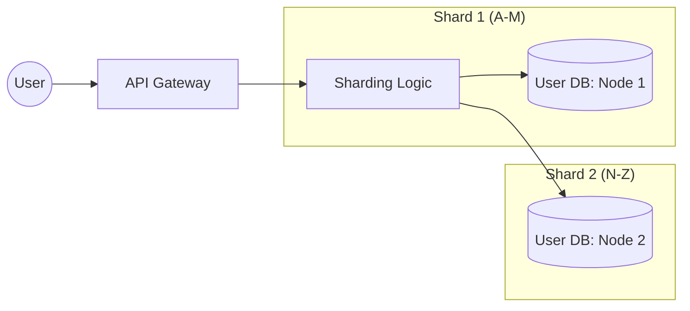

# Session 4: Database Architecture

## The Story: The "Library of Alexandria" Reloaded

Librarian Lexie manages the world's largest library. At first, she had one shelf. Then one room. Eventually, she had millions of books.

### The Storage Crisis
1. **The Indexing Issue**: If Lexie just piles books, finding one takes forever (**Full Table Scan**). She builds a card catalog (**Indexing**).
2. **The Bottleneck**: Everyone wants the latest bestseller. Lexie makes multiple copies (**Read Replicas**).
3. **The Sharding Solution**: The building is full! Lexie builds a "Science Wing" and a "History Wing" in different cities (**Database Sharding**).
4. **The Workload Split**: People returning books (Write) shouldn't block people reading them (Read). She creates a specialized "Return Drop-box" (**CQRS/Workload Optimization**).

Database Architecture is about choosing the right storage structure and optimization strategy so your data can scale as fast as your users.

---

## Core Concepts Explained

### 1. Read-Heavy vs Write-Heavy Workloads
*   **Read-Heavy**: Social media feeds, news sites. Optimization: Caching, Read Replicas, Indexing.
*   **Write-Heavy**: Logging systems, IoT sensor data. Optimization: LSM Trees (Cassandra), NoSQL, Sharding.

### 2. Database Sharding
*   **Vertical Sharding**: Splitting by feature (User Table on DB1, Orders Table on DB2).
*   **Horizontal Sharding (The Real "Sharding")**: Splitting the same table across nodes based on a key (User IDs 1-10k on DB1, 10k-20k on DB2).

---

## Sharding Visualization



---

## Code Examples: Sharding Logic (Consistency)

### Python Implementation
```python
import hashlib

class DatabaseShard:
    def __init__(self, name):
        self.name = name
        self.data = {}

    def save(self, key, value):
        self.data[key] = value
        print(f"--- Saved '{key}' to {self.name} ---")

class ShardingManager:
    def __init__(self, shards):
        self.shards = shards

    def _get_shard_index(self, key):
        # Use hashing to consistently map a key to a shard
        hash_val = int(hashlib.md5(key.encode()).hexdigest(), 16)
        return hash_val % len(self.shards)

    def put(self, key, value):
        idx = self._get_shard_index(key)
        self.shards[idx].save(key, value)

# Execution
shard_a = DatabaseShard("Shard_North")
shard_b = DatabaseShard("Shard_South")
manager = ShardingManager([shard_a, shard_b])

manager.put("alice_99", {"email": "alice@email.com"})
manager.put("bob_22", {"email": "bob@email.com"})
```

### Java Implementation
```java
import java.util.ArrayList;
import java.util.List;

class ShardNode {
    String name;
    ShardNode(String name) { this.name = name; }
    void store(String key) {
        System.out.println("--- Storing key [" + key + "] in node: " + name + " ---");
    }
}

public class DatabaseRouter {
    private List<ShardNode> shards = new ArrayList<>();

    public DatabaseRouter() {
        shards.add(new ShardNode("US-West-1"));
        shards.add(new ShardNode("EU-Central-1"));
    }

    public void route(String key) {
        // Simple Hash-based routing
        int shardIndex = Math.abs(key.hashCode()) % shards.size();
        shards.get(shardIndex).store(key);
    }

    public static void main(String[] args) {
        DatabaseRouter router = new DatabaseRouter();
        router.route("user_data_123");
        router.route("user_data_456");
    }
}
```

---

## Interview Q&A

### Q1: What is "Database Normalization" and when should you avoid it?
**Answer**: Normalization is the process of organizing data to reduce redundancy (e.g., using foreign keys). While great for **Consistency**, it requires many "JOINs" which can be slow. In high-scale systems, we often **Denormalize** (duplicate data) to make Reads faster by avoiding joins.

### Q2: How do you choose a Sharding Key?
**Answer**: (Medium-Hard)
A good sharding key must ensure a **Uniform Distribution** of data to avoid "Hotspots" (where one shard is much busier than others). If you shard by `CountryID` and 90% of users are from one country, that shard will fail. A generic `UserID` or `UUID` is usually better for balance.

### Q3: What is the difference between an Index and a Partition?
**Answer**: 
*   An **Index** is a data structure (like a B-Tree) that helps find rows quickly without scanning the whole table. 
*   **Partitioning** is physically splitting a large table into smaller pieces (e.g., by date) within the same database engine to improve query performance on specific ranges.
---
