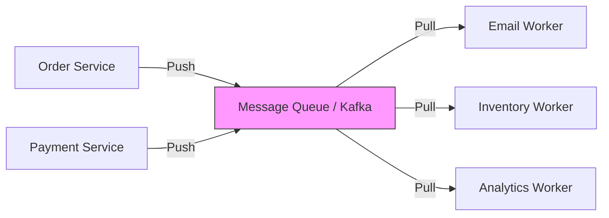

# Session 6: Asynchronous Communication

## The Story: The "Coffee Order" Evolution

Young barista Billy runs a coffee stand. 

### The Waiting Line
1. **Synchronous (The Slow Way)**: Billy takes an order, makes the coffee while the customer stares at him, and *then* takes the next order. The line moves at a snail's pace.
2. **Asynchronous (The Fast Way)**: Billy takes the order, gives the customer a "buzzer" (**Message Token**), and sends the order slip to a kitchen board (**Message Queue**). 
3. **The Kitchen Workflow**: 
    *   **The Ticket Tape (Kafka)**: A continuous stream of orders is printed.
    *   **The Chefs (Consumers)**: Three chefs pick orders from the stream. One makes espresso, one foams milk, one assembles. They work in parallel.
4. **The Notification**: When the coffee is ready, the buzzer goes off (**Callback/Event**).

Asynchronous communication allows systems to "decouple" tasks, so one slow part doesn't hold up the entire pipeline.

---

## Core Concepts Explained

### 1. Producer-Consumer Model
*   **Producer**: The service that creates the data (e.g., Order Service).
*   **Message Broker (The Middleman)**: Stores the messages (e.g., Kafka, RabbitMQ).
*   **Consumer**: The service that processes the data (e.g., Email Notification Service).

### 2. Kafka Architecture Overview
*   **Topic**: A category or feed name (like "user-signups").
*   **Partition**: A topic is split into partitions for scalability.
*   **Offset**: A unique ID for each message in a partition, tracking progress.

---

## Message Queue Visualization



---

## Code Examples: Simple Producer-Consumer (In-Memory)

### Python Implementation
```python
import queue
import threading
import time

# The Message Queue
order_queue = queue.Queue()

def producer():
    for i in range(1, 6):
        print(f"--- [Order Service] Creating Order #{i} ---")
        order_queue.put(f"Order_{i}")
        time.sleep(0.5)

def consumer():
    while True:
        order = order_queue.get()
        if order is None: break
        print(f"--- [Shipping Service] Processing {order} ---")
        time.sleep(1)
        order_queue.task_done()

# Execution
p = threading.Thread(target=producer)
c = threading.Thread(target=consumer, daemon=True)

p.start()
c.start()
p.join()
print("--- All orders sent to queue ---")
```

### Java Implementation
```java
import java.util.concurrent.BlockingQueue;
import java.util.concurrent.LinkedBlockingQueue;

public class AsyncCoffeeShop {
    private static final BlockingQueue<String> orderBoard = new LinkedBlockingQueue<>();

    public static void main(String[] args) {
        // Producer Thread (Cashier)
        Thread cashier = new Thread(() -> {
            try {
                for (int i = 1; i <= 5; i++) {
                    System.out.println("--- [Cashier] Placed Order #" + i + " ---");
                    orderBoard.put("Cappuccino_" + i);
                    Thread.sleep(500);
                }
            } catch (InterruptedException e) {}
        });

        // Consumer Thread (Barista)
        Thread barista = new Thread(() -> {
            try {
                while (true) {
                    String order = orderBoard.take();
                    System.out.println("--- [Barista] Making: " + order + " ---");
                    Thread.sleep(1000);
                }
            } catch (InterruptedException e) {}
        });

        cashier.start();
        barista.start();
    }
}
```

---

## Interview Q&A

### Q1: What is the difference between "At-least-once" and "Exactly-once" delivery?
**Answer**: 
*   **At-least-once**: The consumer might process the same message twice if the acknowledgment fails. Requires **Idempotent** logic.
*   **Exactly-once**: The system guarantees a message is processed exactly once (very hard, requires transaction coordination). Kafka supports this via transactional producers.

### Q2: Why use Kafka instead of a simple REST call?
**Answer**: (Medium-Hard)
1. **Decoupling**: The producer doesn't need to know if the consumer is online.
2. **Buffering**: If the consumer is slow, Kafka holds the messages until it catches up.
3. **Fan-out**: Multiple consumers (Email, Analytics, Fraud Detection) can read the same message independently.
4. **Replayability**: Kafka stores data for days; you can "rewind" and re-process old messages.

### Q3: What happens if a Kafka Consumer group has more consumers than partitions?
**Answer**: Some consumers will be idle. In Kafka, only **one consumer per group** can read from a single partition at any time. To increase parallelism, you must increase the number of partitions.
---
