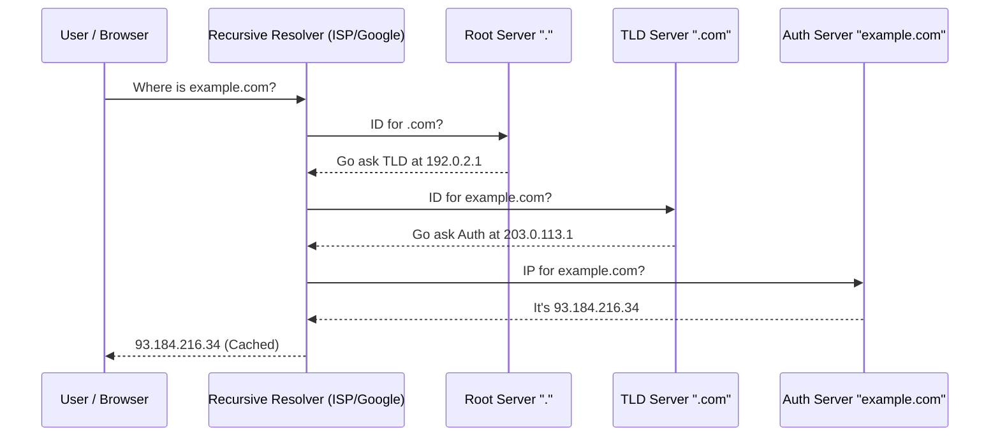

# Session 9: Domain Name Resolution

## The Story: The "Giant Phonebook" of the Internet

Charlie wants to find his friend Dave. He knows Dave lives at "**123.45.67.89**" (IP address), but that's impossible to remember. 

### The Address Mystery
1. **The Nickname (Domain)**: Instead of the number, Charlie just remembers "daves-house.com".
2. **The Local Assistant (Recursive Resolver)**: Charlie asks his phone, "Where is daves-house.com?" The phone doesn't know, so it asks the **Recursive Resolver** (Chalie's ISP).
3. **The Hierarchy Hike**: 
    *   The Resolver asks the **Root Server**: "Where is .com?" 
    *   The Root says, "Ask the **TLD Server** for .com."
    *   The TLD server says, "Ask the **Authoritative Server** for daves-house.com."
    *   The Authoritative Server finally gives the IP.
4. **The Sticky Note (Caching)**: To avoid this long trek every time, the Resolver keeps a sticky note (**TTL - Time To Live**) with the address.

DNS is the system that translates human names into machine addresses, acting as the internet's decentralized phonebook.

---

## Core Concepts Explained

### 1. DNS Resolution Stages
*   **Recursive Query**: The client asks a resolver to find the IP. The resolver does all the heavy lifting.
*   **Iterative Query**: The resolver asks servers one by one, and each server just points to the next level down.

### 2. Record Types
*   **A Record**: Maps name to IPv4 address.
*   **AAAA Record**: Maps name to IPv6 address.
*   **CNAME Record**: Maps one name to another name (Alias).
*   **MX Record**: Directs email to a mail server.

---

## DNS Resolution Visualization



---

## Code Examples: DNS Lookup Simulation

### Python Implementation
```python
import socket

def simulate_dns_lookup(domain):
    print(f"--- Simulating DNS Lookup for: {domain} ---")
    try:
        # Standard library call to resolve hostname
        ip_addr = socket.gethostbyname(domain)
        print(f"Resolved IP: {ip_addr}")
        return ip_addr
    except socket.gaierror:
        print("Error: Could not resolve domain.")
        return None

# Execution
simulate_dns_lookup("google.com")
simulate_dns_lookup("example.invalid")
```

### Java Implementation
```java
import java.net.InetAddress;
import java.net.UnknownHostException;

public class DNSResolver {
    public static void resolve(String domain) {
        System.out.println("--- Resolving Domain: " + domain + " ---");
        try {
            InetAddress address = InetAddress.getByName(domain);
            System.out.println("Resulting IP: " + address.getHostAddress());
        } catch (UnknownHostException e) {
            System.err.println("Error: Domain not found.");
        }
    }

    public static void main(String[] args) {
        resolve("github.com");
        resolve("non-existent-domain-test.com");
    }
}
```

---

## Interview Q&A

### Q1: What is "DNS Propagation"?
**Answer**: When you update a DNS record (e.g., pointing `example.com` to a new server IP), it takes time for this change to spread globally. This is because resolvers around the world have old records cached based on the **TTL**. Until the TTL expires, they won't ask for the new IP.

### Q2: How can DNS be used for Load Balancing?
**Answer**: (Medium-Hard)
An Authoritative DNS server can return multiple IP addresses for a single domain name. When a client asks for `api.example.com`, the DNS server can rotate the order (**Round Robin DNS**) or return the IP of the server closest to the user (**GeoDNS**). This is the "First Level" of load balancing before the request even hits your infrastructure.

### Q3: What is "DNS Hijacking"?
**Answer**: It's a type of cyberattack where an attacker subverts the resolution of DNS queries. This is often achieved by malware that changes the DNS settings on a user's machine or by compromising a DNS server. The goal is to redirect the user to a malicious website that looks identical to the real one to steal credentials.
---
