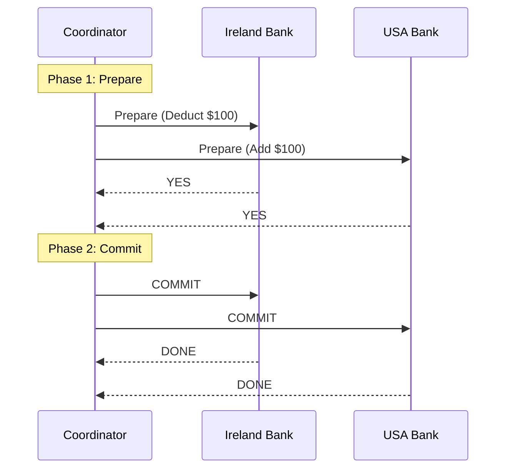

# Session 11: Distributed Transactions & Consensus

## The Story: The "Bank Transfer" Tightrope

Bono wants to send \$100 to his friend Edge. Bono's account is in the **Ireland Bank Node**, and Edge's account is in the **USA Bank Node**.

### The "In-Between" Nightmare
1. **The Failure**: Ireland Bank deducts \$100. Then, the network crashes. USA Bank never receives the signal. The \$100 has vanished into thin air!
2. **The Coordinator (Two-Phase Commit)**: A "Master Coordinator" is hired. 
    *   **Phase 1 (Prepare)**: Coordinator asks both banks, "Are you ready?" Both lock the accounts and say "YES."
    *   **Phase 2 (Commit)**: Coordinator says, "DO IT." Both banks finalize the change.
3. **The Rollback**: If one bank says "NO" or doesn't answer during Phase 1, the Coordinator tells everyone to "ABORT" and release the locks.
4. **Idempotency**: What if Ireland Bank sends the \$100 message twice? Edge's bank must be smart enough to say, "I already processed Transfer ID #999" (**Deduplication**).

Distributed Transactions ensure that even if pieces of the system are on different planets, they either all succeed together or all fail together (**Atomicity**).

---

## Core Concepts Explained

### 1. Two-Phase Commit (2PC)
*   **Prepare Phase**: All participating nodes are asked to prepare for a commit and respond with a vote.
*   **Commit Phase**: If all voted yes, the coordinator sends a commit command. Otherwise, it sends an abort command.
*   **Weakness**: It's a "blocking" protocol. If the coordinator crashes mid-process, the participants might keep their resources locked indefinitely.

### 2. Saga Pattern (An Alternative)
Instead of one giant transaction, a Saga is a sequence of local transactions. If one fails, the system executes **Compensating Transactions** (undo actions) for all previous successful steps.

---

## Distributed Transaction Visualization



---

## Code Examples: Idempotency Logic

### Python Implementation
```python
class PaymentProcessor:
    def __init__(self):
        self.processed_transactions = set()
        self.balances = {"Edge": 1000}

    def process_transfer(self, transaction_id, recipient, amount):
        # 1. Idempotency Check
        if transaction_id in self.processed_transactions:
            print(f"--- [Warning] Transaction {transaction_id} already processed. Skipping. ---")
            return True
        
        # 2. Local Transaction
        print(f"--- Processing Transfer {transaction_id}: +${amount} to {recipient} ---")
        self.balances[recipient] += amount
        
        # 3. Mark as Processed
        self.processed_transactions.add(transaction_id)
        return True

# Execution
p = PaymentProcessor()
p.process_transfer("TX_999", "Edge", 100) # Success
p.process_transfer("TX_999", "Edge", 100) # Duplicate!
```

### Java Implementation
```java
import java.util.HashSet;
import java.util.Set;

public class TransactionService {
    private Set<String> processedIds = new HashSet<>();

    public synchronized void executeTransaction(String txId, String action) {
        // Idempotency: Deduplication
        if (processedIds.contains(txId)) {
            System.out.println("--- TX [" + txId + "] already exists. No action taken. ---");
            return;
        }

        System.out.println("--- Executing TX [" + txId + "]: " + action + " ---");
        // Perform logic here...
        
        processedIds.add(txId);
    }

    public static void main(String[] args) {
        TransactionService service = new TransactionService();
        service.executeTransaction("ABC-123", "CREDIT_ACCOUNT");
        service.executeTransaction("ABC-123", "CREDIT_ACCOUNT"); // Re-try
    }
}
```

---

## Interview Q&A

### Q1: What is the main problem with Two-Phase Commit (2PC)?
**Answer**: Performance and Availability. 2PC is a **blocking** protocol. If any participant or the coordinator fails, resources (like DB rows) remain locked, potentially causing a system-wide halt. It also doesn't scale well to hundreds of nodes.

### Q2: What are "Compensating Transactions" in the Saga pattern?
**Answer**: (Medium-Hard)
Since Sagas don't use global locks, a step might succeed but the overall flow might eventually fail. A compensating transaction is an "undo" logic. For example, if "Book Flight" and "Book Hotel" succeeded but "Pay for Package" fails, the system must trigger "Cancel Flight" and "Cancel Hotel" to return the system to a consistent state.

### Q3: What is "Write-Ahead Logging" (WAL)?
**Answer**: It's a technique used for fault tolerance. Before any change is made to the actual database files, the intention is written to a "log" file on disk. If the system crashes mid-update, it can read the WAL on reboot to either finish the update or roll it back.
---
