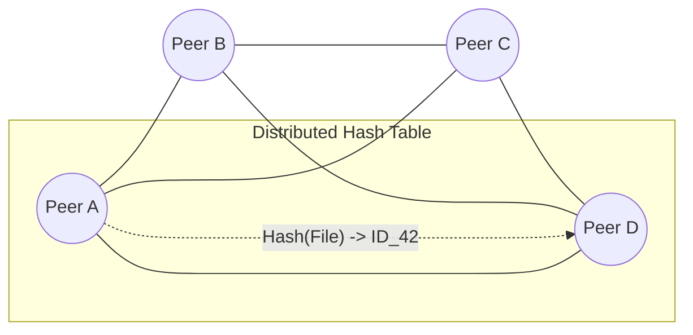

# Session 12: Peer-to-Peer Systems

## The Story: The "Neighborhood Tool Library"

The town of **BitVillage** has no hardware store. Instead, every neighbor owns a few tools (a drill, a saw, a ladder).

### The Search for a Saw
1. **The Central Board (Old P2P)**: Neighbor Ned has a giant blackboard in his yard listing who has what. This is great until Ned moves away (**Single Point of Failure**).
2. **The Gossip Network (Modern P2P)**: Instead of a blackboard, everyone just knows 5 of their neighbors. If Charlie needs a saw, he asks his 5 friends. They ask their 5 friends. Eventually, the request finds Bob, who has the saw (**Peer Discovery**).
3. **The Map (Distributed Hash Table)**: To make it faster, they agree on a rule: "Neighbor names starting with A-D handle tools starting with A-D." Charlie immediately knows to ask Dave for a Drill (**consistent placement**).
4. **The Chunking Miracle**: Dave wants to share a 1000-page manual. He gives 10 pages to 100 different neighbors. If one neighbor is out on vacation, the manual isn't lost (**Chunk Replication**).

Peer-to-Peer (P2P) systems allow for massive scalability and resilience by removing the "Master-Slave" relationship and treating every node as equal.

---

## Core Concepts Explained

### 1. Distributed Hash Tables (DHT)
A DHT is a decentralized storage system that provides lookup services similar to a hash table. `(key, value)` pairs are stored in the DHT, and any participating node can efficiently retrieve the value associated with a given key.

### 2. Peer Discovery
*   **Seed Nodes**: Known stable nodes that new peers connect to initially to "join the network."
*   **Gossip/Epidemic Protocols**: Information (like a new peer joining) spreads through the network by nodes randomly sharing it with neighbors.

---

## P2P Network Visualization



---

## Code Examples: Simple DHT Node Lookup

### Python Implementation
```python
class PeerNode:
    def __init__(self, node_id, neighbors=None):
        self.node_id = node_id
        self.neighbors = neighbors or []
        self.data = {}

    def lookup(self, key, visited=None):
        if visited is None: visited = set()
        if self.node_id in visited: return None
        visited.add(self.node_id)
        
        print(f"--- [Node {self.node_id}] Searching for {key} ---")
        if key in self.data:
            return f"Found on Node {self.node_id}: {self.data[key]}"
        
        # Recursive search in neighbors (Simplified Gossip)
        for neighbor in self.neighbors:
            result = neighbor.lookup(key, visited)
            if result: return result
        return None

# Execution
node_c = PeerNode("C")
node_c.data["file_101"] = "Secret_Data"
node_b = PeerNode("B", [node_c])
node_a = PeerNode("A", [node_b])

print(node_a.lookup("file_101"))
```

### Java Implementation
```java
import java.util.*;

class Peer {
    String id;
    Map<String, String> localStore = new HashMap<>();
    List<Peer> neighbors = new ArrayList<>();

    Peer(String id) { this.id = id; }

    public String find(String key, Set<String> visited) {
        if (visited.contains(id)) return null;
        visited.add(id);

        System.out.println("--- Peer " + id + " checking local store ---");
        if (localStore.containsKey(key)) return localStore.get(key);

        for (Peer n : neighbors) {
            String res = n.find(key, visited);
            if (res != null) return res;
        }
        return null;
    }
}

public class P2PNetwork {
    public static void main(String[] args) {
        Peer p1 = new Peer("Alpha");
        Peer p2 = new Peer("Beta");
        Peer p3 = new Peer("Gamma");

        p1.neighbors.add(p2);
        p2.neighbors.add(p3);
        p3.localStore.put("manifest.txt", "Content_Alpha_Beta");

        System.out.println("Result: " + p1.find("manifest.txt", new HashSet<>()));
    }
}
```

---

## Interview Q&A

### Q1: What is the "Sybil Attack" in P2P systems?
**Answer**: It's an attack where a single malicious actor creates a large number of pseudonymous identities (fake nodes) to gain a disproportionately large influence on the network. This can be used to subvert reputation systems or disrupt the DHT. 
**Fixes**: Requiring proof-of-work, social trust scores, or a central identity validator.

### Q2: How does "BitTorrent" handle peers that only download but never upload?
**Answer**: (Medium-Hard)
This is known as the **Free-riding problem**. BitTorrent uses a "Tit-for-Tat" algorithm. A peer will only upload data to other peers from whom it is currently receiving data at a high rate. This incentivizes everyone to contribute their bandwidth.

### Q3: What is "Chord" or "Kademlia"?
**Answer**: These are specific DHT protocols. 
*   **Chord** uses a logical ring where nodes have "finger tables" to jump halfway across the ring, allowing lookups in $O(\log N)$ steps.
*   **Kademlia** uses the XOR metric for distance between nodes and is the basis for many real-world P2P networks (like the Mainline DHT for BitTorrent) because of its efficiency in handling peer churn (nodes entering/leaving).
---
