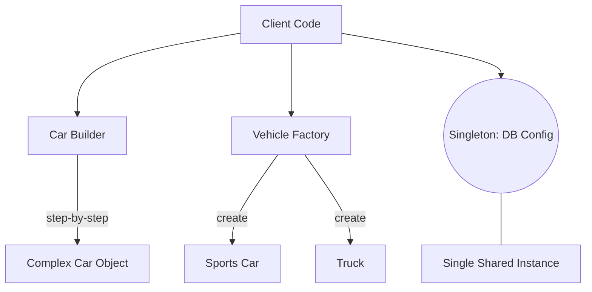

# Session 14: Design Patterns (Creational)

## The Story: The "Custom Car Factory"

Carl owns **Carl's Cars**, a high-end luxury car dealership. 

### The Manufacturing Mess
1. **The Overwhelmed Mechaninc (No Factory)**: Every time a customer wants a car, Carl has to remember all the parts: "Engine #4, Red Paint, Leather Seats..." If he forgets one, the car breaks (**Complex Object Creation**).
2. **The Factory Solution**: Carl builds a "Car Factory." He just says, "Make me a Sports Car," and the factory handles the complexity (**Factory Pattern**).
3. **The One-of-a-Kind Engine (Singleton)**: Every car needs a connection to the GPS Satellite. Carl only wants *one* satellite connection for the entire fleet, not 1000 individual ones (**Singleton Pattern**).
4. **The "Build-Your-Own" (Builder)**: A customer wants a car with a sunroof, seat warmers, but NO radio. Instead of 100 different constructor parameters, Carl gives them a checklist (**Builder Pattern**).

Creational patterns are all about **who** creates an object and **how**, decoupling the usage of an object from its construction.

---

## Core Concepts Explained

### 1. Singleton Pattern
Ensures a class has only one instance and provides a global point of access to it.
*   **Use case**: Database connection pools, configuration managers.

### 2. Factory Method
Provides an interface for creating objects in a superclass but allows subclasses to alter the type of objects that will be created.

### 3. Builder Pattern
Allows producing complex objects step by step. It lets you produce different types and representations of an object using the same construction code.

---

## Creational Patterns Visualization



---

## Code Examples: Singleton & Builder

### Python Implementation
```python
# Singleton Pattern
class DatabaseConfig:
    _instance = None
    
    def __new__(cls):
        if cls._instance is None:
            print("--- Creating NEW DB Config Instance ---")
            cls._instance = super(DatabaseConfig, cls).__new__(cls)
            cls._instance.connection_str = "db://localhost:5432"
        return cls._instance

# Builder Pattern
class Pizza:
    def __init__(self):
        self.toppings = []
    
class PizzaBuilder:
    def __init__(self):
        self.pizza = Pizza()
    def add_cheese(self):
        self.pizza.toppings.append("Cheese")
        return self
    def add_pepperoni(self):
        self.pizza.toppings.append("Pepperoni")
        return self
    def build(self):
        return self.pizza

# Execution
config1 = DatabaseConfig()
config2 = DatabaseConfig() # Returns same instance

my_pizza = PizzaBuilder().add_cheese().add_pepperoni().build()
print(f"Pizza Toppings: {my_pizza.toppings}")
```

### Java Implementation
```java
// Singleton Pattern (Thread Safe)
class DatabaseConnection {
    private static DatabaseConnection instance;
    private DatabaseConnection() {}

    public static synchronized DatabaseConnection getInstance() {
        if (instance == null) {
            instance = new DatabaseConnection();
        }
        return instance;
    }
}

// Builder Pattern
class Computer {
    private String CPU;
    private String RAM;
    
    private Computer(Builder builder) {
        this.CPU = builder.CPU;
        this.RAM = builder.RAM;
    }

    public static class Builder {
        private String CPU;
        private String RAM;
        public Builder setCPU(String cpu) { this.CPU = cpu; return this; }
        public Builder setRAM(String ram) { this.RAM = ram; return this; }
        public Computer build() { return new Computer(this); }
    }
}

public class Main {
    public static void main(String[] args) {
        Computer myPc = new Computer.Builder().setCPU("Intel i9").setRAM("32GB").build();
    }
}
```

---

## Interview Q&A

### Q1: Why is "Double-Checked Locking" used in Singletons (Java)?
**Answer**: It's an optimization to reduce the overhead of synchronization. You first check if the instance is null without locking. If it is null, then you synchronize and check again. This ensures that the expensive synchronization only happens once (the first time the instance is created).

### Q2: What is the main difference between "Factory Method" and "Abstract Factory"?
**Answer**: (Medium-Hard)
*   **Factory Method**: Produces one type of product (e.g., a "Vehicle Factory" creates a "Car").
*   **Abstract Factory**: Produces "Families" of related products (e.g., a "Modern Furniture Factory" creates "Modern Chair", "Modern Sofa", and "Modern Table").

### Q3: When should you use the Builder pattern over a simple constructor?
**Answer**: Use the Builder pattern when a class has many optional parameters (the "Telescoping Constructor" problem) or when the construction process involves multiple complex steps that must follow a specific order.
---
