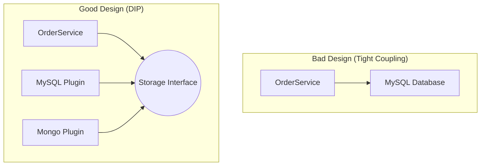

# Session 15: SOLID Principles

## The Story: The "House of Cards" Application

Developer Dave built a simple app for a "Lemonade Stand." It was great! But then the owner said, "We also sell cookies now." Dave changed one line of code, and suddenly the "Lemonade" price changed to "Cookie."

### The Maintenance Nightmare
1. **The God Object**: Dave had one `MainStore` class that did everything: handling payments, baking, cleanup, and accounting (**Violation of SRP**).
2. **The Switch-Case Disaster**: Every time a new product was added, Dave had to open the `PriceCalculator` class and add another `case` statement (**Violation of OCP**).
3. **The Fake Square**: Dave had a `Square` class that inherited from `Rectangle`. When someone set the height of a Square, the width changed too, breaking the app's logic (**Violation of LSP**).

SOLID principles are the "Constitution" of Low-Level Design. They ensure your code is easy to change, test, and maintain as the business grows.

---

## Core Concepts Explained

### 1. S: Single Responsibility (SRP)
A class should have one, and only one, reason to change.
*   *Bad*: A `User` class that saves itself to the DB and sends its own welcome email.
*   *Good*: `User` (Data), `UserRepository` (DB), `EmailService` (Communication).

### 2. O: Open-Closed (OCP)
Software entities should be open for extension, but closed for modification.
*   *Technique*: Use Interfaces/Abstract classes. Add new behavior by creating a new class, not editing old ones.

### 3. L: Liskov Substitution (LSP)
Objects of a superclass should be replaceable with objects of its subclasses without breaking the application.

### 4. I: Interface Segregation (ISP)
A client should never be forced to implement an interface that it doesn't use.
*   *Better*: Many small, specific interfaces instead of one giant "Universal" interface.

### 5. D: Dependency Inversion (DIP)
High-level modules should not depend on low-level modules. Both should depend on abstractions.

---

## SOLID Visualization (DIP)



---

## Code Examples: Open-Closed & Dependency Inversion

### Python Implementation
```python
from abc import ABC, abstractmethod

# 1. Abstraction (DIP)
class NotificationService(ABC):
    @abstractmethod
    def send(self, message):
        pass

# 2. Concrete Implementations (OCP - We can add more without changing User)
class EmailNotification(NotificationService):
    def send(self, message):
        print(f"--- Sending Email: {message} ---")

class SMSNotification(NotificationService):
    def send(self, message):
        print(f"--- Sending SMS: {message} ---")

class UserProfile:
    def __init__(self, notifier: NotificationService):
        self.notifier = notifier # Dependency Injection

    def update_profile(self):
        # Business logic...
        self.notifier.send("Profile Updated!")

# Execution
email_user = UserProfile(EmailNotification())
email_user.update_profile()

sms_user = UserProfile(SMSNotification()) # Added new behavior easily
sms_user.update_profile()
```

### Java Implementation
```java
// SRP Example
class Report {
    void getReportData() {} // Responsiblity 1: Data Logic
}
class ReportPrinter {
    void print(Report report) {} // Responsibility 2: Formatting/Output
}

// DIP Example
interface Database {
    void save(String data);
}

class MySqlDatabase implements Database {
    public void save(String data) { System.out.println("Saving to MySQL..."); }
}

class OrderService {
    private Database db; // High level depends on Abstraction
    public OrderService(Database db) { this.db = db; }
    
    void checkout(String item) { db.save(item); }
}
```

---

## Interview Q&A

### Q1: Can you explain the difference between SRP and Cohesion?
**Answer**: They are related but different. **Cohesion** refers to how logically related the responsibilities inside a module are. **SRP** is about the "Reason to Change." High cohesion often leads to a single responsibility.

### Q2: What is a "Fat Interface" and which SOLID principle does it violate?
**Answer**: (Medium-Hard)
A "Fat Interface" is an interface with too many unrelated methods. It violates the **Interface Segregation Principle (ISP)**. Clients implementing a fat interface are forced to provide empty or "Throw Not Supported" implementations for methods they don't need.

### Q3: How is the Open-Closed Principle (OCP) related to Design Patterns?
**Answer**: Many design patterns are specifically designed to honor OCP. For example, the **Strategy Pattern** allows you to add new algorithms without changing the context class, and the **Decorator Pattern** allows adding responsibilities to objects without modifying their base code.
---
