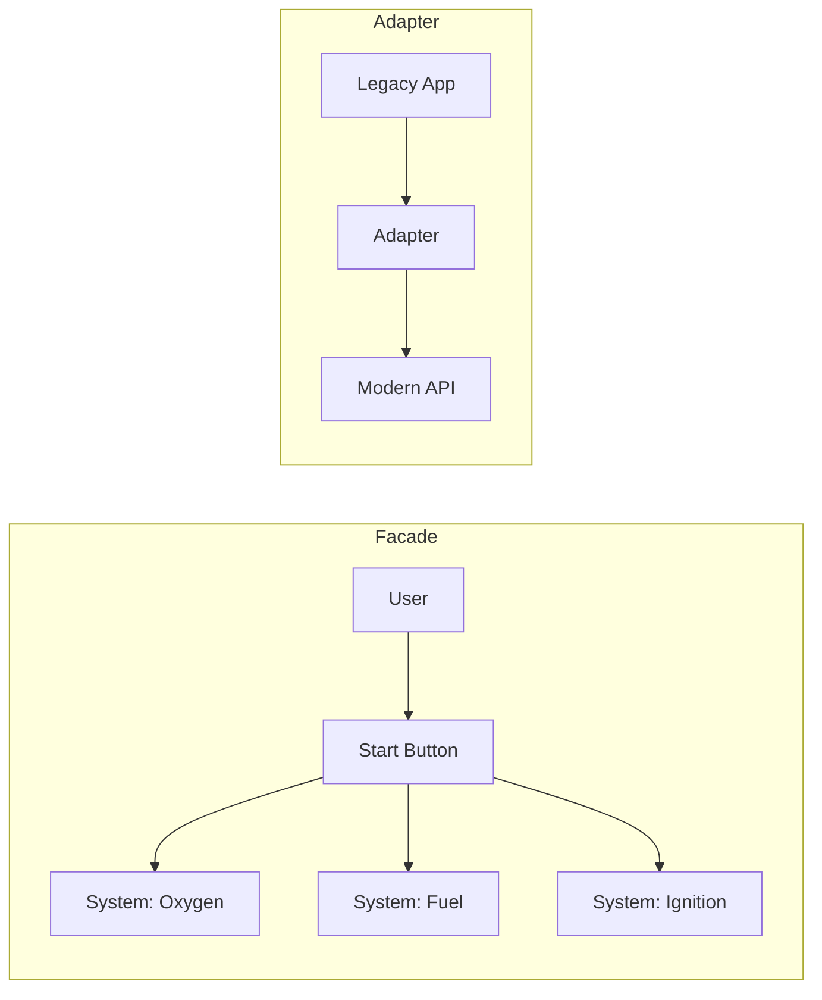

# Session 16: Structural Patterns

## The Story: The "Universal Connector" Gadget

Engineer Ed is building a giant robot. But he has a problem: the Robot's "Left Hand" uses a square plug, but the "Arm" has a round socket.

### The Connection Crisis
1. **The Adapter**: Ed doesn't want to rebuild the arm. He builds a small "round-to-square" piece that sits in the middle (**Adapter Pattern**).
2. **The Simplifier (Facade)**: The Robot's startup process involves 100 switches: "Enable Battery," "Prime Hydraulics," "Check Sensors..." Ed builds a single "START" button that triggers them all in the right order (**Facade Pattern**).
3. **The Multi-Layered Armor (Decorator)**: The Robot starts with a basic shell. Ed adds "Fireproof Coating" and then "Camouflage Paint." Each layer adds a feature without changing the robot itself (**Decorator Pattern**).
4. **The "Part vs Whole" (Composite)**: The Robot is made of Arms, which are made of Fingers. Ed wants to say "Move Robot," and every finger moves automatically (**Composite Pattern**).

Structural patterns are about how classes and objects are composed to form larger structures, ensuring that if one part changes, the whole system doesn't collapse.

---

## Core Concepts Explained

### 1. Adapter Pattern
Allows objects with incompatible interfaces to collaborate. It acts as a wrapper that translates calls from one interface to another.

### 2. Facade Pattern
Provides a simplified interface to a library, a framework, or any other complex set of classes.

### 3. Decorator Pattern
Lets you attach new behaviors to objects by placing these objects inside special wrapper objects that contain the behaviors.

### 4. Composite Pattern
Lets you compose objects into tree structures and then work with these structures as if they were individual objects.

---

## Structural Patterns Visualization



---

## Code Examples: Adapter & Decorator

### Python Implementation
```python
# 1. Adapter Pattern
class OldPrinter:
    def legacy_print(self, text):
        print(f"--- Printing in OLD style: {text} ---")

class PrinterAdapter:
    def __init__(self, old_printer):
        self.old_printer = old_printer
        
    def print(self, text):
        # Translating modern 'print' call to 'legacy_print'
        self.old_printer.legacy_print(text)

# 2. Decorator Pattern
class BasicCoffee:
    def cost(self): return 5

class MilkDecorator:
    def __init__(self, coffee): self.coffee = coffee
    def cost(self): return self.coffee.cost() + 2

# Execution
adapter = PrinterAdapter(OldPrinter())
adapter.print("Hello Structural Patterns!")

my_coffee = BasicCoffee()
latte = MilkDecorator(my_coffee)
print(f"Latte Cost: ${latte.cost()}")
```

### Java Implementation
```java
// Facade Pattern
class Engine { void start() { System.out.println("Engine started"); } }
class Lights { void on() { System.out.println("Lights on"); } }

class CarFacade {
    private Engine engine = new Engine();
    private Lights lights = new Lights();

    public void drive() {
        engine.start();
        lights.on();
        System.out.println("Ready to go!");
    }
}

// Adapter Pattern
interface ModernClient { void webRequest(); }

class LegacyServer {
    void soapRequest() { System.out.println("Processing Legacy SOAP..."); }
}

class SoapToRestAdapter implements ModernClient {
    private LegacyServer server;
    public SoapToRestAdapter(LegacyServer s) { this.server = s; }
    
    @Override
    public void webRequest() { server.soapRequest(); }
}

public class Main {
    public static void main(String[] args) {
        CarFacade car = new CarFacade();
        car.drive();
    }
}
```

---

## Interview Q&A

### Q1: What is "Composition over Inheritance" and which pattern uses it?
**Answer**: It's the idea that you should achieve polymorphic behavior and code reuse by assembling objects (composition) rather than inheriting from a base class. The **Decorator Pattern** is a prime example of this, where you wrap objects to add functionality at runtime instead of creating a huge inheritance tree.

### Q2: When should you use a Proxy pattern vs a Decorator?
**Answer**: (Medium-Hard)
While they look similar:
*   **Proxy**: Controls access to the object (e.g., Lazy Loading, Security, Logging). The client often doesn't know it's talking to a proxy.
*   **Decorator**: Adds new responsibilities to the object. The focus is on extending functionality.

### Q3: How does the Facade pattern improve "Loose Coupling"?
**Answer**: By providing a single point of entry to a complex subsystem, the Facade pattern prevents the client code from needing to know about the internal details of that subsystem. If the subsystem's internal classes change, only the Facade needs an update, not the 100 different places where the subsystem is used.
---
