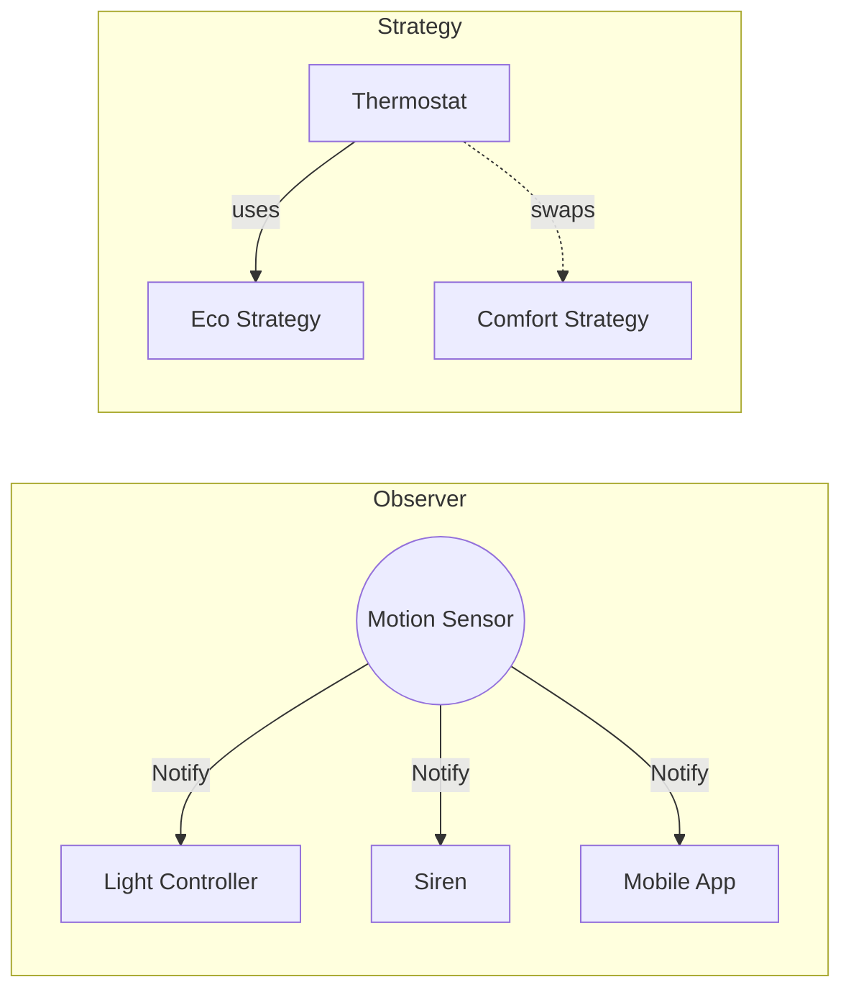

# Session 17: Behavioral Patterns I

## The Story: The "Smart Home" Controller

Engineer Eric is designing a smart home system. He wants the house to be intelligent and reactive.

### The Logic Puzzle
1. **The Modern Thermostat (Strategy)**: The house can be in "Economy Mode," "Comfort Mode," or "Vacation Mode." Eric doesn't want a giant `if-else` block. He creates different "Heating Strategies" and swaps them on the fly (**Strategy Pattern**).
2. **The Alarm System (Observer)**: When a sensor detects motion, 10 things must happen: lights turn on, the siren blares, the owner gets a text... The sensor doesn't need to know *who* or *what* is listening; it just yells "Intrusion!" (**Observer Pattern**).
3. **The Remote Control (Command)**: Eric wants a "Panic Button" that he can program to do anything. He turns every action into a small "Command" object. Now, the button can hold any command (**Command Pattern**).

Behavioral patterns focus on **how objects communicate** and assign responsibilities, making complex interactions manageable and decoupled.

---

## Core Concepts Explained

### 1. Strategy Pattern
Defines a family of algorithms, encapsulates each one, and makes them interchangeable. It lets the algorithm vary independently from clients that use it.

### 2. Observer Pattern
Defines a one-to-many dependency between objects so that when one object changes state, all its dependents are notified and updated automatically.

### 3. Command Pattern
Turns a request into a stand-alone object that contains all information about the request. This transformation lets you pass requests as a method arguments, delay or queue a request's execution, and support undoable operations.

---

## Behavioral Patterns Visualization



---

## Code Examples: Strategy & Observer

### Python Implementation
```python
# 1. Strategy Pattern
class PaymentStrategy:
    def pay(self, amount): pass

class CreditCard(PaymentStrategy):
    def pay(self, amount): print(f"--- Paid ${amount} using Credit Card ---")

class PayPal(PaymentStrategy):
    def pay(self, amount): print(f"--- Paid ${amount} using PayPal ---")

class ShoppingCart:
    def __init__(self, strategy): self.strategy = strategy
    def checkout(self, amount): self.strategy.pay(amount)

# 2. Observer Pattern
class YoutubeChannel:
    def __init__(self): self.subscribers = []
    def subscribe(self, sub): self.subscribers.append(sub)
    def notify(self, video_title):
        for sub in self.subscribers: 
            sub.update(video_title)

class Subscriber:
    def __init__(self, name): self.name = name
    def update(self, title): print(f"--- {self.name} notified: New video '{title}' ---")

# Execution
cart = ShoppingCart(PayPal())
cart.checkout(100)

mrbeast = YoutubeChannel()
pete = Subscriber("Pete")
mrbeast.subscribe(pete)
mrbeast.notify("Giving away 1 Million Pizzas!")
```

### Java Implementation
```java
import java.util.ArrayList;
import java.util.List;

// Command Pattern
interface Command { void execute(); }

class LightOnCommand implements Command {
    public void execute() { System.out.println("--- Lights are ON ---"); }
}

class RemoteControl {
    private Command slot;
    public void setCommand(Command c) { slot = c; }
    public void pressButton() { slot.execute(); }
}

// Strategy Pattern
interface SortingStrategy { void sort(int[] list); }

class QuickSort implements SortingStrategy {
    public void sort(int[] list) { System.out.println("--- Sorting using QuickSort ---"); }
}

public class Main {
    public static void main(String[] args) {
        RemoteControl remote = new RemoteControl();
        remote.setCommand(new LightOnCommand());
        remote.pressButton();
    }
}
```

---

## Interview Q&A

### Q1: What is the primary benefit of the Strategy pattern over an `if-else` or `switch` block?
**Answer**: It follows the **Open-Closed Principle**. You can add new algorithms/behaviors by creating new strategy classes without modifying the existing code. It also makes the code more testable by isolating specific logic into its own class.

### Q2: How does the Observer pattern help in "Event-Driven" systems?
**Answer**: It allows for **temporal decoupling**. The publisher (Subject) doesn't need to know who the subscribers are or how they will react. This is crucial in large-scale systems where a single event (like "Order Placed") might trigger actions in dozens of unrelated microservices.

### Q3: How is the Command pattern used for "Undo" functionality?
**Answer**: (Medium-Hard)
Each Command object can store the "previous state" of the system before it was executed. By adding an `undo()` method to the Command interface, the system can maintain a stack of executed commands. To undo an action, you simply pop the last command and call its `undo()` method.
---
