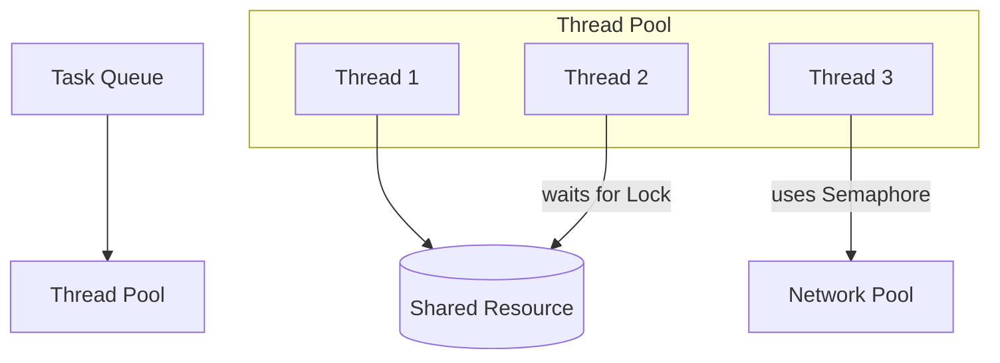

# Session 19: Concurrency in LLD

## The Story: The "Shared Notepad" Frustration

Two coworkers, Alice and Bob, are working on a single shared notepad. 

### The Overwrite Conflict
1. **The Race Condition**: Alice and Bob both read the "To-Do" list at the same time. Both see "1. Buy Milk." They both write "2. Buy Bread" at the same spot. When they look back, only one "Buy Bread" is there. The other's work is lost! (**Race Condition**).
2. **The "Lock" (Mutex)**: Alice takes a physical lock and puts it on the notepad. Bob has to wait until Alice finishes and removes the lock (**Mutex / Mutual Exclusion**).
3. **The Multi-Seat Table (Semaphore)**: The office only has 5 desks. Eric (the manager) keeps 5 "tokens." If a 6th person wants a desk, they have to wait until someone returns a token (**Semaphore**).
4. **The Chef Pool (Thread Pool)**: Instead of hiring a new chef for every single burger, the restaurant has 4 chefs in the kitchen. Orders come in, are placed in a pile, and whichever chef is free picks one up (**Thread Pool / Executor**).

Concurrency is about managing multiple tasks at once without them stepping on each other's toes and causing a mess.

---

## Core Concepts Explained

### 1. Mutex vs Semaphore
*   **Mutex**: Only **one** thread can access a resource at a time. It's binary (0 or 1).
*   **Semaphore**: **Multiple** ($N$) threads can access a resource simultaneously. Great for limiting access to a pool of connections or threads.

### 2. Thread Pools
Creating a new thread is expensive. A thread pool keeps a set of threads "warm" and ready to execute tasks from a queue. This improves performance and prevents the system from crashing under a sudden spike of requests.

---

## Concurrency Visualization



---

## Code Examples: Thread Safety & Locks

### Python Implementation
```python
import threading
import time

class BankAccount:
    def __init__(self):
        self.balance = 100
        self.lock = threading.Lock()

    def withdraw(self, amount, name):
        # Without lock, two threads could read the same balance and withdraw
        with self.lock:
            print(f"--- {name} checking balance (${self.balance}) ---")
            if self.balance >= amount:
                time.sleep(0.1) # Simulating processing
                self.balance -= amount
                print(f"--- {name} withdrawn ${amount}. New balance: ${self.balance} ---")
            else:
                print(f"--- {name}: Insufficient funds! ---")

# Execution
account = BankAccount()
t1 = threading.Thread(target=account.withdraw, args=(70, "Alice"))
t2 = threading.Thread(target=account.withdraw, args=(70, "Bob"))

t1.start()
t2.start()
t1.join(); t2.join()
```

### Java Implementation
```java
import java.util.concurrent.ExecutorService;
import java.util.concurrent.Executors;
import java.util.concurrent.Semaphore;

public class ResourcePool {
    // Only 2 threads can access the sensor at once
    private static final Semaphore semaphore = new Semaphore(2);

    public static void accessSensor(String threadName) {
        try {
            System.out.println("--- " + threadName + " is waiting for sensor ---");
            semaphore.acquire();
            System.out.println("--- " + threadName + " ACQUIRED sensor ---");
            Thread.sleep(1000); // Simulating work
        } catch (InterruptedException e) {
        } finally {
            System.out.println("--- " + threadName + " RELEASED sensor ---");
            semaphore.release();
        }
    }

    public static void main(String[] args) {
        ExecutorService pool = Executors.newFixedThreadPool(3);
        pool.execute(() -> accessSensor("Task_1"));
        pool.execute(() -> accessSensor("Task_2"));
        pool.execute(() -> accessSensor("Task_3"));
        pool.shutdown();
    }
}
```

---

## Interview Q&A

### Q1: What is a "Deadlock" and how do you avoid it?
**Answer**: A Deadlock happens when Thread A holds Lock 1 and waits for Lock 2, while Thread B holds Lock 2 and waits for Lock 1. Neither can move.
**Avoidance**: 
1. **Lock Ordering**: Always acquire locks in the same predefined order.
2. **Lock Timeout**: Use `tryLock()` with a timeout instead of waiting forever.
3. **Deadlock Detection**: Some systems periodically check for circular dependencies and kill one thread to break the loop.

### Q2: What is the difference between "Optimistic" and "Pessimistic" locking?
**Answer**: (Medium-Hard)
*   **Pessimistic**: You assume collisions will happen, so you lock the resource *before* accessing it. (Safe but slow).
*   **Optimistic**: You don't lock. You perform the update and at the very end check if anyone else changed the data (e.g., using a Version number). If they did, you fail and retry. (Fast if collisions are rare).

### Q3: What is "Context Switching" in Multithreading?
**Answer**: It's the process by which the CPU saves the state (context) of one thread so it can be resumed later, and loads the state of another thread to run it. Context switching is expensive; having too many threads can lead to "Thrashing," where the CPU spends more time switching than doing actual work.
---
