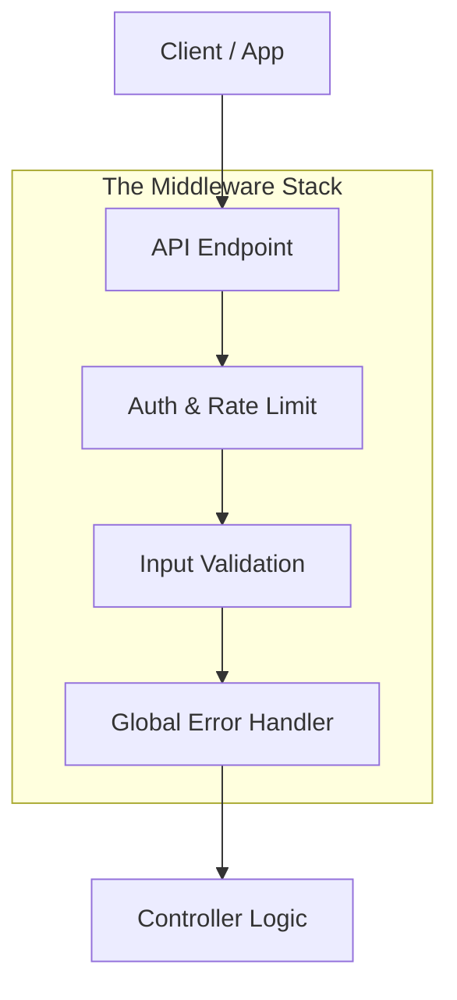

# Session 22: API Layer & Error Handling

## The Story: The "Polite Receptionist"

Receptionist Rita works at a high-end clinic. Her job is to greet patients, check their IDs, and handle problems.

### The Service Challenges
1. **The Validation Gate**: A patient hands in a form with a fake date of birth. Rita doesn't let them through. She catches the error early so the doctors don't waste time (**Input Validation**).
2. **The Surge Protector**: A group of 100 people try to enters the clinic at the same time. Rita says, "Only 5 at a time, please!" (**Rate Limiting**).
3. **The Global Translator**: If a patient says "I'm in pain" in 5 different ways, Rita translates it to a standard code for the medical record (**HTTP Status Codes**).
4. **The Calm Emergency**: If a doctor faints, Rita doesn't scream. She calmly says, "We are experiencing a temporary issue, please wait" (**Global Error Handling**).

The API Layer is the "face" of your application. It must be robust, secure, and helpful to the clients calling it.

---

## Core Concepts Explained

### 1. HTTP Status Codes
*   **2xx (Success)**: `200 OK`, `201 Created`.
*   **4xx (Client Error)**: `400 Bad Request`, `401 Unauthorized`, `429 Too Many Requests`.
*   **5xx (Server Error)**: `500 Internal Server Error`, `503 Service Unavailable`.

### 2. Rate Limiting
Prevents a single user from overwhelming your API. Common algorithms include **Token Bucket** or **Fixed Window**.

### 3. Centralized Error Handling
Instead of having `try-catch` in every single controller method, use a "Global Interceptor" or "Middleware" that catches all exceptions and formats them into a standard JSON response.

---

## API Layer Visualization



---

## Code Examples: Validation & Error Handling

### Python Implementation
```python
def validate_user(data):
    # Simple validation rules
    if "email" not in data or "@" not in data["email"]:
        return False, "Invalid Email"
    if "age" not in data or data["age"] < 18:
        return False, "Must be 18+"
    return True, None

def api_controller(request_data):
    # 1. Validation
    is_valid, error_msg = validate_user(request_data)
    if not is_valid:
        return {"error": error_msg}, 400

    try:
        # 2. Logic
        # (Simulate database error)
        raise Exception("Database Connection Failed")
    except Exception as e:
        # 3. Global Error Handling logic
        print(f"--- [LOG] Internal Error: {e} ---")
        return {"error": "Something went wrong on our end"}, 500

# Execution
print(api_controller({"email": "bad-email", "age": 20})) # 400
print(api_controller({"email": "good@test.com", "age": 20})) # 500
```

### Java Implementation
```java
class ApiException extends RuntimeException {
    int code;
    ApiException(String message, int code) { super(message); this.code = code; }
}

public class GlobalErrorHandler {
    // Simulated "Middleware"
    public void processRequest(String input) {
        try {
            if (input == null) throw new ApiException("Input is missing", 400);
            // Business logic...
        } catch (ApiException e) {
            System.err.println("--- [CLIENT ERROR " + e.code + "] " + e.getMessage() + " ---");
        } catch (Exception e) {
            System.err.println("--- [SERVER ERROR 500] Critical Failure ---");
        }
    }

    public static void main(String[] args) {
        GlobalErrorHandler handler = new GlobalErrorHandler();
        handler.processRequest(null);
    }
}
```

---

## Interview Q&A

### Q1: What is the benefit of using "Data Transfer Objects" (DTOs)?
**Answer**: DTOs allow you to decouple the Data Model (DB table) from the API Response. You can hide sensitive fields (like `password_hash`) and combine data from multiple tables into a single neat object for the client.

### Q2: How do you implement "Rate Limiting" in a distributed system with 100 servers?
**Answer**: (Medium-Hard)
A single server's local memory won't work. You need a centralized store like **Redis**. For every request, the server checks a key in Redis (`rate_limit:user_id`). If the number of requests in the last minute exceeds the limit, it returns `429`.

### Q3: Why is "Idempotency" critical for API Error Handling?
**Answer**: If a client calls `POST /api/pay` and the network drops before they get a response, they might try again. Without idempotency, the user might be charged twice. By requiring an `Idempotency-Key` header, the server can check if it already processed that specific request.
---
