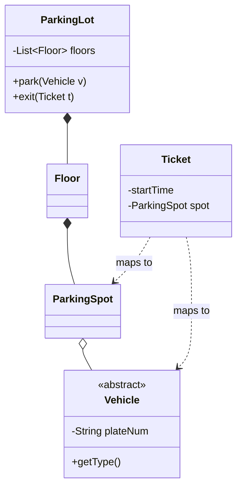

# Session 24: Capstone: LLD Mock Interview

## The Story: The "Parking Lot" Challenge

You are being interviewed for a Senior Engineer role at **MegaCorp**. The interviewer says, "Design a **Parking Lot System**."

### The Planning Phase
1. **The Requirements (Analysis)**: Is it for cars only or bikes too? Do we need to pay? Yes, it needs to handle multiple vehicle types, calculate fees based on time, and manage availability across different floors.
2. **The Blueprint (OOP)**: You create a `ParkingLot` class (Singleton), which has many `Floor` objects (Composition). Each floor has many `ParkingSpot` (Aggregation).
3. **The Strategy (Patterns)**: You use the **Strategy Pattern** for different "Pricing Models" (Hourly vs Flat Rate) and the **Factory Pattern** to create different `Vehicle` objects.
4. **The "Wait, what if...?" (Scalability)**: What if 100 people try to park at once? You discuss using **Mutexes** to prevent two cars from taking the same spot at the same time (**Concurrency**).

The Capstone Mock Interview is where you bring every single HLD and LLD concept together to solve a complex, realistic engineering problem.

---

## Core Concepts Explained

### 1. End-to-End LLD Workflow
1. **Clarify Requirements**: Vehicle types, payment logic, capacity.
2. **Identify Core Entities**: `ParkingLot`, `Floor`, `ParkingSpot`, `Vehicle`, `Ticket`, `Payment`.
3. **Define Relationships**: `ParkingLot` HAS-MANY `Floor`, `Floor` HAS-MANY `ParkingSpot`.
4. **Apply Patterns**: Singleton for `ParkingLot`, Strategy for `Payment`, Factory for `Vehicle`.

### 2. Design Trade-offs
In an interview, there is no "correct" answer. Every choice has a cost. For example, using a SQL database gives you **ACID** transactions for payments, but it might be slower than a NoSQL store for tracking 1 million parking spots in real-time.

---

## Parking Lot System Visualization



---

## Code Examples: Core Parking Logic

### Python Implementation
```python
from abc import ABC, abstractmethod
from datetime import datetime

class Vehicle(ABC):
    def __init__(self, plate): self.plate = plate
    @abstractmethod
    def get_type(self): pass

class Car(Vehicle):
    def get_type(self): return "CAR"

class ParkingSpot:
    def __init__(self, spot_id):
        self.spot_id = spot_id
        self.occupied_by = None

    def is_free(self): return self.occupied_by is None
    def assign(self, vehicle): self.occupied_by = vehicle
    def free(self): self.occupied_by = None

class ParkingLot:
    _instance = None
    def __new__(cls):
        if not cls._instance:
            cls._instance = super().__new__(cls)
            cls._instance.spots = [ParkingSpot(i) for i in range(10)]
        return cls._instance

    def park(self, vehicle):
        for spot in self.spots:
            if spot.is_free():
                spot.assign(vehicle)
                print(f"--- {vehicle.get_type()} parked in spot {spot.spot_id} ---")
                return True
        return False

# Execution
my_lot = ParkingLot()
my_lot.park(Car("ABC-123"))
```

### Java Implementation
```java
import java.util.ArrayList;
import java.util.List;

class ParkingSpot {
    int id;
    boolean isFree = true;
    ParkingSpot(int id) { this.id = id; }
}

class ParkingLotManager {
    private static ParkingLotManager instance = new ParkingLotManager();
    private List<ParkingSpot> spots = new ArrayList<>();

    private ParkingLotManager() {
        for (int i = 0; i < 5; i++) spots.add(new ParkingSpot(i));
    }

    public static ParkingLotManager getInstance() { return instance; }

    public synchronized boolean assignSpot(String vehicleId) {
        for (ParkingSpot s : spots) {
            if (s.isFree) {
                s.isFree = false;
                System.out.println("--- Spot " + s.id + " assigned to " + vehicleId + " ---");
                return true;
            }
        }
        return false;
    }
}

public class Main {
    public static void main(String[] args) {
        ParkingLotManager.getInstance().assignSpot("XYZ-789");
    }
}
```

---

## Interview Q&A

### Q1: How do you handle concurrency in a multi-floor parking lot?
**Answer**: You must use a **Thread-Safe** mechanism (like a `Lock` or `synchronized` block) when searching for and assigning a parking spot. Otherwise, two different gate servers might assign the same spot to two different cars.

### Q2: How would you extend the system to support "Dynamic Pricing" (e.g., higher prices on weekends)?
**Answer**: (Medium-Hard)
Use the **Strategy Pattern**. Create a `PricingStrategy` interface with a `calculate(startTime, endTime)` method. Implement `WeekdayStrategy` and `WeekendStrategy`. The `PaymentService` can check the current date and use the appropriate strategy to calculate the fee.

### Q3: What is the most critical Non-Functional Requirement (NFR) for this system?
**Answer**: **Availability**. If the parking lot system goes down, the gates won't open, and the entire business grinds to a halt. It must be highly available and resilient to network or hardware failures.
---
