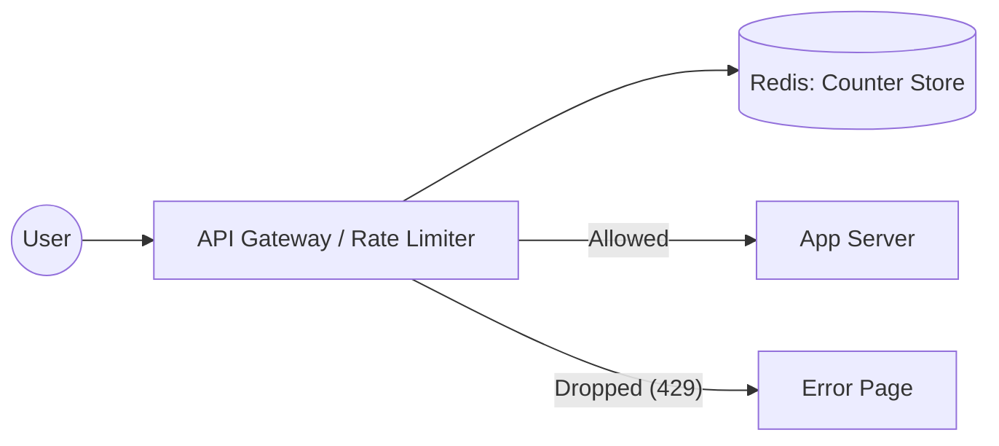

# Session 25: Designing a Rate Limiter (Alex Xu Framework)

## The Story: The "DDoS Disaster" at FlashSale

Emma is an engineer at **FlashSale**, an e-commerce giant. During a major sale, a botnet flooded their "Buy Now" API with 1 million requests per second, crashing the checkout service for legitimate users. To save the system, Emma must design a **Rate Limiter**.

---

## 1. Understand the Problem and Scope

### Questions to Clarify:
*   **Client-side or Server-side?** Server-side is more secure.
*   **What is the throttling rule?** (e.g., 5 requests per minute per IP).
*   **Scale?** Distributed system handling millions of users.
*   **Hard vs Soft Limiting?** Hard limiting (rejecting) is preferred for DDoS protection.

---

## 2. Propose High-Level Design

### Where to put the Rate Limiter?
1.  **Client-side**: Easy to bypass.
2.  **Server-side**: Safe but adds load to app servers.
3.  **Middleware/Gateway (Recommended)**: API Gateways like Kong or Nginx handle this most efficiently.

### Using Redis for Counters
Redis is perfect because it's fast and supports atomic increments (`INCR`) and expirations (`EXPIRE`).



---

## 3. Rate Limiting Algorithms

### A. Token Bucket (Most Popular)
*   **How it works**: A bucket holds tokens. Each request consumes one. Tokens are refilled at a constant rate.
*   **Pros**: Supports bursts of traffic.
*   **Used by**: Amazon, Stripe.

### B. Leaky Bucket
*   **How it works**: Requests enter a queue and are processed at a fixed rate (like water dripping).
*   **Pros**: Ensures stable output rate.
*   **Cons**: Bursty traffic fills the bucket too quickly.

### C. Fixed Window Counter
*   **How it works**: Divide time into fixed slots (e.g., 60s). Increment counter per slot.
*   **Cons**: Traffic spikes at the edges of windows can allow double the limit.

### D. Sliding Window Log / Counter
*   **How it works**: Tracks timestamps of requests to provide a smooth rolling limit.
*   **Pros**: Very accurate.

---

## 4. Design Deep Dive: Java & Redis Implementation

### Distributed Rate Limiting (Token Bucket Implementation)

```java
import java.util.concurrent.atomic.AtomicLong;

/**
 * Simplified Token Bucket Implementation in Java
 * In a real distributed system, logic should be in Lua scripts inside Redis
 */
public class TokenBucketRateLimiter {
    private final long capacity;
    private final long refillRate; // Tokens per second
    private AtomicLong currentTokens;
    private long lastRefillTimestamp;

    public TokenBucketRateLimiter(long capacity, long refillRate) {
        this.capacity = capacity;
        this.refillRate = refillRate;
        this.currentTokens = new AtomicLong(capacity);
        this.lastRefillTimestamp = System.currentTimeMillis();
    }

    public synchronized boolean allowRequest() {
        refill();
        
        if (currentTokens.get() > 0) {
            currentTokens.decrementAndGet();
            return true;
        }
        return false;
    }

    private void refill() {
        long now = System.currentTimeMillis();
        long durationSinceLastRefill = now - lastRefillTimestamp;
        
        // Calculate new tokens to add
        long tokensToAdd = (durationSinceLastRefill / 1000) * refillRate;
        
        if (tokensToAdd > 0) {
            long newTokens = Math.min(capacity, currentTokens.get() + tokensToAdd);
            currentTokens.set(newTokens);
            lastRefillTimestamp = now;
        }
    }

    public static void main(String[] args) {
        // Limit: 5 tokens capacity, 1 refill per second
        TokenBucketRateLimiter limiter = new TokenBucketRateLimiter(5, 1);
        
        for (int i = 0; i < 10; i++) {
            if (limiter.allowRequest()) {
                System.out.println("Request " + (i+1) + ": [ALLOWED]");
            } else {
                System.out.println("Request " + (i+1) + ": [REJECTED - 429 Too Many Requests]");
            }
        }
    }
}
```

---

## Interview Q&A

### Q1: How do you handle race conditions in a distributed rate limiter?
**Answer**: In a distributed environment (multiple servers hitting Redis), you use **Lua Scripts**. Redis executes Lua scripts atomically, ensuring that the `GET` and `SET` operations for the counter happen as a single protected step.

### Q2: What should the client receive when rate-limited?
**Answer**: 
1.  **HTTP 429**: Too Many Requests.
2.  **X-Ratelimit-Remaining**: How many requests are left in the window.
3.  **X-Ratelimit-Limit**: The total limit.
4.  **X-Ratelimit-Retry-After**: Seconds to wait before trying again.

### Q3: How do you handle a "Global" rate limit vs a "Per-User" limit?
**Answer**: You use different Redis keys.
*   **Per-User**: `rate_limit:{user_id}`
*   **Per-IP**: `rate_limit:{ip_address}`
*   **Global**: `rate_limit:global_api_limit`
