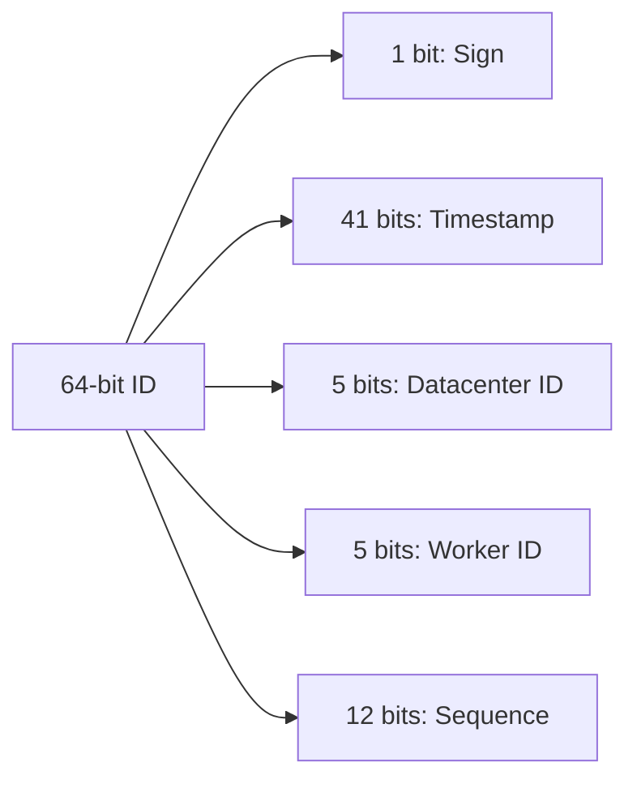

# Session 26: Distributed Unique ID Generator (Alex Xu Framework)

## The Story: The "Collision Chaos" at GlobalShop

GlobalShop, a multi-region e-commerce platform, faced a nightmare: orders from the US and Europe were assigned the same ID because separate databases were using standard auto-incrementing integers. This caused shipping labels and payments to clash. To fix this, the team needs a **Distributed Unique ID Generator**.

---

## 1. Understand the Problem and Scope

### Key Requirements:
*   **IDs must be unique** across all servers and regions.
*   **IDs should be sortable** by time (mostly).
*   **Performance**: High throughput (e.g., 10,000 IDs per second).
*   **Size**: Usually 64-bit to fit in standard long/bigint types.

---

## 2. Approach Options

### A. Multi-master Replication
Each database has a different "increment" (e.g., DB1: 1, 3, 5... DB2: 2, 4, 6...). 
*   **Pros**: Simple.
*   **Cons**: Hard to scale (what if you add a 3rd DB?). Not time-sortable.

### B. UUID (Universally Unique Identifier)
`128-bit` string like `550e8400-e29b-41d4-a716-446655440000`.
*   **Pros**: Very easy, no coordination needed.
*   **Cons**: Too large (128-bit), not time-sortable, indexing performance issues.

### C. Ticket Server (Flickr Approach)
A dedicated central database that generates IDs.
*   **Pros**: Simple, ensures sequential IDs.
*   **Cons**: Single Point of Failure (SPOF).

### D. Twitter Snowflake (Recommended)
A 64-bit ID divided into segments: Time, Machine ID, and Sequence.



---

## 3. Design Deep Dive: Snowflake Implementation in Java

The Snowflake algorithm provides unique, 64-bit IDs that are roughly chronological without requiring a central coordinator.

```java
import java.util.concurrent.atomic.AtomicLong;

/**
 * Snowflake ID Generator Implementation
 */
public class SnowflakeIdGenerator {
    // Bits allocated for each segment
    private static final long TIMESTAMP_BITS = 41L;
    private static final long DATACENTER_ID_BITS = 5L;
    private static final long WORKER_ID_BITS = 5L;
    private static final long SEQUENCE_BITS = 12L;

    // Max values for each segment
    private static final long MAX_DATACENTER_ID = -1L ^ (-1L << DATACENTER_ID_BITS);
    private static final long MAX_WORKER_ID = -1L ^ (-1L << WORKER_ID_BITS);
    private static final long MAX_SEQUENCE = -1L ^ (-1L << SEQUENCE_BITS);

    // Shifts
    private static final long WORKER_ID_SHIFT = SEQUENCE_BITS;
    private static final long DATACENTER_ID_SHIFT = SEQUENCE_BITS + WORKER_ID_BITS;
    private static final long TIMESTAMP_SHIFT = SEQUENCE_BITS + WORKER_ID_BITS + DATACENTER_ID_BITS;

    // Custom epoch (starting from 2024-01-01)
    private static final long EPOCH = 1704067200000L;

    private final long datacenterId;
    private final long workerId;
    private long sequence = 0L;
    private long lastTimestamp = -1L;

    public SnowflakeIdGenerator(long datacenterId, long workerId) {
        if (datacenterId > MAX_DATACENTER_ID || datacenterId < 0) {
            throw new IllegalArgumentException("datacenterId must be between 0 and " + MAX_DATACENTER_ID);
        }
        if (workerId > MAX_WORKER_ID || workerId < 0) {
            throw new IllegalArgumentException("workerId must be between 0 and " + MAX_WORKER_ID);
        }
        this.datacenterId = datacenterId;
        this.workerId = workerId;
    }

    public synchronized long nextId() {
        long timestamp = System.currentTimeMillis();

        if (timestamp < lastTimestamp) {
            throw new RuntimeException("Clock moved backwards. Refusing to generate ID.");
        }

        if (timestamp == lastTimestamp) {
            // Same millisecond, increment sequence
            sequence = (sequence + 1) & MAX_SEQUENCE;
            if (sequence == 0) {
                // Sequence overflow, wait for next millisecond
                timestamp = waitNextMillis(lastTimestamp);
            }
        } else {
            // New millisecond, reset sequence
            sequence = 0L;
        }

        lastTimestamp = timestamp;

        // Compose the 64-bit ID
        return ((timestamp - EPOCH) << TIMESTAMP_SHIFT) 
                | (datacenterId << DATACENTER_ID_SHIFT) 
                | (workerId << WORKER_ID_SHIFT) 
                | sequence;
    }

    private long waitNextMillis(long lastTimestamp) {
        long timestamp = System.currentTimeMillis();
        while (timestamp <= lastTimestamp) {
            timestamp = System.currentTimeMillis();
        }
        return timestamp;
    }

    public static void main(String[] args) {
        SnowflakeIdGenerator generator = new SnowflakeIdGenerator(1, 1);
        
        System.out.println("Generated IDs:");
        for (int i = 0; i < 5; i++) {
            System.out.println(generator.nextId());
        }
    }
}
```

---

## Interview Q&A

### Q1: Why use a 41-bit timestamp?
**Answer**: 41 bits allows for approximately 69 years of unique IDs starting from the chosen epoch (`2^41 / 1000 / 3600 / 24 / 365 ≈ 69.7`). This is usually sufficient for most systems.

### Q2: How do you handle clock drift?
**Answer**: If a server's clock is synchronized backwards (via NTP), the Snowflake algorithm might generate duplicate IDs. Our implementation throws an error if it detects the clock has moved backwards. Advanced versions wait for the clock to catch up or use a buffer.

### Q3: What happens if you need to generate more than 4,096 IDs per millisecond?
**Answer**: 4,096 is the limit for a 12-bit sequence. If exceeded, the `nextId()` method waits for the next millisecond (`waitNextMillis`). In high-scale systems, you can increase the sequence bits or add more worker nodes.
