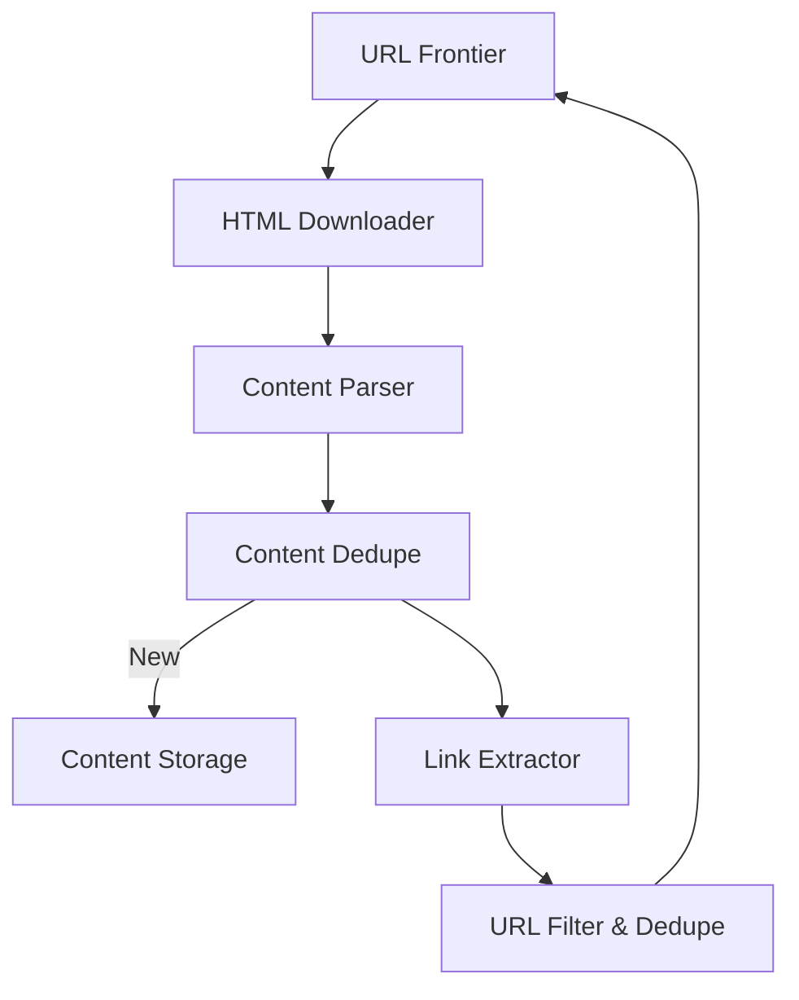

# Session 29: Designing a Web Crawler (Alex Xu Framework)

## The Story: The "SearchEngineX" Journey

Leo is building **SearchEngineX**, a competitor to Google. To index the internet, he needs a **Web Crawler** that can traverse billions of web pages, extract information, and store it efficiently without "DDOSing" small websites.

---

## 1. Understand the Problem and Scope

### Key Requirements:
*   **Purpose**: Search Engine Indexing.
*   **Scale**: 1 billion pages per month.
*   **Politeness**: Don't overwhelm any single server (respect `robots.txt`).
*   **Deduplication**: Don't crawl or store the same content twice.

---

## 2. High-Level Design

The crawler works like a state machine:
1.  **URL Frontier**: A list of URLs to be crawled.
2.  **HTML Downloader**: Fetch the page content.
3.  **Content Parser**: Extract text and links.
4.  **Content Deduplication**: Check if we've seen this content before.
5.  **URL Deduplication**: Check if we've seen this URL before.



---

## 3. Design Deep Dive: The URL Frontier

The Frontier is the "brain" of the crawler. It ensures:
*   **Priority**: Crawl important pages (e.g., Wikipedia) first.
*   **Politeness**: Use different queues for different hostnames.
*   **Freshness**: Periodically recrawl pages to see if they changed.

---

## 4. Java Implementation: URL Frontier & Politeness

This simplified Java code demonstrates how to route URLs to different queues based on their hostname to ensure host-specific politeness.

```java
import java.util.*;
import java.util.concurrent.*;

/**
 * Simplified URL Frontier with Host Politeness
 */
public class UrlFrontier {
    // Map of Hostname -> Queue of URLs
    private final Map<String, BlockingQueue<String>> hostQueues = new ConcurrentHashMap<>();
    private final Set<String> visitedUrls = Collections.newSetFromMap(new ConcurrentHashMap<>());

    public void addUrl(String url) {
        String host = getHost(url);
        if (!visitedUrls.contains(url)) {
            hostQueues.computeIfAbsent(host, k -> new LinkedBlockingQueue<>()).add(url);
            visitedUrls.add(url);
        }
    }

    public String fetchNext(String host) {
        BlockingQueue<String> queue = hostQueues.get(host);
        return (queue != null) ? queue.poll() : null;
    }

    private String getHost(String url) {
        // Mock host extraction
        return url.split("/")[2];
    }

    public void crawlSimulation() {
        addUrl("https://en.wikipedia.org/wiki/Java");
        addUrl("https://en.wikipedia.org/wiki/System_Design");
        addUrl("https://github.com/explore");

        System.out.println("Processing Frontier...");
        hostQueues.forEach((host, queue) -> {
            System.out.println("Crawl Request for host [" + host + "]: " + queue.poll());
        });
    }

    public static void main(String[] args) {
        UrlFrontier frontier = new UrlFrontier();
        frontier.crawlSimulation();
    }
}
```

---

## Interview Q&A

### Q1: How do you handle "Spider Traps" or Infinite Loops?
**Answer**: Sets a maximum URL length limit and a maximum crawling depth. You can also use hash-based fingerprinting of page content to detect if you're stuck in a loop of identical or near-identical dynamically generated pages.

### Q2: How do you perform "Content Deduplication"?
**Answer**: (Medium-Hard) 
Don't compare raw HTML. Instead, generate a **SimHash** (a type of locality-sensitive hashing) of the text content. SimHash allows you to detect "near-duplicate" content (e.g., the same article with different ads/timestamps), which is crucial for efficient web crawling.

### Q3: Why is "Politeness" so important in a web crawler?
**Answer**: Crawlers generate significant traffic. Without politeness rules (waiting between requests to the same host), you might crash a small website's server, which can lead to your IP getting blocked or legal trouble. Always respect `robots.txt`.
