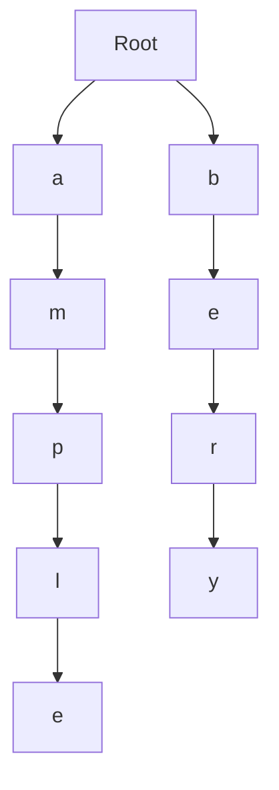
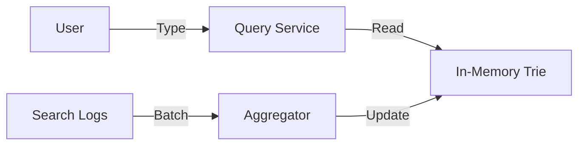

# Session 33: Search Autocomplete System (Alex Xu Framework)

## The Story: The "Search Suggest" Problem at ShopFast

Anna is building **ShopFast**, a global retail app. When users type in the search bar, they expect relevant suggestions instantly. If the system is slow, it feels "laggy" and users leave. To provide sub-50ms suggestions, Anna needs an **Autocomplete System**.

---

## 1. Understand the Problem and Scope

### Key Requirements:
*   **Fast Response**: Sub-50ms for autocomplete.
*   **Relevance**: Suggestions must be the most popular searches.
*   **Scale**: 10 million DAU.
*   **Fault Tolerance**: If the autocomplete service goes down, the main search should still work.

---

## 2. Data Structure: The Trie (Prefix Tree)

A standard database `LIKE 'query%'` is too slow for millions of requests. We use a **Trie**.

1.  **Nodes**: Each node represents a character.
2.  **Frequency**: Each leaf (or node) stores the frequency of that word.



---

## 3. High-Level Design: Data Pipeline

Autocomplete is split into two systems:
1.  **Data Collection Service**: Logs search queries and their frequencies (using Kafka).
2.  **Data Aggregation Service**: Periodically (e.g., every hour) aggregates logs and updates the Trie.
3.  **Query Service**: Serves the Trie from memory.



---

## 4. Java Implementation: Trie with Frequency

This code implements a basic Trie in Java and returns the top 5 suggestions for a given prefix.

```java
import java.util.*;

/**
 * Autocomplete Trie Implementation in Java
 */
public class AutocompleteTrie {
    class TrieNode {
        Map<Character, TrieNode> children = new HashMap<>();
        int frequency = 0;
        boolean isEndOfWord = false;
    }

    private final TrieNode root = new TrieNode();

    public void insert(String word, int freq) {
        TrieNode current = root;
        for (char ch : word.toCharArray()) {
            current = current.children.computeIfAbsent(ch, k -> new TrieNode());
        }
        current.isEndOfWord = true;
        current.frequency += freq;
    }

    public List<String> getSuggestions(String prefix) {
        TrieNode current = root;
        for (char ch : prefix.toCharArray()) {
            current = current.children.get(ch);
            if (current == null) return Collections.emptyList();
        }
        
        // Find all words from this node using DFS
        PriorityQueue<WordFreq> pq = new PriorityQueue<>((a, b) -> b.freq - a.freq);
        dfs(current, prefix, pq);

        List<String> results = new ArrayList<>();
        int count = 0;
        while (!pq.isEmpty() && count < 5) {
            results.add(pq.poll().word);
            count++;
        }
        return results;
    }

    private void dfs(TrieNode node, String currentWord, PriorityQueue<WordFreq> pq) {
        if (node.isEndOfWord) {
            pq.add(new WordFreq(currentWord, node.frequency));
        }
        for (Map.Entry<Character, TrieNode> entry : node.children.entrySet()) {
            dfs(entry.getValue(), currentWord + entry.getKey(), pq);
        }
    }

    class WordFreq {
        String word;
        int freq;
        WordFreq(String w, int f) { this.word = w; this.freq = f; }
    }

    public static void main(String[] args) {
        AutocompleteTrie trie = new AutocompleteTrie();
        trie.insert("apple", 50);
        trie.insert("app", 100);
        trie.insert("application", 30);
        trie.insert("banana", 10);

        System.out.println("Suggestions for 'app': " + trie.getSuggestions("app"));
    }
}
```

---

## Interview Q&A

### Q1: How do you handle "Trending" searches that change every minute?
**Answer**: (Hard) A standard Trie aggregation (every hour) is too slow for trends. You can use a separate **Real-time Pipeline (Flink/Spark Streaming)** to maintain a "Trending Trie" in Redis. Merge results from both the main Trie and the Trending Trie at query time.

### Q2: How do you scale the Trie if it's too large for one server's RAM?
**Answer**: Use **Trie Sharding**. You can shard the Trie based on the first character (e.g., Server 1: 'a' to 'm', Server 2: 'n' to 'z'). For even better distribution, shard by the hash of the first character.

### Q3: How do you optimize the search for frequencies?
**Answer**: Instead of running DFS every time a user types, you can **pre-calculate** and store the top 5 words at each Trie node. This makes lookups `O(length of query)` instead of `O(trie depth)`.
