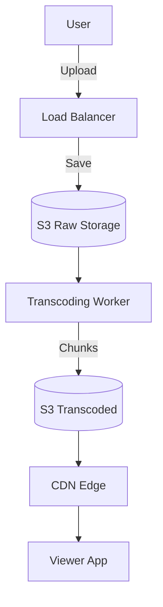

# Session 34: Designing YouTube (Alex Xu Framework)

## The Story: The "Buffer Wheel" at MyVideo

David is building **MyVideo**, a video streaming site. Users complain that videos buffer constantly and don't work on mobile. David needs a system that can handle massive uploads, transcode them into multiple formats (720p, 1080p, 4K), and stream them smoothly regardless of the user's internet speed.

---

## 1. Understand the Problem and Scope

### Key Requirements:
*   **Video Upload**: Support large file uploads.
*   **Video Transcoding**: Convert raw video into different formats and resolutions.
*   **Adaptive Streaming**: Switch quality based on user network (HLS/DASH).
*   **Scale**: 10 million DAU.
*   **Storage**: Massive (PB scale).

---

## 2. High-Level Design: The Video Pipeline

### A. Upload Flow
1.  **Original Store**: Raw video is uploaded to Blob Storage (S3).
2.  **Transcoding**: Workers fetch raw video and convert it.
3.  **Transcoded Store**: Store formatted chunks.

### B. View Flow
1.  **CDN**: Content is cached at edge locations.
2.  **Adaptive Streaming**: The player requests specific chunks (e.g., 4s segments) based on network speed.



---

## 3. Design Deep Dive: Video Transcoding

Why is transcoding necessary?
*   **Device Compatibility**: Different formats for iOS, Android, and Web.
*   **Bitrate Adaptation**: Users on 3G need low bitrate, users on Fiber need 4K.

### Adaptive Bitrate Streaming (ABR):
*   **HLS** (Apple) or **DASH** (Google).
*   The video is split into small 2-10 second chunks. The player decides which chunk resolution to fetch next.

---

## 4. Java Implementation: Video Chunking & Transcoding Simulation

This code demonstrates how a Transcoding Task might split a video into segments (conceptually).

```java
import java.util.*;

/**
 * Simplified Video Transcoding Simulation
 */
public class VideoTranscoder {
    class VideoTask {
        String videoId;
        String resolution;
        VideoTask(String id, String res) { this.videoId = id; this.resolution = res; }
    }

    public void processVideo(String rawVideoId) {
        System.out.println("--- Starting Transcoding for [" + rawVideoId + "] ---");
        
        // Define target resolutions
        List<String> resolutions = Arrays.asList("360p", "720p", "1080p");
        
        for (String res : resolutions) {
            transcodeTo(rawVideoId, res);
        }
        
        System.out.println("Processing Metadata for ABR Playlist (m3u8/mpd)...");
    }

    private void transcodeTo(String id, String res) {
        System.out.println("Worker: Encoding " + id + " to " + res + "...");
        // In real systems, this would call FFmpeg natively
        for (int i = 1; i <= 3; i++) {
            System.out.println("   -> Generating Chunk_" + i + "_" + res + ".ts");
        }
    }

    public static void main(String[] args) {
        VideoTranscoder transcoder = new VideoTranscoder();
        transcoder.processVideo("Cat_Video_001.mp4");
    }
}
```

---

## Interview Q&A

### Q1: How do you handle extremely large file uploads (e.g., 20GB)?
**Answer**: Use **Multipart Upload**. Instead of sending one huge request, the client splits the file into small chunks (e.g., 5MB each) and uploads them in parallel. If one chunk fails, only that chunk needs to be re-sent. Once all are uploaded, S3 merges them back.

### Q2: Why use a DAG (Directed Acyclic Graph) for the transcoding process?
**Answer**: (Hard) Transcoding involves multiple steps (Audio extraction, Thumbnail generation, Resolution encoding). A DAG allows you to run these tasks in parallel where possible (e.g., generating 360p and 720p at the same time) and ensures high throughput.

### Q3: How do you protect against "Video Plagiarism" or unauthorized access?
**Answer**: (Medium-Hard) 
1.  **Signed URLs**: Use S3/CDN Signed URLs that expire in minutes.
2.  **DRM (Digital Rights Management)**: Use systems like Widevine or FairPlay to encrypt the actual video chunks.
3.  **Watermarking**: Overlay the user's ID/IP on the video during transcoding.
