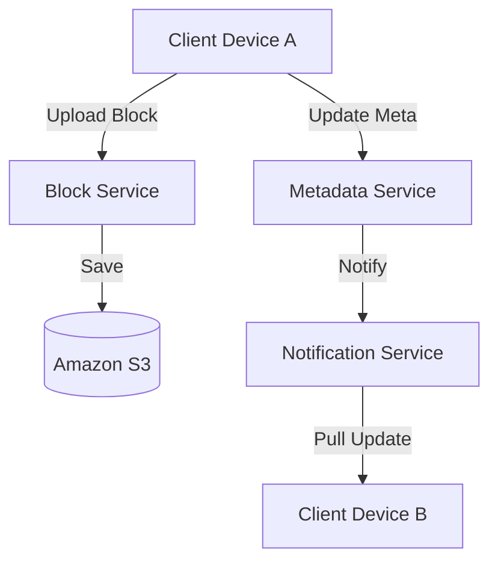

# Session 35: Designing Google Drive (Alex Xu Framework)

## The Story: The "Conflict Crisis" at CloudBox

Liam is building **CloudBox**, a file sync service. Users are complaining that when they edit the same document offline on two devices, the system overwrites one of them randomly. Liam needs a system that handles **Differential Sync**, **Conflict Resolution**, and efficient storage of billions of small and large files.

---

## 1. Understand the Problem and Scope

### Key Requirements:
*   **File Upload/Download**: Support files up to 10GB.
*   **Sync**: Automatic syncing across multiple devices.
*   **Versioning**: Ability to see previous versions of a file.
*   **Offline Support**: Edit offline and sync when online.
*   **Scale**: 50 million DAU.

---

## 2. High-Level Design: The Sync Engine

### Three Main Components:
1.  **Block Service**: Splits large files into small blocks (e.g., 4MB).
2.  **Metadata Service**: Stores file names, sizes, versions, and paths (SQL DB).
3.  **Notification Service**: Notifies other devices when a file has changed.



---

## 3. Design Deep Dive: Differential Sync

How do we save bandwidth? We don't upload the whole file!
*   **Delta Sync**: When a file is modified, only the **modified blocks** are uploaded.
*   **Chunking**: Breaking a file into fixed-size or variable-size blocks.

### Conflict Resolution:
*   **Optimistic Locking**: The first person to save wins; the second person gets a "Conflict Detected" error.
*   **Operational Transformation (OT)**: Used by Google Docs for real-time collaborative editing.

---

## 4. Java Implementation: Block-based Chunking Simulation

This code shows how a file could be split into chunks (blocks) and tracked with hashes for delta syncing.

```java
import java.util.*;
import java.security.MessageDigest;

/**
 * Simplified File Chunking for Differential Sync
 */
public class FileSyncEngine {
    private static final int BLOCK_SIZE = 1024 * 1024 * 4; // 4MB

    /**
     * Splits a file into logical blocks and generates hashes
     */
    public List<String> processFile(String fileName, byte[] content) {
        System.out.println("Processing file: " + fileName + " (" + content.length + " bytes)");
        List<String> blockHashes = new ArrayList<>();
        
        int totalBlocks = (int) Math.ceil((double) content.length / BLOCK_SIZE);
        
        for (int i = 0; i < totalBlocks; i++) {
            int start = i * BLOCK_SIZE;
            int length = Math.min(BLOCK_SIZE, content.length - start);
            byte[] block = Arrays.copyOfRange(content, start, start + length);
            
            String hash = generateHash(block);
            blockHashes.add(hash);
            System.out.println("   -> Block " + i + " Hash: " + hash);
        }
        
        return blockHashes;
    }

    private String generateHash(byte[] content) {
        try {
            MessageDigest md = MessageDigest.getInstance("SHA-256");
            byte[] hash = md.digest(content);
            return Base64.getEncoder().encodeToString(hash).substring(0, 10);
        } catch (Exception e) {
            return "ERROR";
        }
    }

    public static void main(String[] args) {
        FileSyncEngine engine = new FileSyncEngine();
        // Simulating a 10MB file
        byte[] content = new byte[1024 * 1024 * 10];
        new Random().nextBytes(content);
        
        engine.processFile("Design_Doc_v1.pdf", content);
    }
}
```

---

## Interview Q&A

### Q1: Why store Metadata in a Relational Database (MySQL) instead of NoSQL?
**Answer**: ACID compliance is critical for file metadata. If a file is renamed, we must ensure the name and path are updated atomically. Relational databases provide strong consistency, which prevents "Ghost Files" (files that exist in S3 but have no record in the database).

### Q2: How do you handle "Cold Storage" for rarely accessed files?
**Answer**: Use **Tiered Storage**. Move files that haven't been accessed in 30 days from S3 Standard to S3 Intelligent-Tiering or Glacier. This saves significant costs at PB scale.

### Q3: What is the benefit of "Variable-sized Chunking" over Fixed-sized?
**Answer**: (Hard) In fixed-sized chunking, adding one byte at the start of a file shifts all subsequent boundaries, causing every block to change hash. Variable-sized (using algorithms like Rabin Fingerprinting) detects boundaries based on content, so adding bytes only changes the local blocks, making delta sync much more efficient.
