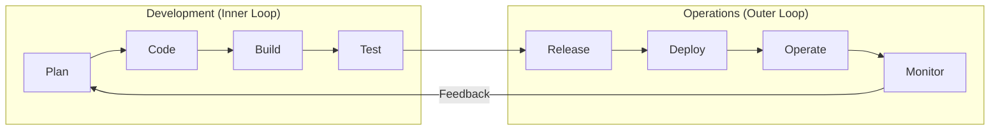

Version: 1.0.0
Last Updated: 2026-03-09
Prerequisites: Module 1.1 (Philosophy)

## 1. The Eight Stages of DevOps

### Story Introduction

Imagine an **Infinite Roller Coaster**.

The cars (The Code) never stop at a station to let everyone off. Instead, while the cars are moving, mechanics are swapping wheels, painters are changing colors, and passengers (The Users) are giving thumbs up or thumbs down.

1.  **Plan**: Deciding where the track should go next.
2.  **Code**: Building the new piece of track.
3.  **Build**: Testing the new track piece in the factory.
4.  **Test**: Sending a test car over it to see if it breaks.
5.  **Release**: Bolting it onto the main coaster.
6.  **Deploy**: Opening that new section to the public.
7.  **Operate**: Making sure the ride is smooth (Monitoring).
8.  **Monitor**: Recording the screams of joy or fear to decide the next section.

There is no "End" to the ride. As soon as you finish one loop, you start the next one with better data.

### Concept Explanation

The DevOps lifecycle is often represented as an **Infinity Symbol (∞)** to show that software development is a continuous process of improvement.

#### The 8 Stages:
1.  **Plan**: Requirements gathering, backlog management (Jira, Trello).
2.  **Code**: Writing and versioning code (Git).
3.  **Build**: Compiling code and creating artifacts (JAR, Docker Image).
4.  **Test**: Running automated unit and integration tests (JUnit, Selenium).
5.  **Release**: "Staging" the build and preparing for production.
6.  **Deploy**: Pushing the code to the live environment.
7.  **Operate**: Managing the live infrastructure (Kubernetes, AWS).
8.  **Monitor**: Gathering logs, metrics, and user feedback (Prometheus, Splunk).

### Code Examples (Automation across the loop)

In a DevOps lifecycle, we use a **Pipeline Script** to manage these stages automatically.

```groovy
// Jenkinsfile (A Pipeline code example)
pipeline {
    agent any
    stages {
        stage('Build') {
            steps {
                sh 'mvn clean package' // Stage 3: Build
            }
        }
        stage('Test') {
            steps {
                sh 'mvn test' // Stage 4: Test
            }
        }
        stage('Deploy') {
            steps {
                sh 'kubectl apply -f deployment.yaml' // Stage 6: Deploy
            }
        }
    }
}
```

### Step-by-Step Walkthrough

1.  **`sh 'mvn clean package'`**: This command triggers the **Build** phase. It cleans up old files and compiles the new ones into a "Package" (like a JAR file).
2.  **`sh 'mvn test'`**: This triggers the **Test** phase. It automatically runs every test a developer has written. If even one test fails, the whole pipeline stops, preventing "Broken" code from reaching users.
3.  **`sh 'kubectl apply...'`**: This is the **Deploy** phase. It tells Kubernetes to take the new package and run it on the servers.

### Diagram



### Real World Use Cases

**Amazon** is the master of this lifecycle. They famously deploy code every **11.7 seconds**. They don't have a "Release Day." Every single developer push triggers this loop automatically. If a developer fixes a typo, it goes through Plan-Code-Build-Test-Deploy in minutes, not months.

### Best Practices

1.  **Shift Left**: Start testing as early as possible in the loop.
2.  **Continuous Feedback**: Don't wait until the "Monitor" stage to check for errors; use automated logs at every stage.
3.  **Small Batches**: Don't release 100 changes at once. Release 1 change at a time so it's easier to find the problem if it breaks.

### Common Mistakes

*   **Manual Gates**: Having a "Human Approval" step between every stage. This kills the speed of the loop.
*   **Ignoring Feedback**: Collecting monitoring data but never looking at it or using it to plan the next phase.

### Exercises

1.  **Beginner**: List the 8 stages of the DevOps lifecycle.
2.  **Intermediate**: What is the difference between the "Release" stage and the "Deploy" stage?
3.  **Advanced**: In a "Fully Automated" pipeline, which stages can be performed without any human intervention?

### Mini Projects

#### Beginner: Map your Workflow
**Task**: Think about a task you do regularly (like writing an essay or a project). Map that task to the 8 stages of the DevOps loop. 
**Deliverable**: A simple list showing what you do in each stage.

#### Intermediate: The failing build
**Task**: Create a simple script that "Builds" a text file. Then, add a "Test" step that checks if the word "Error" is in that file. Intentionally make the test fail.
**Deliverable**: The script and the error message you received when it failed.

#### Advanced: Designing a Rollback
**Task**: Imagine your "Deploy" stage fails. Design a logic for your pipeline that automatically reverts the server back to the "Stage 6" (Deploy) version from yesterday.
**Deliverable**: A flowchart showing the "If/Then" logic for a rollback.
