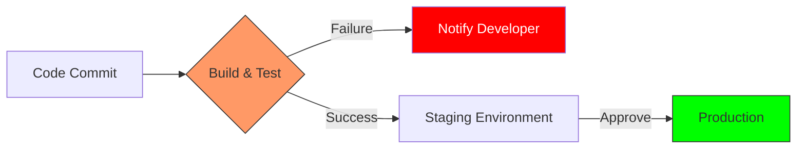

Version: 1.0.0
Last Updated: 2026-03-09
Prerequisites: Module 1.1 (Philosophy) & 1.2 (Lifecycle)

## 1. The C.A.L.M.S. Framework

### Story Introduction

Imagine **Running a High-Tech Restaurant**.

*   **C (Culture)**: The chef, the waiters, and the dishwashers all respect each other. If a plate is cold, they don't scream; they work together to find out why.
*   **A (Automation)**: The restaurant uses a conveyor belt to move dirty dishes to the kitchen and an automated system to order fresh ingredients when the fridge is low.
*   **L (Lean)**: Instead of cooking 100 steaks at once (and wasting half), they cook them one by one as orders come in. No waste.
*   **M (Measurement)**: The manager tracks exactly how long it takes for a customer to get their food and how many plates come back unfinished.
*   **S (Sharing)**: When the chef discovers a new, faster way to chop onions, they write it down in a book that every other cook in the restaurant can read.

This is exactly how a DevOps organization works.

### Concept Explanation

DevOps isn't just a set of tools; it's a set of guiding principles. The most famous way to remember them is **C.A.L.M.S.**

#### The 5 Pillars:
1.  **Culture**: Humans over processes. High-trust environments.
2.  **Automation**: Removing human error and repetitive tasks.
3.  **Lean**: Eliminating waste (like waiting for approvals or unnecessary documentation).
4.  **Measurement**: If you can't measure it, you can't improve it (Monitoring/Observability).
5.  **Sharing**: Open communication and shared responsibility.

---

## 2. CI/CD: The Heart of Automation

### Concept Explanation

**Continuous Integration (CI)**: Developers merge their changes back to the main branch as often as possible. Each merge triggers an automated build and test.
**Continuous Delivery (CD)**: The practice of keeping your code in a "Deployable" state at all times. You could push to production with a "Single Click."

### Code Example (CI/CD logic)

A simple script that demonstrates "Automation" and "Continuous Integration":

```bash
#!/bin/bash
# ci-check.sh

# 1. Automation: Compile the code automatically
echo "Starting Build..."
gcc main.c -o myapp
if [ $? -ne 0 ]; then
    echo "BUILD FAILED!"
    exit 1
fi

# 2. Continuous Integration: Run the tests automatically
echo "Running Tests..."
./myapp --test-mode
if [ $? -ne 0 ]; then
    echo "TESTS FAILED!"
    exit 1
fi

echo "Everything passed! Ready for Deployment."
```

### Step-by-Step Walkthrough

1.  **`#!/bin/bash`**: Tells the computer to use the Bash shell to run this "Automation."
2.  **`gcc main.c...`**: This is the **Build** step. It creates a machine-readable file from human code.
3.  **`if [ $? -ne 0 ]; then`**: This is the **Feedback** logic. `$?` captures the success or failure of the last command. If it failed, the script "Errors out" immediately.
4.  **`myapp --test-mode`**: This is the **Test** step. It verifies the code actually works before we say it's "Ready."

### Diagram



### Real World Use Cases

**Etsy** is a great example of the **Sharing** principle. They have a "Morgue" where they store all the data from past system failures. Anyone in the company can read about what went wrong and how it was fixed. By sharing this knowledge, they ensure the same mistake never happens twice.

### Best Practices

1.  **Automate for the right reasons**: Don't automate a broken process. Fix it first, then automate.
2.  **Measure what matters**: Don't just track "CPU usage." Track "User Sign-up Speed" or "Average Checkout Time."
3.  **Fail Fast**: Your CI pipeline should tell you about a bug in 5 minutes, not 5 hours.

### Common Mistakes

*   **Automation Obsession**: Trying to automate 100% of everything, even tasks that only happen once every two years.
*   **Measurement Overload**: Creating 500 dashboards that no one ever looks at. Focus on the "Four Golden Signals" (Latency, Traffic, Errors, Saturation).

### Exercises

1.  **Beginner**: What does the "S" stand for in C.A.L.M.S.?
2.  **Intermediate**: Why is "Lean" important for software development speed?
3.  **Advanced**: Explain the difference between Continuous Delivery and Continuous Deployment. (Hint: One is manual approval, the other is 100% automatic).

### Mini Projects

#### Beginner: The "Manual vs. Auto" Timer
**Task**: Time yourself performing a repetitive task (like creating 10 folders). Then, write a simple script to do it. Compare the times.
**Deliverable**: A short log showing the "Manual Time" vs. the "Automated Time."

#### Intermediate: Design an SLI (Service Level Indicator)
**Task**: Choose a website you use often (like YouTube). Identify 3 things you would measure to determine if that site is "Healthy."
**Deliverable**: A list of 3 metrics (e.g., Video Load Time, Search Result Accuracy).

#### Advanced: Case Study Analysis
**Task**: Research a famous tech failure (like the "Cloudflare 2019 Outage" or "Knight Capital Group 2012"). Identify which DevOps principle (C, A, L, M, or S) was missing or violated.
**Deliverable**: A 1-paragraph summary of the failure and the "DevOps Lesson" learned.
