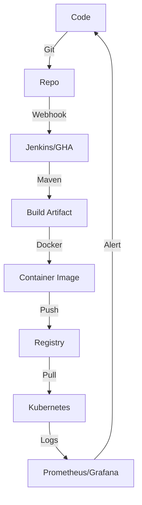

Version: 1.0.0
Last Updated: 2026-03-09
Prerequisites: Module 1.1, 1.2, 1.3

## 1. Navigating the "Cloud-Native" Jungle

### Story Introduction

Imagine **Building a Modern Skyscraper**.

You can't just use a hammer and a saw. You need:
*   **Blueprints (Version Control)**: One source that everyone follows so the 50th floor matches the 1st floor.
*   **Automated Cranes (CI/CD)**: Massive machines that lift heavy beams into place automatically once the engineers approve them.
*   **Interchangeable Shipping Containers (Docker)**: Standardized boxes where rooms are built inside a factory and then simply plugged into the building.
*   **Building Manager (Orchestration)**: Someone who manages the elevators, electricity, and water for the entire building at once.
*   **Security Cameras & Sensors (Monitoring)**: To make sure there are no cracks in the walls or fires in the basement.

In DevOps, our toolkit is our "Workshop."

### Concept Explanation

The **DevOps Toolchain** is a collection of tools that facilitate the 8 stages of the lifecycle. Because the field moves fast, there are hundreds of tools, but they all fall into a few major categories.

#### The 5 Essential Categories:
1.  **Version Control System (VCS)**: Tracking every change to the code and infrastructure. (e.g., **Git**, GitHub, GitLab).
2.  **CI/CD & Build Tools**: Automating the assembly line. (e.g., **Jenkins**, GitHub Actions, Maven, Gradle).
3.  **Containerization**: Packaging an app and its environment into a single unit. (e.g., **Docker**, Podman).
4.  **Orchestration & Infrastructure**: Managing "Fleets" of containers and servers. (e.g., **Kubernetes**, Terraform, Ansible).
5.  **Monitoring & Observability**: Seeing inside the running system. (e.g., **Prometheus**, Grafana, ELK Stack).

### Code Example (The "Integration" Script)

A "Meta-Script" that shows how these tools talk to each other:

```bash
# devops-workflow-sim.sh

# 1. Version Control (Git)
git add . && git commit -m "Update application"

# 2. Build Tool (Maven)
mvn clean package

# 3. Containerization (Docker)
docker build -t my-app:latest .

# 4. Deployment (Kubernetes)
kubectl apply -f deployment.yaml

# 5. Monitoring Check (Curl/Logs)
curl -f http://localhost:8080/health-check
```

### Step-by-Step Walkthrough

1.  **`git add ...`**: We save our progress in the "History Book" (Git).
2.  **`mvn clean package`**: We turn human-written code into a Java artifact (JAR).
3.  **`docker build ...`**: We put that JAR file inside a "Shipping Container" (Image) so it can run anywhere.
4.  **`kubectl apply ...`**: We tell the "Building Manager" (K8s) to start 3 copies of our container.
5.  **`curl -f ...`**: We perform a "Health Check" to see if our sensors (Monitoring) detect any problems.

### Diagram



### Real World Use Cases

In **Large Scale AI companies** (like OpenAI), they use thousands of GPUs. They use **Terraform** to provision the GPUs, **Kubernetes** to run the training jobs, and **Prometheus** to monitor the temperature and power usage of the servers. Without this integrated "Toolchain," managing that much hardware would be impossible for humans.

### Best Practices

1.  **Tool Consolidation**: Don't use 10 different tools for the same job. Pick one (e.g., GitHub Actions) and standardize everyone on it.
2.  **Tools as Code**: Never configure a tool by clicking buttons in a UI. Use config files (YAML/HCL) so the tool configuration can also be saved in Git.
3.  **Security First**: Scan your Docker images and Git repos for secrets automatically using tools like **Trivy** or **Snyk**.

### Common Mistakes

*   **Shiny Object Syndrome**: Buying a new tool just because it's popular, without understanding if it actually solves a problem for *your* team.
*   **The Swiss Army Knife Problem**: Trying to make one tool (like LinkedIn) do everything, even things it's not designed for.

### Exercises

1.  **Beginner**: Name one tool for "Version Control" and one tool for "Monitoring."
2.  **Intermediate**: Why do we separate the "Build" tool (Maven) from the "Container" tool (Docker)?
3.  **Advanced**: Explain the concept of "Vendor Lock-in" in the context of choosing a DevOps toolchain.

### Mini Projects

#### Beginner: The Tool Scavenger Hunt
**Task**: Visit the [CNCF Landscape](https://landscape.cncf.io/). Find three tools that fall under "Continuous Integration" and write down their names.
**Deliverable**: A list of 3 CI tools and a 1-sentence description of what makes them different.

#### Intermediate: Hello DevOps Script
**Task**: Create a folder. Inside, create a `README.md` and a `Jenkinsfile` (even if it's empty). Use `git init` to turn this folder into a repository.
**Deliverable**: Run `ls -R` and show the file structure of your new "DevOps Project."

#### Advanced: Tool Architecture Design
**Task**: You are hired to set up a toolchain for a startup. They use Java for their backend and React for their frontend. They want to deploy to AWS.
**Deliverable**: Draw a diagram (or describe one) listing the exact tools you would choose for each of the 5 categories for this specific startup.
